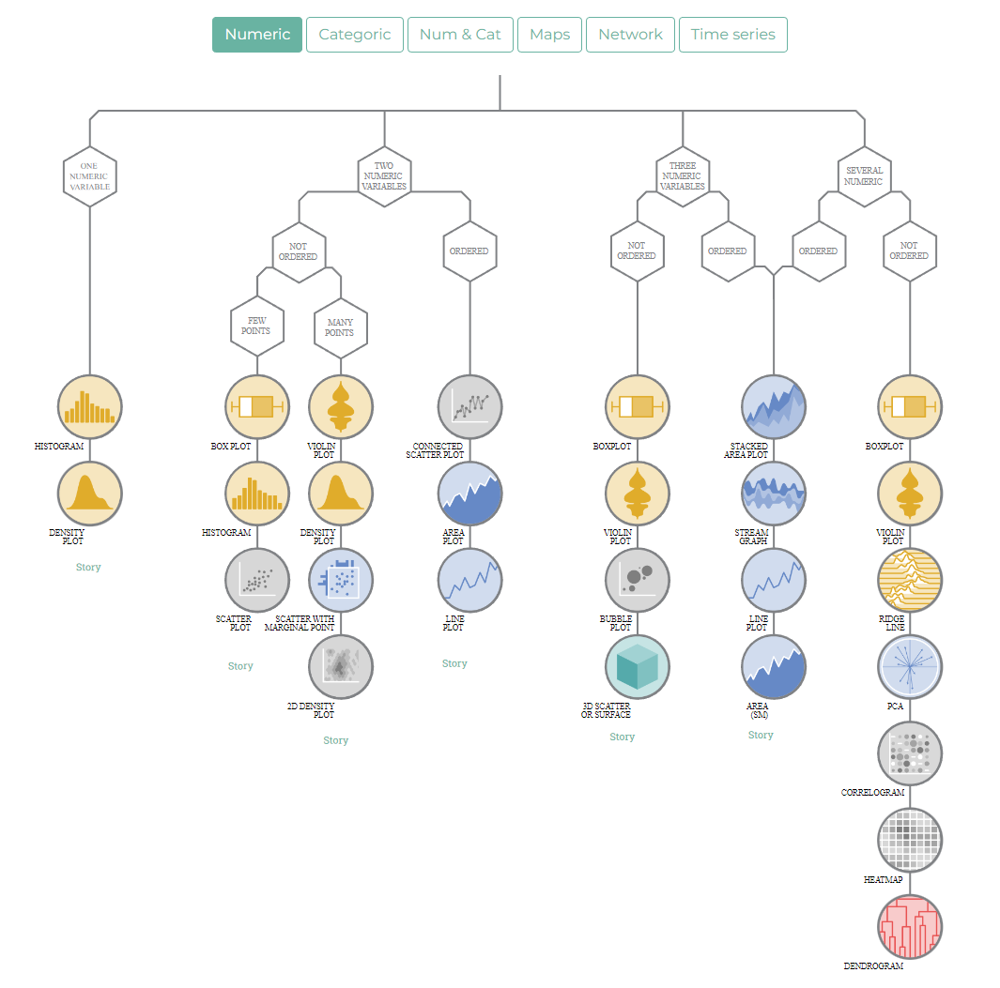
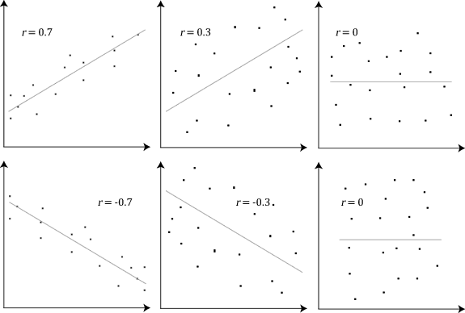
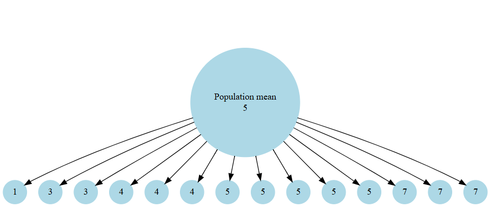
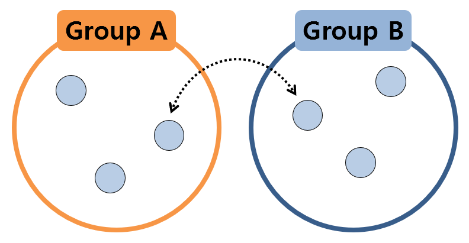

# Welcome! {background-color="#D9DBDB"}

```{r}
#| include: false
#| message: false
#| warning: false

library(arm)
library(car)
library(DHARMa)
library(emmeans)
library(equatiomatic)
library(fitdistrplus)
library(gtsummary)
library(lmtest)
library(MASS)
library(MuMIn)
library(performance)
library(pscl)
library(sjPlot)


```

:::: columns
::: {.column .right}


:::

::: {.column}

{fig-align="center" fig-alt="physalia logo" width=70%}

:::
::::


## About me

:::: columns
::: {.column .right}

Associate Professor in Data Science and Genetics at the [University of East Anglia](https://www.uea.ac.uk/).

<br>

Academic background in Behavioural Ecology, Genetics, and Insect Pest Control.

<br>

Teach Genetics, Programming, and Statistics

:::

::: {.column}

{fig-align="center" fig-alt="UEA logo" width=70%}

:::
::::

## About me

::: columns
::: {.column .right}


Norwich - "A Fine City!"

{fig-align="center" fig-alt="Norwich cathedral" width=90%}

:::

::: {.column}

{fig-align="center" fig-alt="Norwich on a map" width=70%}

:::
:::

# Introduce yourselves {background-color="#D9DBDB"}


## Outline of the course

- Learning R and data wrangling

- Checking data quality and producing insights

- Statistics with linear models

- Generalized Linear Models

- Mixed modelling


## What to expect during this workshop


We will have a 30 min break halfway through each day

But take breaks when you need to!

* Combines slides, live coding examples, and exercises for you to participate in.

* Ask questions in the chat throughout!

## What to expect during this workshop

::: columns
::: {.column}

<br>

I hope you end up with more questions than answers after this workshop!

:::

::: {.column .center-text}

<br>

{fig-align="center" fig-alt="Schitts Creek questions gif" width=60%}

<small>Source: <a href="https://giphy.com/gifs/schittscreek-64afibPa7ySzhFAf00">giphy.com</a></small>

:::
:::


# An Introduction to R {background-color="#D9DBDB"}

## What is R?


* R is a full programming language

* R is a calculator

* R simulates & generates data

* R reads, processes and manipulates data

* R analyses data

* R makes plots, graphics, reports and presentations

## Why use R?

- Specialized in data analysis and statistical computing

- Large repository of packages (CRAN)

- Active community and extensive documentation

- Excellent for reproducible research 


## What is RStudio/Posit?

```{r, echo = FALSE, out.width="85%"}
knitr::include_graphics("images/engine.png")
```


# R is for Open, Reproducible Research {background-color="#D9DBDB"}


## Open Research

:::: {.columns}

::: {.column}

Reproducible

Robust

Transparent

Reusable

Shareable research materials

:::

::: {.column}


```{r, echo = FALSE}
knitr::include_graphics("images/reproducible-data-analysis-02.png")
```

:::

::::

## Why Reproducibility Matters

- Computational reproducibility means obtaining the same results using the same data, code, and computational environment

- It underpins scientific credibility, transparency, and trust

- Reproducibility failures are widespread across disciplines

::: aside
[Powers and Hampton 2019](https://esajournals.onlinelibrary.wiley.com/doi/full/10.1002/eap.1822)
:::


## Evidence: The Current State of Reproducibility

::: {.panel-tabset}

## Trisovic et al 2022

- 74% of archived R scripts failed to run without error in a large-scale audit

- After code cleaning, 56% still failed

- Failures were dominated by file paths, missing dependencies, and lack of documentation

::: aside
[Trisovic et al](https://pubmed.ncbi.nlm.nih.gov/35190569/)
:::

## Kellner et al 2025

- 93% of papers could not be reproduced

- 27% of papers with potentially reproducible code could be successfully run

- Structural issues dominated over statistical ones

::: aside

[Kellner et al. 2025](https://esajournals.onlinelibrary.wiley.com/doi/full/10.1002/ecy.4475)

:::

:::


## A Record of decision making

- Same data different analysts

[Gould et al 2025](https://ecoevorxiv.org/repository/view/6000/)

- Many societies, journals and community groups are requiring or advocating for documented analyses


# Basic R {background-color="#D9DBDB"}

## Syntax

```{r, echo = T}

5 + 10

```

```{r, echo = T}

x <- 5 + 10
x

y <- 20
```


## Basic operations

```{r, echo = T}
sum <- x + y
diff <- x - y
prod <- x * y
quot <- x / y

```

## Data types

```{r, echo = T}
x

y <- "apple"

z <- TRUE

str(x)
str(y)
str(z)

```

## Data Structures

- Vectors

```{r, echo = T}

vec <- c(1, 2, 3, 4, 5)
vec
```

- Data Frames

```{r, echo = T}

df <- data.frame(name=c("Alice", "Bob"), age=c(25, 30))
df
```

- Lists

```{r, echo = T}

lst <- list(name="Alice", age=25, scores=c(90, 85, 88))
lst
```


## Accessing data structures

```{r, echo = T}
df

```

```{r, echo = T}
df$name
```

```{r, echo = T}
df[1,]

df[,1]
```

## R terms

```{r, echo = FALSE, out.width="70%"}
knitr::include_graphics("images/terms.png")
```

## Functions

Functions are bits of code that complete specific tasks

```
select(.data, columns)
```

```{r, echo = T}

dplyr::select(.data = df, name)

```


```{r, echo = T}

dplyr::select(df, name)

```


## Pipes

Pipes let us string multiple functions together by passing the output from one line of code into the next line

```{r, echo = T}
df |>  
dplyr::select(name) |>  
  dplyr::arrange(dplyr::desc(name))

```

## Using Packages

R packages are collections of code and data that extend or improve functionality

```{r, echo = T, eval = F}
install.packages("ggplot2")
```

Once installed, packages must be loaded into the working environment to function

```{r, echo = T, eval = F}
library(ggplot2)

```


```{r, echo = T, eval = F}

ggplot(data, aes(x=variable1, y=variable2)) + geom_point()

```


# Practice R {background-color="#D9DBDB"}


```{r}
#| label: ex-R
countdown::countdown(
  minutes = 15,
  color_border = "#00AEEF",
  color_text = "#00AEEF",
  color_running_text = "white",
  color_running_background = "#00AEEF",
  color_finished_text = "#00AEEF",
  color_finished_background = "white",
  top = 0,
  margin = "0.8em",
  font_size = "2em"
)
```

# RStudio {background-color="#D9DBDB"}

## Layout


```{r, echo = FALSE, out.width="70%"}
knitr::include_graphics("images/environment.jpg")
```

## Navigating RStudio

Layout:

- Source Pane: Writing and editing scripts

- Console Pane: Executing R commands

- Environment/History Pane: Viewing and managing variables and command history

- Files/Plots/Packages/Help Pane: Managing files, viewing plots, accessing packages, and getting help

# Practice RStudio {background-color="#D9DBDB"}


```{r}
#| label: ex-studio
countdown::countdown(
  minutes = 15,
  color_border = "#00AEEF",
  color_text = "#00AEEF",
  color_running_text = "white",
  color_running_background = "#00AEEF",
  color_finished_text = "#00AEEF",
  color_finished_background = "white",
  top = 0,
  margin = "0.8em",
  font_size = "2em"
)
```

# Projects {background-color="#D9DBDB"}


## Why Use RStudio Projects?

:::: {.columns}

::: {.column}

- Organisation: keeps related files together

- Reproducibility: avoids absolute file paths

- Isolation: reduces conflicts between analyses

:::

::: {.column}

```{r, echo = F, out.width = "80%"}
knitr::include_graphics("images/Project.png")
```

:::

::::

## Evidence for Project-Oriented Workflows

- Absolute file paths are a leading cause of code failure

- Project-relative paths substantially increase portability

- Project-based workflows are explicitly recommended in reproducibility audits


## Creating a Project in RStudio

- File > New Project

- Choose new or existing directory, or version control

- Use a clear directory structure

- Disable saving workspace history and .RData files

## Organising an R Project


:::: {.columns}

::: {.column}

### Outline

```
project/
├── data/
├── scripts/
├── outputs/
└── README.txt
```
:::

::: {.column}

### Best Practice

- Raw data should never be overwritten

- Scripts should be clearly named and ordered

- Outputs should be generated automatically

:::

::::

# Setting up a project {background-color="#D9DBDB"}


- We have some introductory project exercises:

```{r}
#| label: ex-proj
countdown::countdown(
  minutes = 15,
  color_border = "#00AEEF",
  color_text = "#00AEEF",
  color_running_text = "white",
  color_running_background = "#00AEEF",
  color_finished_text = "#00AEEF",
  color_finished_background = "white",
  top = 0,
  margin = "0.8em",
  font_size = "2em"
)
```

# Scripts {background-color="#D9DBDB"}

## Scripts

- Scripts: Write **reusable code** in .R files

```{r, echo = T}

# This is a comment

print("Hello, R!")


```

- Run code by executing lines or selections

- Automate running scripts


## Why We Use Scripts in R

- Scripts provide a complete and permanent record of an analysis

- All analytical decisions are explicit and inspectable

- Scripts can be rerun, reviewed, and shared

- GUI-based workflows leave no reproducible audit trail

::: aside
[Ivimey-Cook et al. 2023](https://onlinelibrary.wiley.com/doi/10.1111/jeb.14230)
:::


## Writing Clear and Reproducible Scripts


- Load all packages at the top

- Use project-relative file paths

- Comments explain what the code is doing and why

- Focus on logical blocks rather than every line


## Bad vs Good Reproducibility

:::: {.columns}

:::{.column}

### Poor practice

```
setwd("C:/Users/alice/Documents/analysis")
data <- read.csv("finaldata.csv")
model <- lm(y ~ x, data = data)
summary(model)
```

- User-specific file paths

- No documentation or annotation

- Fails on other systems

:::

:::{.column}

### Good practice

```
# Load data and fit linear model of y as a function of x

fecundity_data <- read.csv("data/fecundity_experiment_200116.csv")
model <- lm(y ~ x, data = fecundity_data)
summary(model)
```

- Project-relative paths

- Clear annotation

- Portable and reproducible

:::

::::


## Workflow


```{r, echo = FALSE, out.width="60%", fig.alt = "Allison Horst"}
knitr::include_graphics("images/annotated.png")
```

## TADA: A Minimal Reproducibility Framework

- **T**ransferable: plain-text scripts, no local paths

- **A**ccessible: code can be shared and archived

- **D**ocumented: README explains how to run the analysis

- **A**nnotated: readable, commented code

::: aside
[Ivimey-Cook et al. 2024](https://ecoevorxiv.org/repository/view/9806/)
:::

## Key Take-Home Messages

- Reproducibility is a practical, learnable skill

- Scripts and Projects are foundational tools

- Organisation and annotation matter as much as statistics

- Small habits substantially improve reliability


# Questions? {background-color="#D9DBDB"}


# Importing Data {background-color="#D9DBDB"}


- We have some introductory data exercises:

```{r}
#| label: ex-load-data
countdown::countdown(
  minutes = 15,
  color_border = "#00AEEF",
  color_text = "#00AEEF",
  color_running_text = "white",
  color_running_background = "#00AEEF",
  color_finished_text = "#00AEEF",
  color_finished_background = "white",
  top = 0,
  margin = "0.8em",
  font_size = "2em"
)
```

# Data wrangling {background-color="#D9DBDB"}

## Tidy data

- Tidy data is a standardized way of organizing data values within a dataset.
- Each variable forms a column.
- Each observation forms a row.
- Each type of observational unit forms a table.

## Why is Tidy Data Important?
- Makes data easier to manipulate, analyze, and visualize.
- Simplifies data cleaning and preparation tasks.
- Enhances reproducibility and collaboration.

## Example of Tidy Data


| Name   | Age | Height |
|--------|-----|--------|
| John   | 23  | 180    |
| Alice  | 25  | 165    |
| Bob    | 22  | 175    |

## Example of Non-Tidy Data

| Name   | John | Alice | Bob   |
|--------|------|-------|-------|
| Age    | 23   | 25    | 22    |
| Height | 180  | 165   | 175   |

## Converting Non-Tidy Data to Tidy Data

Identify variables and observations.

Restructure data so that each variable forms a column and each observation forms a row.

## Example

::: columns
::: {.column}


| Variable | John | Alice | Bob |
|----------|------|-------|-----|
| Age      | 23   | 25    | 22  |
| Height   | 180  | 165   | 175 |

:::

::: {.column}

| Name   | Age | Height |
|--------|-----|--------|
| John   | 23  | 180    |
| Alice  | 25  | 165    |
| Bob    | 22  | 175    |

:::

:::

## Another example

| Subject | Treatment_A | Treatment_B |
|---------|-------------|-------------|
| John    | 80          | 85          |
| Alice   | 90          | 95          |
| Bob     | 85          | 80          |


## Tidy data for treatments

| Subject | Treatment | Score |
|---------|-----------|-------|
| John    | A         | 80    |
| John    | B         | 85    |
| Alice   | A         | 90    |
| Alice   | B         | 95    |
| Bob     | A         | 85    |
| Bob     | B         | 80    |


## Tidy data is long

::: columns
::: {.column}

```{r, eval = T, echo = F}
library(tibble)
library(tidyr)
data <- tibble(
  Subject = c("John", "Alice", "Bob"),
  Treatment_A = c(80, 90, 85),
  Treatment_B = c(85, 95, 80)
)

```


```{r}

  data 


```

:::

::: {.column}

```{r}
data |> 
  pivot_longer(cols = starts_with("Treatment"),
               names_to = "Treatment",
               values_to = "Score")
```

:::

:::

## Benefits of tidy data

- Messy data can be messy in lots of different ways

- Tidy data is always consistent

- Our work as an analyst is easier if we can use consistent tools to work with our data

## What is the Tidyverse?

:::: {.columns}

::: {.column}

- The **tidyverse** is a collection of R packages designed for data science.

- Developed by **Hadley Wickham**, it provides powerful tools for data wrangling and visualization.

- they help make data *tidy* and work with manipulating and cleaning *tidy* data to generate insights

:::

::: {.column}

- Core packages include:

  - **dplyr**: Data manipulation
  - **tidyr**: Data tidying
  - **readr**: Data import
  - **purrr**: Functional programming
  - **ggplot2**: Data visualization
  - **tibble**: Modern data frames

:::

::::

## Loading the Tidyverse
- Load the tidyverse with:
  
```{r, echo = T, eval = T, message = T, warning = T}
  library(tidyverse)
```

## What is Data Wrangling?

Data wrangling involves: 

- Cleaning 

- Checking

- Transforming

Raw data into a usable format.

This process is essential for effective analysis and visualization.

## Keeping Raw Data Raw

By keeping raw data intact:

- **Integrity**: You preserve the original dataset for reference.

- **Reproducibility**: Enables others to verify your work and replicate analyses.

- **Transparency**: Allows tracking of changes made during the wrangling process.

[Data Organization in Spreadsheets](https://www.tandfonline.com/doi/full/10.1080/00031305.2017.1375989)

## Documenting Data Manipulations

When we have a script we are maintaining a history of data checks and manipulations:

- Helps in understanding decisions made during analysis.

- Supports data integrity by enabling audits and reviews.

## What is dplyr?

**dplyr** is a key package in the tidyverse focused on data manipulation.

It provides six essential functions, known as the **"Wickham Six"**, for intuitive data wrangling.

## The Wickham Six Functions

| Function   | Description                                      |
|------------|--------------------------------------------------|
| `select()` | Include or exclude specific columns.            |
| `filter()` | Include or exclude specific rows.               |
| `mutate()` | Create new columns or modify existing ones.     |
| `arrange()`| Change the order of rows.                       |
| `group_by()`| Organize data into groups for analysis.       |
| `summarise()`| Create summary statistics for groups.        |

## Introducing the Palmer Penguins Dataset

The **palmerpenguins** dataset includes data on penguin species, bill length, flipper length, and more.

It’s a great resource for practicing data wrangling in R.

To get started, load the dataset:

```{r, eval = F, echo = T}
# IMPORT DATA ----
penguins <- read_csv ("data/penguins_raw.csv")

head(penguins) # check the data has loaded, prints first 10 rows of dataframe
#__________________________----
```

```{r, echo = F}

library(palmerpenguins)

penguins

```

## Using select()

Purpose: Choose specific columns from a data frame.

Example:

```{r, echo = T}
penguins |>  
  select(species, bill_length_mm, flipper_length_mm)

```

## Using filter()

Purpose: Filter rows based on conditions.

Example:


```{r, echo = T}
penguins |>  filter(bill_length_mm > 40)

```

## Using mutate()


Purpose: Add or modify columns.

Example:


```{r, echo = T}
 penguins |>  mutate(bill_length_cm = bill_length_mm / 10)
```

## Using arrange()

Purpose: Sort rows by specific columns.

Example:


```{r, echo = T}

penguins |>  arrange(desc(flipper_length_mm))

```


## Using group_by()

Purpose: Group data for summary operations.

Example:


```{r, echo = T}
penguins |>  group_by(species)
```

## Using summarise()

Purpose: Create summary statistics for grouped data.

Example:


```{r, echo = T}
penguins |>  
  group_by(species)|>  
  summarise(avg_bill_length = mean(bill_length_mm, na.rm = TRUE))
```

## Example Workflow with Palmer Penguins


Wrangle data while preserving the raw dataset:


```{r, echo = T}

penguins_cleaned <- penguins |> 
  filter(!is.na(bill_length_mm)) |> 
  mutate(bill_length_cm = bill_length_mm / 10) |> 
  arrange(species)

penguins_cleaned

```

## Documenting Your Work

Always comment your code:


```{r, echo = T}
# Filtering out missing values and converting bill length to cm
penguins_cleaned <- penguins |> 
  filter(!is.na(bill_length_mm)) |> 
  mutate(bill_length_cm = bill_length_mm / 10) |> 
  arrange(species)
```


# Data wrangling practice


```{r}
#| label: ex-data-wrangling
countdown::countdown(
  minutes = 30,
  color_border = "#00AEEF",
  color_text = "#00AEEF",
  color_running_text = "white",
  color_running_background = "#00AEEF",
  color_finished_text = "#00AEEF",
  color_finished_background = "white",
  top = 0,
  margin = "0.8em",
  font_size = "2em"
)
```


We introduced the tidyverse and focused on dplyr for data wrangling using the palmer penguins dataset.

Emphasized the importance of keeping raw data raw and documenting manipulations for transparency.

# Questions and Discussion   {background-color="#D9DBDB"}


# Understanding Data Quality  {background-color="#D9DBDB"}

## Importance of data quality

## Missing  data

The first issue we will cover is missing data. There is a whole host of reasons that your data could have missing values.

## Missing data {.smaller}

This can be broken down into three broad categories:

::: {.incremental}

- **MCAR (Missing Completely at Random)**	The probability of missing data is independent of any observed or unobserved data.	

- Leaf samples lost randomly due to a labeling error in a plant growth study.

- **MAR (Missing at Random)	** The probability of missing data is related to some observed data but not to the missing data itself.	

- Blood pressure readings missing more frequently for older patients in a drug trial.

- **MNAR (Missing Not at Random)**	The probability of missing data is related to the value of the missing data itself.	

- Heavier birds in a wildlife study are harder to capture and weigh, leading to missing weight data.

:::

## Missing data

Lots of ways to gather information on missing data:

```{r, echo = T}

summary(penguins)

```

And ways to remove it:

```{r, echo = T, eval = F}

drop_na(penguins)

drop_na(penguins, -delta_15n, -delta_13c, -comments)

```


## Missing data

There are helpful R packages that can give us greater insights into the distribution and clustering of missing data: 

- `naniar`


## Mean imputation

- Preserves power

- Mean imputation can introduce bias if data is not **missing completely at random**.

- Reduces variability in the dataset.

- For MAR - we can use multiple imputation methods - see [mice package](https://www.rdocumentation.org/packages/mice/versions/3.17.0/topics/mice).

- MNAR very specialist

```{r, echo = T, eval = F}
penguins |>  
  group_by(species, sex) |>  
  mutate(body_mass_g = replace_na(body_mass_g, mean(body_mass_g, na.rm = T))) |>  
  ungroup()

```

## Duplications

Duplications can skew results and reduce reliability of our data insights

```{r, eval = T, echo = T}
# check for duplicate rows in the data
penguins |>  
  duplicated() |>  # produces a list of TRUE/FALSE statements for duplicated or not
  sum() # sums all the TRUE statements
```

## Data types and consistency

Example: Data is treated as a factor when it should be numerical 

Ensuring correct data types is essential for performing accurate analyses

```{r}

str(penguins)

```

## Implausible values {.smaller}

Values that fall outside of a possible range for a given variable.

- **Categorical**: "Male", "Female", "Mle"

```{r}
penguins |>  
  distinct(species)

```

- **Continuous**: Negative values for an age, or a date given in the future

```{r}
summary(penguins)

```

## Outliers

:::: {.columns}

::: {.column}

Observations that fall outside of a tolerated range from other observations

- > 3* Standard Deviation from the mean

- > 1.5 * Interquartile Range

Important to identify, but crucially these are *real* values

:::

::: {.column}

```{r, echo = T}
penguins |>  ggplot(aes(x = species, y = body_mass_g)) + geom_boxplot() +coord_flip()
```

:::

::::

## Histograms

A key aspect of histograms is the bin size (or number of bins), which determines how the data is grouped along the x-axis. 

- Choosing too few bins can oversimplify the data, hiding important details or patterns. 

- On the other hand, too many bins can make the histogram noisy and hard to interpret, exaggerating minor fluctuations. 

## Histograms

:::: {.columns}

::: {.column}

```{r, fig.width = 7}
library(ggridges)
penguins |>  drop_na(sex) |>  
ggplot(aes(x = body_mass_g, y = species)) + 
  ggridges::stat_binline(aes(fill = sex),
                alpha = 0.8)

```
:::

::: {.column}
```{r, fig.width = 7}

library(ggridges)
penguins |>  drop_na(sex) |>  
ggplot(aes(x = body_mass_g, y = species)) + 
  ggridges::stat_binline(aes(fill = sex),
                alpha = 0.8,
                bins = 10)

```
:::

::: {.column}

```{r}

library(ggridges)
penguins |>  drop_na(sex) |>  
ggplot(aes(x = body_mass_g, y = species)) + 
  ggridges::stat_binline(aes(fill = sex),
                alpha = 0.8,
                bins = 50)

```
:::

::::

## Density plots

:::: {.columns}

::: {.column}

```{r, fig.width = 7}
library(ggridges)
penguins |>  drop_na(sex) |>  
ggplot(aes(x = body_mass_g, y = species)) + 
  ggridges::stat_binline(aes(fill = sex),
                alpha = 0.8)

```
:::

::: {.column}
```{r, fig.width = 7, warning = FALSE}

library(ggridges)
penguins |>  drop_na(sex) |>  
ggplot(aes(x = body_mass_g, y = species)) + 
  ggridges::geom_density_ridges(aes(fill = sex),
                alpha = 0.8)

```
:::

::::


## Distributions

How values are spread across a range:

- Normal distribution

- Skewed distribution

- Uniform distribution

Hard to tell even when using a histogram/density plot


## QQ Plot

```{r}
# Set up 2x4 layout: 2 columns (Histogram + QQ plot) × 4 rows (sample sizes)
par(mfrow = c(4, 2), mar = c(4, 4, 2, 1))  # Adjust margins

# Define different sample sizes
sample_sizes <- c(20, 50, 200, 1000)

# Loop over sample sizes
for (n in sample_sizes) {
  data_normal <- rnorm(n, mean = 0, sd = 1)
  
  # Histogram
  hist(data_normal, main = paste("Histogram (n =", n, ")"), 
       xlab = "Value", col = "lightblue", border = "black")
  
  # QQ plot
  qqnorm(data_normal, main = paste("QQ Plot (n =", n, ")"))
  qqline(data_normal, col = "red")
}


```

## QQ plots

:::: {.columns}

::: {.column}

A Q-Q plot (quantile-quantile plot) is a graphical tool used to compare the distribution of a dataset to a theoretical distribution (like the normal distribution) by plotting their quantiles against each other—if the points fall roughly along a straight line, it suggests the data follows that distribution.

:::

::: {.column}


```{r, echo = FALSE, out.width="90%", fig.alt = "QQ plot examples"}
knitr::include_graphics("images/qq_example.png")
```

:::

::::


## QQplots

```{r}
# Set up 4-panel layout: 4 rows × 1 column (only QQ plots)
par(mfrow = c(2, 2), mar = c(4, 4, 2, 1))  # Adjust margins

# Define different sample sizes
sample_sizes <- c(30, 30, 30, 30)

# Loop over sample sizes to generate QQ plots
for (n in sample_sizes) {
    data_normal <- rnorm(n, mean = 0, sd = 2)
    
    # QQ plot only
    qqnorm(data_normal, main = paste("QQ Plot (n =", n, ")"))
    qqline(data_normal, col = "red")
}

```


## Formal tests of normality

The Shapiro-Wilk test is a commonly used statistical test for checking normality, but it has some limitations:

- Too sensitive at large sample sizes: With large datasets, the test can detect very small deviations from normality that are not practically significant, often leading to rejection of normality even when the data is nearly normal.

- Low power at small sample sizes: With small samples, the test may not detect meaningful departures from normality — leading to false confidence that the data is normal.

- It's always best to pair statistical tests with visual checks, like Q-Q plots, to assess normality in context

## Skimr - generate quick overviews of data {.smaller}


```{r, echo = T}

skimr::skim(penguins)

```


## Exercise practice data checking

```{r}
#| label: ex-data-quality
countdown::countdown(
  minutes = 30,
  color_border = "#00AEEF",
  color_text = "#00AEEF",
  color_running_text = "white",
  color_running_background = "#00AEEF",
  color_finished_text = "#00AEEF",
  color_finished_background = "white",
  top = 0,
  margin = "0.8em",
  font_size = "2em"
)
```

- We need to have strategies for removing or correcting errors in the data.

- R scripts give us a record of changes without affecting the integrity of the raw data

- Having a clear series of checks saves time in the long run


# Introduction to ggplot  {background-color="#D9DBDB"}

## A **grammar** of graphics

* `ggplot2` is an application of the **grammar of graphics** for R  

::: {.fragment}

* A default dataset and set of mappings from variables to aesthetics  
* One or more layers of geometric objects    
* One scale for each aesthetic mapping used  
* A coordinate system  
* The facet specification  

:::


## A **grammar** of graphics, from [**ggplot2 as a creativity engine**](https://johnburnmurdoch.github.io/slides/r-ggplot/#/)  

:::: {.columns}

::: {.column}


```{r, include = FALSE}
library(patchwork)
library(ggimage)

fruitfly <- readRDS(here::here("data", "fruitfly.rds"))

flyls2 <- lm(longevity ~ type + thorax + sleep, data = fruitfly)

  model_data <- emmeans::emmeans(flyls2, specs = ~ type + thorax,
                at=list(thorax=seq(.64,.96, by =.04))) |>  
  as_tibble()
  
  colours <- c("cyan", "darkorange", "purple")
  
  dros_img <- here::here("docs", "images", "dros.jpg")
```

Easy enough to [*rapidly prototype*](https://johnburnmurdoch.github.io/slides/r-ggplot/#/14) graphics at the "speed of thought"  

```{r, warning = FALSE, echo = FALSE, fig.asp = 0.8, fig.width = 7}

fruitfly |>  
  ggplot()+
  aes(x = thorax,
      y = longevity,
      colour = type)+
  geom_point()

```

:::

::: {.column}

Powerful enough for [*final "publication"*](https://johnburnmurdoch.github.io/slides/r-ggplot/#/34)  

```{r, warning = FALSE, echo = FALSE, fig.asp = 0.8, fig.width = 7}
# density plot of thorax length by treatment
marginal1 <- fruitfly |>  
  ggplot()+
  geom_density(aes(x = thorax, fill = type),
               alpha = 0.5)+
  scale_fill_manual(values = colours)+
  theme_void()+
  theme(legend.position = "none")

# density plot of longevity by treatment
marginal2 <- fruitfly |>  
  ggplot()+
  geom_density(aes(x = longevity, fill = type),
               alpha = 0.5)+
  scale_fill_manual(values = colours)+
  theme_void()+
  coord_flip()


# use the final model to produce model predictions set to the new constant sleep dataframe
model_plot <- model_data |>   
  ggplot(aes(x=thorax, y = emmean, colour = type, fill = type))+
  geom_ribbon(aes(ymin=lower.CL, ymax=upper.CL), alpha = 0.2)+
  geom_line(linetype = "dashed", show.legend = FALSE)+
  geom_point(data = fruitfly, aes(x = thorax, y = longevity),
             show.legend = FALSE)+
  scale_colour_manual(values = colours)+
  scale_fill_manual(values = colours)+
  labs(y = "Lifespan in days",
       x = "Thorax length (mm)",
       fill = "Type of female exposure")+
  guides(colour = "none")+
  theme_classic()+
  theme(legend.position = "none")+
  geom_image( x = .7, y = 80, aes(image = dros_img),
              size = .2, by="height",
              inherit.aes = FALSE)

layout <- "
AAA#
BBBC
BBBC
BBBC"


marginal1+model_plot+marginal2 +plot_layout(design = layout)

```


:::

::::


## Axis


:::: {.columns}

::: {.column width="40%"}


```{r, eval = FALSE, echo = T, fig.asp = 0.8, fig.width = 7}
ggplot(data = penguins, 
       aes(x = bill_depth_mm,#<<
           y = body_mass_g))#<<


```

:::

::: {.column width="60%"}

```{r, echo = FALSE, fig.asp = 0.8, fig.width = 7}
theme_set(theme_gray(base_size = 18))

penguins <- penguins |> 
  mutate(species = fct_relevel(species, "Chinstrap", "Gentoo", "Adelie")) 

ggplot(data = penguins, 
       aes(x = bill_depth_mm,
           y = body_mass_g))


```

:::

::::

## Geoms

:::: {.columns}

::: {.column width="40%"}

```{r, eval = FALSE, echo = T, fig.asp = 0.8, fig.width = 7}
ggplot(data = penguins, 
       aes(x = bill_depth_mm,
           y = body_mass_g))+
         geom_point()#<<


```

:::

::: {.column width="60%"}

```{r, echo = FALSE, fig.asp = 0.8, fig.width = 7}


ggplot(data = penguins, 
       aes(x = bill_depth_mm,
           y = body_mass_g))+
         geom_point()


```

:::

::::

## Colour

:::: {.columns}

::: {.column width="40%"}


```{r, eval = FALSE, echo = T}
ggplot(data = penguins, 
       aes(x = bill_depth_mm,
           y = body_mass_g))+
         geom_point(colour = "red")#<<


```

:::

::: {.column width="60%"}

```{r, echo = FALSE, fig.asp = 0.8, fig.width = 7}

ggplot(data = penguins, 
       aes(x = bill_depth_mm,
           y = body_mass_g))+
         geom_point(colour = "red")


```

:::

::::

## Colour by variable

:::: {.columns}

::: {.column width="40%"}


```{r, eval = FALSE, echo = T}
ggplot(data = penguins, 
       aes(x = bill_depth_mm,
           y = body_mass_g))+
         geom_point(aes(#<<
           colour = species))#<<


```

:::

::: {.column width="60%"}

```{r, echo = FALSE, fig.asp = 0.8, fig.width = 7}

ggplot(data = penguins, 
       aes(x = bill_depth_mm,
           y = body_mass_g))+
       geom_point(aes(colour = species))


```

:::

::::

## Layers

:::: {.columns}

::: {.column width="40%"}


```{r, eval = FALSE, echo = T}
ggplot(data = penguins, 
       aes(x = bill_depth_mm,
           y = body_mass_g,
           colour = species))+#<<
         geom_point()+
  geom_smooth(method = "lm", #<<
              se = FALSE)#<<


```

:::

::: {.column width="60%"}

```{r, echo = FALSE, fig.asp = 0.8, fig.width = 7}

ggplot(data = penguins, 
       aes(x = bill_depth_mm,
           y = body_mass_g,
           colour = species))+#<<
         geom_point()+
  geom_smooth(method = "lm", se = FALSE)#<<


```

:::

::::

## Labels

:::: {.columns}

::: {.column width="40%"}


```{r, eval = FALSE, echo = T}
ggplot(data = penguins, 
       aes(x = bill_depth_mm,
           y = body_mass_g,
           colour = species))+
         geom_point()+
  geom_smooth(method = "lm", 
              se = FALSE)+
  labs(x = "Body mass (g)",#<<
       y = "Flipper length (mm)")#<<


```

:::

::: {.column width="60%"}

```{r, echo = FALSE, fig.asp = 0.8, fig.width = 7}
ggplot(data = penguins, 
       aes(x = bill_depth_mm,
           y = body_mass_g,
           colour = species))+
         geom_point()+
  geom_smooth(method = "lm", 
              se = FALSE)+
  labs(x = "Body mass (g)",#<<
       y = "Flipper length (mm)")#<<
  


```

:::

::::

## Manual colours

:::: {.columns}

::: {.column width="40%"}


```{r, eval = FALSE, echo = T}
ggplot(data = penguins, 
       aes(x = bill_depth_mm,
           y = body_mass_g,
           colour = species))+
         geom_point()+
  geom_smooth(method = "lm", 
              se = FALSE)+
  labs(x = "Body mass (g)",
       y = "Flipper length (mm)")+
  scale_color_manual(
    values = c("darkolivegreen4", #<<
               "darkorchid3", #<<
               "goldenrod1"))#<<

```

:::

::: {.column width="60%"}

```{r, echo = FALSE, fig.asp = 0.8, fig.width = 7}

ggplot(data = penguins, 
       aes(x = bill_depth_mm,
           y = body_mass_g,
           colour = species))+
         geom_point()+
  geom_smooth(method = "lm", se = FALSE)+
  labs(x = "Body mass (g)",
       y = "Flipper length (mm)")+
  scale_color_manual(
    values = c("darkolivegreen4", 
               "darkorchid3", 
               "goldenrod1"))#<<


```

:::

::::

## Themes

:::: {.columns}

::: {.column width="40%"}


```{r, eval = FALSE, echo = T}
ggplot(data = penguins, 
       aes(x = bill_depth_mm,
           y = body_mass_g,
           colour = species))+
         geom_point()+
  geom_smooth(method = "lm", 
              se = FALSE)+
  labs(x = "Body mass (g)",
       y = "Flipper length (mm)")+
  scale_color_manual(
    values = c("darkolivegreen4", 
               "darkorchid3", 
               "goldenrod1"))+
  theme_minimal()#<<

```

:::

::: {.column width="60%"}

```{r, echo = FALSE, fig.asp = 0.8, fig.width = 7}

ggplot(data = penguins, 
       aes(x = bill_depth_mm,
           y = body_mass_g,
           colour = species))+
         geom_point()+
  geom_smooth(method = "lm", 
              se = FALSE)+
  labs(x = "Body mass (g)",
       y = "Flipper length (mm)")+
  scale_color_manual(
    values = c("darkolivegreen4", 
               "darkorchid3", 
               "goldenrod1"))+
  theme_minimal(base_size = 18)


```

:::

::::

# GGplot exercises

```{r}
#| label: ex-continue
countdown::countdown(
  minutes = 40,
  color_border = "#00AEEF",
  color_text = "#00AEEF",
  color_running_text = "white",
  color_running_background = "#00AEEF",
  color_finished_text = "#00AEEF",
  color_finished_background = "white",
  top = 0,
  margin = "0.8em",
  font_size = "2em"
)
```

# Best Practice in Data Visualisation  {background-color="#D9DBDB"}


## Why Data Visualisation Matters

- Figures are often the primary way results are interpreted

- Poor visualisation can mislead even when the analysis is correct

- Visual design choices affect comprehension, accuracy, and trust

Cleveland and McGill 1984; Correll et al. 2020


## Design flaws that distort interpretation

- Misuse of colour, scales, and chart types is widespread

- Poor accessibility disproportionately affects colour-blind readers

Cairo 2016; Schwabish and Feng 2021; Nunez et al. 2018

## Matching Chart Types to the Data

- Different charts answer different questions

- Choosing the wrong chart obscures structure and comparisons

## Data to viz

```{r, echo = FALSE, out.width="50%"}


```

::: aside
(https://www.data-to-viz.com/)
:::


## Avoiding Inappropriate Chart Types

- Bar charts for continuous trends distort perception

- Pie charts make comparisons difficult

- Dual-axis plots frequently mislead

- Studies show accuracy drops sharply when chart type does not match task

Few 2012; Correll et al. 2020

## Choosing chart types

:::{.panel-tabset}

## Bad

```{r, echo = FALSE, fig.asp = 0.8, fig.width = 7}
data <- data.frame(
Category = factor(c("A","B","C","D","E")),
Value = c(20,22,18,25,15)
)


ggplot(data, aes(x="", y=Value, fill=Category)) +
geom_bar(stat="identity", width=1) +
coord_polar("y") +
theme_void() +
ggtitle("Poor choice: pie chart")

```

## Good


```{r, eval = FALSE, echo = T, fig.asp = 0.8, fig.width = 7}
ggplot(data, aes(x=Category, y=Value)) +
geom_col() +
theme_minimal() +
ggtitle("Better choice: bar chart")

```


## Better


```{r, eval = FALSE, echo = T, fig.asp = 0.8, fig.width = 7}
data |> 
    mutate(Category = fct_reorder(Category, Value)) |> 
    ggplot(aes(x=Category, y=Value)) +
    geom_col() +
    theme_minimal() +
    ggtitle("Better choice: Re-ordered bar chart")+
  coord_flip()

```


```{r, echo = FALSE, fig.asp = 0.8, fig.width = 7}

data |> 
    mutate(Category = fct_reorder(Category, Value)) |> 
    ggplot(aes(x=Category, y=Value)) +
    geom_col() +
    theme_minimal() +
    ggtitle("Better choice: Re-ordered bar chart")+
  coord_flip()

```

:::

## Using Colour Effectively

- Colour should encode information, not decorate

- Use colour to highlight structure or groups

- Avoid unnecessary gradients and saturated palettes

- Colour misuse is a leading cause of misinterpretation

Cairo 2016; Wilke 2019

## Example

::: {.column}


```{r, echo = FALSE, fig.asp = 0.8, fig.width = 7}
ggplot(penguins, aes(bill_length_mm, bill_depth_mm, colour=species)) +
geom_point() +
ggtitle("Relies on colour alone")

```

:::

::: {.column}

```{r, echo = FALSE, fig.asp = 0.8, fig.width = 7}
library(colorspace)
ggplot(penguins, aes(bill_length_mm, bill_depth_mm,
colour=species, shape=species)) +
geom_point(size=2) +
theme_minimal()+
  ggtitle("Redundant colour with shape")

```

:::

## Use appropriate palettes

```{r, echo = FALSE, out.width="80%"}
knitr::include_graphics("images/palette.png")

```


## Accessibility: Colour, Shape, and Redundancy

- Approximately 8% of men and 0.5% of women have colour-vision deficiency

- Do not rely on colour alone to encode information

- Use redundancy: colour + shape + line type

- Redundant encoding improves accuracy and inclusivity

Ware 2013; Nunez et al. 2018

## Colour Palettes and Accessibility

- Use colour-blind-safe palettes

- Avoid red–green contrasts

- Ensure sufficient contrast between foreground and background

- Accessible palettes improve interpretability without reducing information

Crameri et al. 2020; Wilke 2019

## Example

::: {.column}


```{r, echo = FALSE, fig.asp = 0.8, fig.width = 7}
ggplot(penguins, aes(bill_length_mm, bill_depth_mm, colour=species)) +
geom_point() +
ggtitle("Relies on colour alone")

```

:::

::: {.column}

```{r, echo = FALSE, fig.asp = 0.8, fig.width = 7}
library(colorspace)
ggplot(penguins, aes(bill_length_mm, bill_depth_mm,
colour=species, shape=species)) +
geom_point(size=2) +
scale_colour_discrete_qualitative()+
theme_minimal()+
  ggtitle("Accessible colour")

```

:::

## Using Appropriate Scales

- Scales must reflect the data honestly

- Truncated axes can exaggerate effects

- Log scales must be justified and clearly indicated

- Axis manipulation is a well-documented source of distortion

Cleveland et al. 1988; Pandey et al. 2015

## Example

::: {.column}


```{r, echo = FALSE, fig.asp = 0.8, fig.width = 7}
set.seed(123)
data <- data.frame(
  Time = 1:10,
  Value = c(1, 10, 100, 1000, 10000, 100000, 1000000, 10000000, 100000000, 1000000000) # Exponential growth
)

# Misleading Log Scale (Unlabelled)
ggplot(data, aes(x = Time, y = Value)) +
  geom_line() +
  scale_y_log10() 

```


:::

::: {.column}


```{r, echo = FALSE, fig.asp = 0.8, fig.width = 7}
ggplot(data, aes(x = Time, y = Value)) +
  geom_line() +
  scale_y_log10(labels = scales::label_log()) +
  theme_minimal()+
  annotation_logticks(sides = "l")+
  labs(y = "Log10 scale")

```

:::

## Clearly Labelled Axes

Every axis should have:

- A clear label

- Units where relevant

- Meaningful tick marks

- Avoid unexplained abbreviations

- Clear labelling improves comprehension and reduces cognitive load

Schwabish 2020

## Ensuring Text Is Legible

- Text must be readable at publication size

- Avoid overly small fonts

- Illegible text undermines otherwise correct figures

Cairo 2016; Wilke 2019

## Adding Text Directly to Figures

- Direct labels reduce reliance on legends

- Particularly useful for:

    - Bar charts

    - Counts and amounts

- Direct labelling improves speed and accuracy of interpretation

Few 2012; Schwabish 2020

## Example

::: {.column}

```{r, echo = FALSE, fig.asp = 0.8, fig.width = 7}
penguin_count <- penguins |> group_by(species) |> 
  summarise(n = n())

penguins |> 
  ggplot(aes(x = species)) +
    geom_bar(
         colour = "black",
         fill = "gray90") +
    coord_flip() +
    theme_minimal()+
    theme(legend.position = "none")

```

:::

::: {.column}

```{r, echo = FALSE, fig.asp = 0.8, fig.width = 7}
penguin_count <- penguins |> group_by(species) |> 
  summarise(n = n())

penguins |> 
    mutate(species = fct_infreq(species)) |> 
  ggplot(aes(x = species)) +
    geom_bar(
         colour = "black",
         fill = "gray90") +
   geom_text(data = penguin_count,
             aes(x = species, 
                 y = n, 
                 label = n),
             hjust = 1.5)+
    coord_flip() +
    theme_minimal()+
    theme(legend.position = "none")

```

:::

## Avoiding Overcluttering

- Too much information reduces clarity

- Avoid excessive annotations, colours, and symbols

- Visual clutter significantly reduces interpretability

Tufte 2001; Correll et al. 2020

## Strip plots

::: {.column}


```{r, echo = FALSE, fig.asp = 0.8, fig.width = 7}


penguins |> 
    ggplot(aes(x = species,
               y = body_mass_g,
               colour = species))+
    geom_point()+
  theme_classic()+
scale_colour_discrete_qualitative()

```

:::

::: {.column}

```{r, echo = FALSE, fig.asp = 0.8, fig.width = 7}

library(ggbeeswarm)
penguins |> 
    ggplot(aes(x = species,
               y = body_mass_g,
               fill = species))+
    geom_beeswarm(shape = 21, 
                  colour = "white")+
  theme_classic()+
  scale_fill_discrete_qualitative()

```

:::


## Example

::: {.column}

```{r, echo = FALSE, fig.asp = 0.8, fig.width = 7}
penguins |> drop_na(sex) |> 
ggplot(aes(x= bill_length_mm, 
                     y= bill_depth_mm,
                     colour=species,
                     shape = sex)) +
  geom_point()+
  scale_colour_discrete_qualitative()+
  theme_classic()+
    labs(x="Bill length (mm)",
         y="Bill depth (mm)") +
  theme(text = element_text(size = 6))

```

:::

::: {.column}

```{r, echo = FALSE, fig.asp = 0.8, fig.width = 7}
penguins |> drop_na(sex) |> 
ggplot(aes(x= bill_length_mm, 
                     y= bill_depth_mm,
                     colour=species,
                     shape = sex)) +
  geom_point()+
  scale_colour_discrete_qualitative()+
  theme_classic()+
    labs(x="Bill length (mm)",
         y="Bill depth (mm)") +
  theme(text = element_text(size = 6))+
  facet_wrap(~sex)

```

:::

## Gridlines: Less Is Usually More

- Gridlines should support, not dominate

- Use light, unobtrusive lines

- Remove unnecessary minor gridlines


Few 2012; Cairo 2016

## Example

::: {.column}

```{r, echo = FALSE, fig.asp = 0.8, fig.width = 7}
library(ggbeeswarm)
penguins |> 
    ggplot(aes(x = species,
               y = body_mass_g,
               fill = species))+
    geom_beeswarm(shape = 21, 
                  colour = "white")+
  theme_bw()+
  scale_fill_discrete_qualitative()

```

:::

::: {.column}

```{r, echo = FALSE, fig.asp = 0.8, fig.width = 7}
library(ggbeeswarm)
penguins |> 
    ggplot(aes(x = species,
               y = body_mass_g,
               fill = species))+
    geom_beeswarm(shape = 21, 
                  colour = "white")+
  theme_classic()+
  scale_fill_discrete_qualitative()

```

:::

## Example


::: {.column}

```{r, echo = FALSE, fig.asp = 0.8, fig.width = 7}
penguins |> 
ggplot(aes(x= bill_length_mm, 
                     y= bill_depth_mm,
                     colour=species)) +
  geom_point()+
  scale_colour_discrete_qualitative()+
  theme_classic()+
    labs(x="Bill length (mm)",
         y="Bill depth (mm)") +
  theme(text = element_text(size = 6))

```

:::

::: {.column}

```{r, echo = FALSE, fig.asp = 0.8, fig.width = 7}
penguins |> 
ggplot(aes(x= bill_length_mm, 
                     y= bill_depth_mm,
                     colour=species)) +
  geom_point()+
  scale_colour_discrete_qualitative()+
  theme_minimal()+
    labs(x="Bill length (mm)",
         y="Bill depth (mm)") +
  theme(text = element_text(size = 6))

```

:::


## Additional Essential Best Practices

- Show uncertainty where relevant (e.g. confidence intervals)

- Show raw data where possible


## Example

::: {.column}

```{r, echo = FALSE, fig.asp = 0.8, fig.width = 7}
penguins |> 
ggplot(aes(x= species, 
                     y= body_mass_g,
           fill = species)) +
  geom_bar(stat = "summary")+
  scale_fill_discrete_qualitative()+
  theme_classic()+
    labs(x="Bill length (mm)",
         y="Bill depth (mm)") +
  theme(text = element_text(size = 6))+
  theme(legend.position = "none")

```

:::

::: {.column}

```{r, echo = FALSE, fig.asp = 0.8, fig.width = 7}
penguins |> 
  ggplot(aes(x = species, y = body_mass_g, color = species, fill = species)) +
      geom_boxplot(aes(fill = species),
               colour = "black",
        width = .5,
        outlier.shape = NA,
        alpha = .7)+
  geom_jitter(width =.2,
              shape = 21,
              colour = "white")+
  scale_fill_discrete_qualitative()+
  scale_colour_discrete_qualitative()+
  theme_classic()+
  theme(legend.position = "none")+
    labs(
    x = "",
    y = "Body mass (g)",
    title = "Body mass of brush-tailed penguins",
    subtitle = "Box and jitter plot of body mass by species")

```

:::

## Reproducibility and Visualisation

- Figures should be generated directly from code

- Avoid manual editing in external software

- Visualisation code should be readable and documented

- Reproducible figures improve transparency and trust

Sandve et al. 2013; Ivimey-Cook et al. 2023


## Keep learning

[R Cheat Sheets](https://www.rstudio.com/resources/cheatsheets/)

[Fundamentals of Data Visualisation](https://clauswilke.com/dataviz/)

[Beautiful plotting in R](https://www.cedricscherer.com/2019/08/05/a-ggplot2-tutorial-for-beautiful-plotting-in-r/)

[Data to viz](https://www.data-to-viz.com/)

[The ggplot2 book](https://ggplot2-book.org/)

[The ggplot extensions library](https://exts.ggplot2.tidyverse.org/)

# Questions? {background-color="#D9DBDB"}

# GGplot customisation

```{r}
#| label: ex-gg
countdown::countdown(
  minutes = 40,
  color_border = "#00AEEF",
  color_text = "#00AEEF",
  color_running_text = "white",
  color_running_background = "#00AEEF",
  color_finished_text = "#00AEEF",
  color_finished_background = "white",
  top = 0,
  margin = "0.8em",
  font_size = "2em"
)
```

# Descriptive Statistics  {background-color="#D9DBDB"}

## Building Statistical Models


:::: {.columns}

::: {.column}

A model is a representation of what we think is going on in the real world. It can be a good fit, or a poor fit. 

- Descriptive statistics are the simplest models we use to summarise data.

- A well fitted model could be used to make *predictions* about what might happen in the real world. 


- If we want our inferences to be **accurate** the model must represent the data collected.


:::

::: {.column}

```{r, echo = FALSE}

knitr::include_graphics("images/bridge.png")
```

> All statistics are models, some are simpler than others 

:::

::::


## Populations

- The total “pool” you are trying to explore/describe

    - "e.g. all the trees in a forest" 

- Usually you’re not going to be able to study the entire population, because: time, money, access, resources, support, etc. 

- So instead, we can usually only work with a sample


## Sample

- Drawn **randomly** from the population...

- ...to collect observations for variable(s) of interest...

- ...to try to say something meaningful about the population.

- *A sample can misrepresent the population if it is biased.*

## Central tendency & spread

Often we will start with

- **Central tendency** - a central or typical value

- **Data Spread** - how observations are dispersed

In Descriptive statistics we often start with the *mean* and *standard deviation*


## Central tendency

The **central tendency** of a series of observations is a measure of the “middle value”


| Mean        | Median      | Mode       |
| ----------- | ----------- |----------- |
| The average value     | The middle value      |The most frequent value      |
| Sum of the total divided by *n*   | The middle value (if *n* is odd). The average of the two central values (if *n* is even)      |The most frequent value      |
| Most common reported measure, affected by outliers | Less influenced by outliers, improves as *n* increases | Less common

Different measures can give different centres depending on the data distribution


## Mean

One of the simplest statistical models in biology is the **mean**

:::: {.columns}

::: {.column}

| Lecturer     | Friends |
| ----------- | ----------- |
| Mark      | 5       |
| Tony   | 3     |
| Becky | 3    |
| Ellen   | 2      |
| Phil   | 1     |
| **Mean **  | **2.6**      |
| **Median **  | **3**      |
| **Mode **  | **3**      |


:::

::: {.column}


Calculating the mean:

$$ \bar{x} = \frac{\sum_{i=1}^{n} x_i}{n} $$
$$\frac{5 + 3 + 3 + 2 + 1}{5} = 2.6$$

Sum all the values and divide by n of values

> On average, lecturers have about 2.6 friends

:::

::::


## Symmetrical

If data is symmetrically distributed, the **mean and median** will be close, especially as *n* increases. 

This shape is characteristic of a **normal distribution**


```{r, echo = FALSE, out.width = "60%"}
# Load required packages
library(ggplot2)

# Set seed for reproducibility
set.seed(123)

# Generate random sample from a normal distribution
sample_size <- 1000
mu <- 0  # mean
sigma <- 1  # standard deviation
sample <- rnorm(sample_size, mean = mu, sd = sigma)

# Create a data frame with the sample data
df <- data.frame(x = sample)

# Create a histogram plot using ggplot2
ggplot(df, aes(x = x)) +
  geom_histogram(binwidth = 0.2, fill = "lightblue", color = "black") +
  labs(x = "Value", y = "Frequency", title = "Distribution Histogram") +
  theme_classic()


```


## Variance

Variance measures the average **squared distance** from the mean.


$$s{^2}_{sample} = \frac{\sum(x - \bar{x})^2}{N -1}$$

- Sample variance is a robust measure of data spread, but can be sensitive to outliers. 

- A higher variance means more spread.

## Calculating variance

Variance is the average squared distance from the mean; it tells us how spread out the data are

:::: {.columns}

::: {.column}

| Value | Distance from mean | Squared distance |
| ----- | ------------------ | ---------------- |
| 2     | −2                 | 4                |
| 4     | 0                  | 0                |
| 6     | +2                 | 4                |

Average squared distance:

$$
Variance = \frac{4+0+4}{3-1} = 4
$$

:::

::: {.column}

Why do we square and divide by *n-1*

- Square makes *all* distances positive

- *n-1* stops us underestimating spread when we use a sample

:::

::::


## N-1? {.smaller}

```{r, echo = FALSE, out.width="30%", fig.alt = "Sampling"}
knitr::include_graphics("images/pop_sam.png")
```

For a *population* the variance $S_p^2$ is exactly the **mean** squared distance of the values from the population mean

$$
s{^2}_{pop} = \frac{\sum(x - \bar{x})^2}{N}
$$


But this is a *biased* estimate for the population variance 

- A biased sample variance will *underestimate* population variance

- n-1 (if you take a large enough sample size, will correct for this)

[More here](https://www.jamelsaadaoui.com/unbiased-estimator-for-population-variance-clearly-explained/#:~:text=The%20expected%20value%20of%20the%20sample%20variance%20is%20equal%20to,definition%20of%20an%20unbiased%20estimator.)


## Standard Deviation

- Square root of **sample variance**

- A measure of dispersion of the sample

- Smaller SD = more values closer to mean, larger SD = greater data spread from mean

* *variance*:

$$
s^2 = \sqrt{\sum(x - \overline x)^2\over n - 1}
$$


## Standard deviation - our example

Lecturer     | Friends |  Squared diff |
  ------------ | ------- | ------ |
  Mark         | 5       | 5.76    |
  Tony         | 3       | 0.16    |
  Becky        | 3       | 0.16    |
  Ellen        | 2       |  0.36    |
  Phil         | 1       |  2.56    |   
|  **Mean **  | **2.6**      |
| **variance** | **2.2** |
| **SD **  | **1.4**      |


## Standard Deviation

Small $s$ = data points are clustered near the mean

Large $s$ = data points are widely dispersed around the mean


```{r, echo = FALSE, message = FALSE, warning = FALSE, out.width = "60%"}

library(patchwork)

`SD = 1` <- rnorm(n = 1000, mean = 0, sd = 1)
`SD = 2` <- rnorm(n = 1000, mean = 0, sd = 2)
`SD = 3` <- rnorm(n = 1000, mean = 0, sd = 3)

tibble(`SD = 1`, `SD = 2`, `SD = 3`) |>  
pivot_longer(cols = everything(), names_to = "Standard Deviation", values_to = "values") |>  
  ggplot(aes(x = values, fill = `Standard Deviation`))+
  geom_histogram()+
  facet_wrap(~ `Standard Deviation`)+
  theme_classic()+
  theme(legend.position = "none")+
  labs(x = " ",
       y = "Frequency")


```

> Same mean different spread


## Why the Normal Distribution matters

Shape: Symmetrical, bell-shaped curve

:::: {.columns}

::: {.column}

- Rule of Thumb: For normally distributed data:

    ~68% within 1 SD

    ~95% within 2 SDs

    ~99.7% within 3 SDs

:::

:::{.column}


```{r, echo = FALSE, out.width="80%"}
knitr::include_graphics("images/Standard_deviation.png")
```

:::

::::


## Visualising a Distribution

:::: {.columns}

::: {.column}

**Histograms** show shape

```{r, echo = FALSE, message = FALSE, out.width="80%"}
tibble(`SD = 1`, `SD = 2`, `SD = 3`) |>  
pivot_longer(cols = everything(), names_to = "Standard Deviation", values_to = "values") |>  
  filter(`Standard Deviation` == "SD = 2") |>  
  ggplot(aes(x = values), fill = "grey")+
  geom_histogram()+
  theme_minimal()+
  theme(legend.position = "none")+
  labs(x = bquote(bar(x)),
       y = " ")
```

:::

::: {.column}

**Quantile-Quantile plots** plots against normality

```{r, echo = FALSE, warning = F, message  = F, out.width="80%"}

tibble(`SD = 1`,`SD = 2`, `SD = 3`) |>  
pivot_longer(cols = everything(), names_to = "Standard Deviation", values_to = "values") |>  
  filter(`Standard Deviation` == "SD = 2") |>  
  ggplot(aes(sample = values))+
  geom_qq()+
  geom_qq_line()+
  theme(legend.position = "none")+
  labs(x = " ",
       y = " ")
```

:::

::::


## Why is data distribution important?

Understanding the shape of our data informs the summary statistics we can use

Mean, median and mode can disagree

```{r, echo = FALSE, fig.alt = "Frequency distribution with central tendencies", out.width = "60%"}
# Set seed for reproducibility
set.seed(123)

Mode <- function(x) {
  ux <- unique(x)
  ux[which.max(tabulate(match(x, ux)))]
}


# Generate random sample from a skewed distribution
sample_size <- 1000
skewness <- 0.6  # skewness parameter
sample1 <- rnorm(sample_size)
sample1 <- exp(sample * skewness)

# Create a data frame with the sample data
df1 <- data.frame(x = sample1)

# Calculate mean and median
mean_val <- mean(sample1)
median_val <- median(sample1)
mode_val <- Mode(sample1)
# Create a histogram plot using ggplot2
ggplot(df1, aes(x = x)) +
    geom_histogram(binwidth = 0.2, fill = "lightblue", color = "black") +
    geom_vline(xintercept = mean_val, linetype = "dashed", color = "red", size = 1) +
    geom_vline(xintercept = median_val, linetype = "dashed", color = "blue", size = 1) +
    geom_vline(xintercept = mode_val, linetype = "dashed", color = "black", size = 1) +
    labs(x = "Value", y = "Frequency") +
    annotate("text", x = mean_val, y = 80, label = "Mean", color = "red", vjust = -1, hjust = -0.2) +
    annotate("text", x = median_val, y = 140, label = "Median", color = "blue", vjust = -1, hjust = -0.2)+annotate("text", x = mode_val, y = 160, label = "Mode", color = "black", vjust = -1, hjust = -0.2)+
    theme_classic()
```


## When data are not normal

- Median: Middle value of sorted data—resistant to skew/outliers

- Interquartile Range (IQR): More robust (Q3 – Q1)

- Range: Max − Min (simple but sensitive to outliers)

Why Use These?:

- Mean/SD can be misleading in highly skewed distributions

- Median & IQR often better represent central tendency & spread

## Median and Range

Going back to our friends data: 

:::: {.columns}

::: {.column}


| Lecturer     | Friends |
| ----------- | ----------- |
| Mark      | 5       |
| Tony   | 3     |
| Becky | 3    |
| Ellen   | 2      |
| Phil   | 1     |
| **Median **  | **3**      |
| **Range **  | **4**      |

:::

::: {.column}


- The range is affected by extreme values

- The interquartile range (IQR)  looks at the middle 50% of scores

- The first **quartile** is the median of the lower 50% of the data: 1.5

- The second **quartile** is the median: 3

- The third **quartile** is the median of the upper 50% of the data: 5

:::

::::


## IQR

* Box bounded by 25th and 75th percentile (first and third quartile). This is called the interquartile range (IQR)

* Line in box is usually the median

* Whiskers extend to last OBSERVATION within 1 step (usually 1.5*IQR) from end of the box

* Any observations beyond whisker are plotted as individual points

:::: {.columns}

::: {.column}


```{r, echo = FALSE, out.width="80%", fig.alt = "Boxplot"}
knitr::include_graphics("images/boxplot.png")
```

:::

::: {.column}

```{r, echo = FALSE, out.width="50%", fig.alt = "Box and whiskers"}
knitr::include_graphics("images/cat.jpg")
```

:::

::::

## What is Correlation?

A statistical measure that quantifies the degree to which two variables move together.

:::: {.columns}
::: {.column}
Correlation Coefficient Range: −1 to +1

- +1: Perfect positive relationship

- -1: Perfect negative relationship

- 0: No linear relationship
:::
::: {.column}

```{r, echo = FALSE, out.width="80%", fig.alt = "correlation"}

```

:::
::::

## Pearson's correlation

Pearson’s correlation measures the strength and direction of the linear relationship between two continuous variables: 

### Key Assumptions of Pearson’s Correlation:

- Linearity: The relationship between variables is linear.

- Normality: Both variables should be approximately normally distributed (especially important for inference).

- No significant outliers: Outliers can strongly distort the correlation.


## Spearman's correlation

- Less sensitive to outliers

- Works with rank ordered data, no requirement for normality


## Correlation

- Correlation ≠ Causation
A high correlation does not imply that one variable causes the other to change.

- Sign provides direction (+/-)

- Magnitude tells you the strength (0 - 1)

- There may be confounding variables or a third factor causing both.


# Inferential Statistics  {background-color="#D9DBDB"}

## Inferential vs Descriptive

:::: {.columns}

::: {.column}

### Descriptive

- Summarises the data in a meaningful way

- Measures of central tendency & measures of variability

:::

::: {.column}

### Inferential

- Analyses a sample of data to infer about a larger population

- Includes hypothesis testing and building confidence intervals

:::

::::


## Standard deviation predicts data

Standard deviation describes how spread out individual observations are

```{r, fig.width = 12}
library(patchwork)

`SD = 1` <- rnorm(n = 1000, mean = 0, sd = 1)
`SD = 2` <- rnorm(n = 1000, mean = 0, sd = 2)
`SD = 3` <- rnorm(n = 1000, mean = 0, sd = 3)

tibble(`SD = 1`, `SD = 2`, `SD = 3`) |>  
pivot_longer(cols = everything(), names_to = "Standard Deviation", values_to = "values") |>  
  ggplot(aes(x = values, fill = `Standard Deviation`))+
  geom_histogram()+
  facet_wrap(~ `Standard Deviation`)+
  theme_classic()+
  theme(legend.position = "none")+
  labs(x = " ",
       y = "Frequency")

```

## Introduction to Standard Error

Standard error describes **uncertainty in the mean**, not spread of data

$$
SE = {s\over \sqrt n}
$$


```{r, echo = FALSE, out.width="100%", fig.alt = "Data sampling"}

knitr::include_graphics("images/standard_error.png")

```

## Standard Error

### Standard deviation vs. standard error: 


:::: {.columns}

::: {.column}

- Standard deviation measures variability **within** a sample


$s = \sqrt{\sum(x - \overline x)^2\over n - 1}$

:::


::: {.column}

- Standard error  is how much the sample mean (from a given sample) is likely to vary from the true population mean.

$SE(\overline{X}) = \frac{s}{\sqrt(N)}$

:::

::::


## Standard Error

- Standard Error of the Mean ($\overline{X}$) is the **Standard Deviation of the Sampling Distribution of the Mean.

- If you took many samples from the same population, each sample would give a different mean.

```{r, echo = FALSE, out.width="50%", fig.alt = ""}

```


## The Normal Distribution

Also known as the Gaussian distribution, its a bell shaped probability distribution

- Symmetrical around the mean

- Mean, mode, median are equal

- The shape is determined by two parameters: the mean ($\mu$) and standard deviation ($s$)


## Confidence Intervals Explained

:::: {.columns}

::: {.column}

Can be constructed by YOU:

Do you want to know the range within which you will capture the mean...

::: {.incremental}

* 66% of the time = 1 * S.E.


* 95% = 1.96 * S.E. 


* 99% = 2.58 * S.E. 

:::

The Confidence level (C) is the inverse of the significance level.

$$
\alpha = 1 - C
$$

:::

::: {.column}

```{r, fig.height = 9}

# Load required libraries
library(ggplot2)

# Define mean and standard deviation
mean <- 0
sd <- 1

# Define the limits for the x-axis
x_limits <- c(-4, 4)

# Create a sequence of x values
x <- seq(x_limits[1], x_limits[2], length.out = 1000)

# Calculate the y values for the normal distribution
y <- dnorm(x, mean, sd)

# Create a data frame
data <- data.frame(x, y)

# Define the z-scores for SE, 95% CI, and 99% CI
se_limit <- c(-1, 1) * sd
ci_95_limit <- qnorm(c(0.025, 0.975), mean, sd)
ci_99_limit <- qnorm(c(0.005, 0.995), mean, sd)

# Plot the normal distribution
ggplot(data, aes(x = x, y = y)) +
  geom_line(linewidth = 1) +
  
  # Standard error shading
  geom_area(data = subset(data, x >= se_limit[1] & x <= se_limit[2]),
            aes(x = x, y = y), fill = "blue", alpha = 0.3) +
  
  # 95% CI shading
  geom_area(data = subset(data, x >= ci_95_limit[1] & x <= ci_95_limit[2]),
            aes(x = x, y = y), fill = "green", alpha = 0.2) +
  
  # 99% CI shading
  geom_area(data = subset(data, x >= ci_99_limit[1] & x <= ci_99_limit[2]),
            aes(x = x, y = y), fill = "red", alpha = 0.1) +
  
  # Add vertical lines for limits
  geom_vline(xintercept = se_limit, linetype = "dashed", color = "blue") +
  geom_vline(xintercept = ci_95_limit, linetype = "dashed", color = "green") +
  geom_vline(xintercept = ci_99_limit, linetype = "dashed", color = "red") +
  
  # Add text labels
  annotate("text", x = mean(se_limit), y = max(y) * 0.9, label = "SE", color = "blue", vjust = -1) +
  annotate("text", x = mean(ci_95_limit), y = max(y) * 0.8, label = "95% CI", color = "green", vjust = -1) +
  annotate("text", x = mean(ci_99_limit), y = max(y) * 0.7, label = "99% CI", color = "red", vjust = -1) +
  
  # Customize plot
  labs(title = "Normal Distribution with Standard Error and Confidence Intervals",
       x = "x", y = "Density") +
  theme_minimal(base_size = 18)


```

:::

::::

## 95% Confidence interval

"In 95% of experiments we would capture the true mean with our confidence interval range"

```{r, fig.height = 9}

set.seed(123)

true_mean <- 0
true_sd <- 1
n <- 30
n_sims <- 100

ci_data <- map_dfr(1:n_sims, ~{
  sample <- rnorm(n, mean = true_mean, sd = true_sd)
  m <- mean(sample)
  se <- sd(sample) / sqrt(n)
  tibble(
    mean = m,
    lower = m - qt(0.975, df = n - 1) * se,
    upper = m + qt(0.975, df = n - 1) * se
  )
}, .id = "sim")

ci_data <- ci_data |>
  mutate(contains_true = lower <= true_mean & upper >= true_mean)

ggplot(ci_data, aes(y = as.numeric(sim))) +
  geom_errorbarh(
    aes(xmin = lower, xmax = upper, colour = contains_true),
    height = 0
  ) +
  geom_vline(xintercept = true_mean, linetype = "dashed") +
  scale_colour_manual(values = c("TRUE" = "black", "FALSE" = "red")) +
  labs(
    x = "Mean value",
    y = "Sample",
    colour = "Contains true mean"
  ) +
  coord_flip()+
  theme(legend.position = "bottom")


```

## Central Limit Theoreom (CLT)

- The mean behaves normally even if data do not, when n is large, **no matter the original data’s shape** (assuming finite variance & independence).

- Lets us use normal-based methods (like confidence intervals and hypothesis tests) even if the original data are not normal—provided 𝑛 is large.

- The sample size required for the Central Limit Theorem (CLT) to give a good normal approximation is difficult to predict in advance


[Shiny App demonstrating CLT](https://pleft86.shinyapps.io/Sampling/)

:::aside
There is no universal threshold (e.g. n = 30) that guarantees adequacy of the CLT in all situations
:::

## The T Distribution

Under realistic scenarios we only ever have an *estimate* of the standard deviation. 

- At large enough sample sizes this doesn't matter, but *how* large? 

- The t-distribution is a correction for small sample size and unknown population variance with an *approximately* normally distributed population

```{r, fig.width = 12}

x <- seq(-5, 5, by = 0.1)
y1 <- dt(x, df = 1)
y2 <- dt(x, df = 3)
y3 <- dt(x, df = 8)
y4 <- dt(x, df = 30)
y5 <- dnorm(x)
plot(x, y1, type = "l", col = "red", 
     xlab = "x", 
     ylab = "Density", 
     main = "T Distributions and Normal Distribution",
     ylim = c(0,0.4),
     xlim = c(-5, 5))
lines(x, y2, col = "blue")
lines(x, y3, col = "green")
lines(x, y4, col = "purple")
lines(x, y5, col = "black", lty = 2)
legend("topright", legend = c("df = 1", "df = 3", "df = 8", "df = 30", "Normal"), col = c("red", "blue", "green", "purple", "black"), lty = c(1, 1, 1, 1, 2))


```

## t vs normal distribution

the t-distribution is closely related to a normal distribution, but influenced by sample size *n* and has **fatter tails**

Calculate Confidence intervals based on *t-distribution*

${95\%~CI} = {\overline x \pm t*SE}$


```{r, out.width = "60%"}

knitr::include_graphics("images/z_vs_t.png")

```

*Calculating t based on sample size WILL affect confidence intervals*


## Exercise - introduction to statistics

```{r}
#| label: ex-intro-stats
countdown::countdown(
  minutes = 30,
  color_border = "#00AEEF",
  color_text = "#00AEEF",
  color_running_text = "white",
  color_running_background = "#00AEEF",
  color_finished_text = "#00AEEF",
  color_finished_background = "white",
  top = 0,
  margin = "0.8em",
  font_size = "2em"
)
```

# Introduction to Linear Models {background-color="#D9DBDB"}

## t-tests

**Q. When testing the difference between two population means, what is the null hypothesis for the difference in their means?**


We know that even when samples **are** drawn from the same population, the samples means won't be exactly the same

```{r, echo = FALSE, out.width="50%", fig.alt = ""}
knitr::include_graphics("images/sample_means.png")
```


## Different enough?

When can we determine that two sample means are different **enough**? To have come from *different* populations?

```{r, echo = FALSE, out.width="40%", fig.alt = ""}
knitr::include_graphics("images/sample_means.png")
knitr::include_graphics("images/sample_means_diff.png")
```


## Two-sample t-test

* Compare the means of two samples

* Null hypothesis: there is no difference between the population means

* t-statistic: based on difference in sample **means, sd & n**

* For a given sample size and t-value, how unlikely is to have two random samples *at least* this different IF both samples are drawn from identical/same populations. 


## Variance matters

```{r, echo = FALSE, out.width="60%", fig.alt = "Equal means, but different variance"}
knitr::include_graphics("images/variance_matters.png")

```


## T-test Example

Example: A botanist is studying the mass of pollen transported by individual bees from two different hives (Hive A and Hive B). 

- She collects pollen samples from 62 bees in Hive A 
      
      - mean pollen mass = 31.4 mg
      - variance = 225.0 mg^2
- She collects pollen samples from 67 bees in Hive B
      
      - mean pollen mass = 36.7 mg 
      - variance = 186.0 mg^2 


**Is there a significant difference in pollen mass transported per bee for the two hives studied?**


## Standard error of the difference

 **Calculate the difference in means, and the standard error of the difference in means**

:::: {.columns}

::: {.column}

### Mean Difference

$$
\Delta \bar{X} = \bar{X}_2 - \bar{X}_1
$$


$$
\Delta \bar{X} = 36.7 - 31.4
$$

$$
\Delta \bar{X} = 5.3
$$

:::

::: {.column}

### Standard error of the difference

$$
SED = \sqrt{s^2_1\over n_1} + {s^2_2\over n_2}
$$


$$
SED = \sqrt{225\over 62} + {186\over 67}
$$


$$
SED = \sqrt{3.63} + {2.78}
$$


$$
SED = 2.53
$$


:::

::::


## Standard error of the difference

:::: {.columns}

::: {.column}

Mean difference = 5.3


**Calculate 95% confidence intervals**

- Assuming a **normal distribution** this would be 1.96 * SED = **4.96**


- Assuming a *t* distribution = ( $\alpha$ = 0.975, *df* = 129-2, *SED* = 2.53 ) = 5.008


95% CI range = 5.3 [± 5.008] 

= [0.292 - 10.308]

:::

::: {.column}

$$
SED = 2.53
$$

```{r, echo = FALSE, out.width="80%", fig.alt = "T distributions"}
knitr::include_graphics("images/t_distribution_comparisons.png")
```

:::

::::


## Confidence Intervals

**Calculate 95% confidence intervals**

95% CI range = 5.3 [± 5.008] = 0.292 - 10.308 


 **Describe the estimated mean difference**

**The mass of pollen transported per bee in Hive B is on average 5.3mg more than Hive A [0.29 - 10.3] (mean [± 95% CI])**

## Write-up

**The mass of pollen transported per bee in Hive B is on average 5.3mg more than Hive A [0.29 - 10.3] (mean [± 95% CI])**

**Q. Will this be a statistically significant difference?**

$$
\alpha = 1 - C
$$

::: {.fragment}

As the 95% CI calculated from the *t* distribution *do not* cross 0, we can say that their is a > 5% probability of observing at least this difference in means under the assumption that the null hypothesis is true

:::

::: {.fragment}

**"At P ≤ 0.05 bees from Hive B transport at least 0.29mg of pollen more per bee than Hive A"**

:::


## P-value {.smaller}

:::: {.columns}

::: {.column}

IF the null hypothesis is true (samples are taken from populations with the same mean), the probability that we would have taken two samples that are at least this different by random chance (means, taking into account data spread, etc.) is 1.15%.


**“Pollen mass transported by individual bees in Hive A (32 ± 15 mg [mean ± sd],  n = 62) and Hive B (38 ± 13.6 mg [mean ± sd], n = 67) differed significantly (t(127) = 2.09, p = 0.0115).”**

:::

::: {.column}

```{r, echo = T, eval = FALSE}

hive_data |>  
  t_test(pollen_mass ~ hive,
         var.equal = T)

```


```

	Two Sample t-test

data:  hive_a and hive_b

t = 2.09, df = 127, p-value = 0.01152

alternative hypothesis: true difference in means is not equal to 0

95 percent confidence interval:
0.294166 10.30808


```

:::

::::


## Linear models

- A linear approach to modeling the relationship between a dependent variable and one or more independent variables.


### Simple Linear Regression
- Models the relationship between two variables by fitting a linear equation.
- Equation: $Y = \beta_0 + \beta_iX + \epsilon$
  - $Y$: Dependent variable
  - $X$: Independent variable
  - $\beta_0$: Intercept
  - $\beta_i$: Slope
  - $\epsilon$: Error term

## Testing with linear models {.smaller}

- Tests if the coefficients ($\beta$) of the model are significantly different from zero.

- Null hypothesis (H0): $\beta_i$ = 0  (no effect).

- Alternative hypothesis (H1): $\beta_i \neq 0$ (significant effect).

### Steps
1. **Fit the model**
   - Use methods like Ordinary Least Squares (OLS).
2. **Calculate the test statistic**
   - Typically a t-statistic for each coefficient.
3. **Determine the p-value**
   - Indicates the probability of observing the data if H0 is true.


## Linear models


:::: {.columns}

::: {.column}

* Difference tests: t-test, ANOVA, ANCOVA

* Association tests: Regressions

:::

::: {.column}

```{r, echo = FALSE, out.width="60%", fig.alt = "Introduction to linear models"}
knitr::include_graphics("images/linear_model_difference.png")
knitr::include_graphics("images/linear_model_regression.png")
```
:::

::::


## R does most of the work for you

```{r, echo = T, eval = FALSE}

hive_lsmodel <- lm(pollen_mass ~ hive, data = hive_data)

```

```
Coefficients:
             Estimate Std. Error t value Pr(>|t|)    
(Intercept)    29.160      1.792  16.274   <2e-16 ***
hiveb		  -5.33       2.53    2.09   0.0115 *  
---
Signif. codes:  0 ‘***’ 0.001 ‘**’ 0.01 ‘*’ 0.05 ‘.’ 0.1 ‘ ’ 1

```

## Exercise - Linear models

```{r}
#| label: ex-linear models
countdown::countdown(
  minutes = 30,
  color_border = "#00AEEF",
  color_text = "#00AEEF",
  color_running_text = "white",
  color_running_background = "#00AEEF",
  color_finished_text = "#00AEEF",
  color_finished_background = "white",
  top = 0,
  margin = "1.2em",
  font_size = "2em"
)
```


## Interpreting the linear model

```{r, include = FALSE}
library(here)
library(tidyverse)
darwin <- read_csv(here("data", "darwin.csv"))

lsmodel1 <- lm(height~type, data = darwin)

```


```{r}

summary(lsmodel1)

```


## Linear model assumptions

:::: {.columns}

::: {.column}

Are the same as those that apply to a Student's T-test

1) Normality of the residual variance

2) Equality of the residual variance

:::

::: {.column}

```{r, echo = FALSE, out.width="100%", fig.alt = "Introduction to linear models"}
knitr::include_graphics("images/lm_t_test.png")

```

:::

::::


## Common statistical tests are linear models

```{r, echo = FALSE, out.width="60%", fig.alt = "Linear model tests"}
knitr::include_graphics("images/commmon_statistical_tests_linear_models.png")
```


## Assumptions of the Linear Model

::: {.incremental}

-  *Errors* should be normally distributed

- Homoscedasticity of the errors

- Independent observations

- A Linear relationship

:::

## Model fit checks

```{r, echo = T, out.width="100%"}
performance::check_model(lsmodel1, 
                         detrend = F) 
```


## Linearity

```{r, echo = T, out.width="100%"}
performance::check_model(lsmodel1,
                         check = "linearity") 
```


## Normality

```{r}
#| eval: true
#| echo: true
#| layout-ncol: 2
#| fig-height: 7
#| message: false

performance::check_model(lsmodel1,
                         check = "normality")

performance::check_normality(lsmodel1)
```

## Heteroscedasticity

```{r}
#| eval: true
#| echo: true
#| layout-ncol: 2
#| fig-height: 7
#| message: false

performance::check_model(lsmodel1,
                         check = "homogeneity")

performance::check_heteroscedasticity(lsmodel1)
```

## Outliers

```{r}
#| eval: true
#| echo: true
#| layout-ncol: 2
#| fig-height: 7
#| message: false

performance::check_model(lsmodel1,
                         check = "outliers")

performance::check_outliers(lsmodel1)
```


# P-values

## What is a P-value

::: {.fragment}

### The probability of getting results at least as extreme as the ones we observed. Assuming the Null Hypothesis is true

:::

## Hypothesis formation

::: {.incremental}

- **Null hypothesis:** there is **no** difference between groups. Or no relationship between dependent and independent variables


- **Alternative hypothesis:** there *is* a difference between groups. Or there *is* a relationship between dependent and independent variables

:::

## Null hypothesis probability distribution

```{r, echo = FALSE, out.width="50%"}

knitr::include_graphics("images/null_hypothesis.png")

```

These areas represent 2.5% of the values in the left tail of the distribution, and 2.5% of the values in the right tail of the distribution. 

Together, they make up 5% of the most extreme mean differences we would expect to observe, given our number of observations, 

when the true mean difference is exactly 0 – this represents the use of an $\alpha$ level of 5%


## Sample size can affect distributions

```{r, echo = FALSE, out.width="60%"}

knitr::include_graphics("images/null_5000.png")

```

A probability distribution can be affected by variance and sample size. 


## Hypothesis testing

The **null hypothesis** is that there is no relationship between your variables of interest or that there is no difference among groups

e.g you want to know whether there is a difference in longevity between two groups of mice fed on different diets, diet A and diet B. 

::: {.incremental}

- **Null hypothesis:** there is **no** difference in longevity between the two groups.


- **Alternative hypothesis:** there *is* a difference in longevity between the two groups.


- We can use a linear model to perform a t-test on the data

:::

```
lm(longevity ~ diet, data = mice)
```


```{r, echo = F}
data_sim <- function(mean1, mean2, sd){
set.seed(123)
mice_a <- rnorm(n = 12, mean = mean1, sd = sd)
mice_b <- rnorm(n = 12, mean = mean2, sd = sd)
mice <- data.frame(cbind(mice_a,mice_b)) |>  
  pivot_longer(cols = everything(),
               names_to = "diet",
               values_to = "longevity")

model <- lm(longevity ~ diet, data = mice)

tidy_model <- model |>  
  broom::tidy(conf.int =T)

tidy_model
}

tidy_model <- data_sim(mean1 = 4, mean2 = 3, sd =1)

```


## Visualising the t distribution of the difference

```{r, fig.show="hold", out.width="50%", echo = F}

tidy_model

x <- seq(-5, 5, by = 0.1)
y1 <- dt(x, df = 22)

estimate <- tidy_model[[2,2]]
std.error <- tidy_model[[2,3]]

conf.low <- tidy_model[[2,6]]
conf.high <- tidy_model[[2,7]]

x1 <- (x*std.error)+estimate


plot(x1, y1, type = "l", col = "darkgrey", lty=1,
     xlab = "Mean difference", 
     ylab = "Density", 
     main = "T Distribution",
     ylim = c(0,0.4),
     xlim = c(min(x1), max(x1)))
polygon(c(x1[x1>=conf.high], max(x1), conf.high), c(y1[x1>=conf.high], 0, 0), col="red")


legend("topright", legend = "95% CI", lty = 1, col = "red")

#GGally::ggcoef_model(model)
```


## Compare these write-ups

“Diets can change the longevity of mice (*p* = 0.0016).”

::: {.incremental}

- “Mice on diet B lived significantly shorter lives than mice on diet A (*t*<sub>22</sub> = -3.6, *p* = 0.006).”


- "Mice on diet B had a reduced mean lifespan of 1.41 years[95% CI; -0.595:-2.22] from the mice on diet A (mean 4.19 years (95% CI, 3.62-4.77). While statistically significant (*t*<sub>22</sub> = -3.6, *p* = 0.006), this is a relatively small sample size, and further testing is recommended to confirm this effect."


- Which has the greatest level of useful detail?

:::


## Common misunderstandings\n about P values

[Common misconceptions about P-values](https://daniellakens.blogspot.com/2017/12/understanding-common-misconceptions.html?m=1)

[Evidence of P-hacking](https://www.ncbi.nlm.nih.gov/pmc/articles/PMC4359000/#:~:text=Evidence%20for%20p%2Dhacking%20from,test%20function%20in%20R)


## Comparing hypothetical distributions

In the real world we will never know whether there is a true mean difference, but let's assume that we could. 

The figure below shows the expected data pattern when the null hypothesis is true (grey line) and the expected data pattern when an alternative hypothesis is true (black line). 

```{r, echo = FALSE, out.width="60%"}

knitr::include_graphics("images/null-and-alternate.png")

```


## A non-significant p-value DOES NOT mean the null hypothesis is true

:::: {.columns}

::: {.column}


Here we can illustrate why a non-significant result does not always mean that the null hypothesis is true.

We *know* that the true mean difference is 0.5, but we only *observe* a mean difference of 0.35.  *p* > $\alpha$. 

BUT - we can see that the observed mean difference is much more likely under the alternative hypothesis than the null. All the *p*-value tells us is that seeing an observed difference of 0.35 is not that surprising under the null hypothesis.

:::

::: {.column}


```{r, echo = FALSE, out.width="90%"}

knitr::include_graphics("images/type-2.png")

```

:::

::::


## Why a significant p-value does not mean the null hypothesis is false


What we can conclude, based on our data, is that we have observed an extreme outcome, that should be considered surprising. But such an outcome is not *impossible* when the null-hypothesis is true.

```{r, echo = FALSE, out.width="60%"}

knitr::include_graphics("images/type-1.png")

```


## Why a significant p-value is not the same as an important effect

:::: {.columns}

::: {.column}

If we plot the null model for a very large sample size, we can see that even very small mean differences will be considered 'surprising'. 

However, just because data is surprising, does not mean we need to care about it. It is mainly the verbal label ‘significant’ that causes confusion here – it is perhaps less confusing to think of a ‘significant’ effect as a ‘surprising’ effect.

:::

::: {.column}

```{r, echo = FALSE, out.width="90%"}

knitr::include_graphics("images/sample-size.png")

```

:::

::::


## Type 1 and Type 2 Errors:

We have now seen that it is possible to make incorrect decisions about rejecting or keeping the null hypothesis.


|             | H0 True   | H0 False     
| ----------- | ----------- |----------- |
| Reject H0 | Type 1 Error $$\alpha$$ | Correct rejection $$1-\beta$$
| Fail to reject H0    | Correct decision $$1-\alpha$$ | Type 2 Error  $$\beta$$   

## Type 1

```{r, echo = FALSE, out.width="60%", fig.alt = "P > 0.05."}

knitr::include_graphics("images/type_1_errors.png")

```

Type 1 error = Rejecting the null hypothesis (because *p* < $\alpha$), but actually this was a random sampling effect, not a *true difference*

## Type 2

```{r, echo = FALSE, out.width="60%", fig.alt = "P < 0.05."}

knitr::include_graphics("images/type_2_errors.png")

```

Type 2 error = Keeping the null hypothesis (because *p* > $\alpha$) the random sampling effect made it look like they come from the *same* parent distribution, but in reality the populations are distinct. 


## Type 2 error

::: {.incremental}

* Probability of a Type 2 error is known as $\beta$ 


* Power is the inverse of a Type 2 error $\beta=1-Power$ 


* A Type 2 error is the scenario where you fail to detect a *true* difference/effect


* Power is the probability you **will** detect a *true* difference/effect 
    *if the alternative hypothesis is true*

:::

## Power

There are three primary factors affecting power:


* Effect size: The magnitude of a result present in a population

* Sample size: The number of observations per sample

* Alpha: the threshold at which you would accept statistical significance (often 0.05)


Raising the value of any of effect size, sample size or $\alpha$ all increase Power $1-\beta$

## Standardised Effect Sizes

| Type                     | Effect Size   | Interpretation (Cohen's)                |
| ------------------------ | ------------- | --------------------------------------- |
| Mean difference (t-test) | **Cohen’s d** | 0.2 (small), 0.5 (medium), 0.8 (large)  |
| ANOVA                    | **f**         | 0.1 (small), 0.25 (medium), 0.4 (large) |
| Correlation              | **r**         | 0.1 (small), 0.3 (medium), 0.5 (large)  |


## Power analysis in R with `pwr`

```{r, echo = T}
library(pwr)
```

```{r, echo = T}
pwr.t.test(d = 0.5, power = 0.8, sig.level = 0.05,
           type = "two.sample", alternative = "two.sided")

```

## Limitations of using standardised effect sizes

- What does a Cohen's D of 0.5 mean in real life?

- Can it obscure the real question?

## Manual power analysis

You're running an experiment comparing two groups (e.g., Control vs. Treatment), and:

- The outcome is continuous (e.g., test score, measurement, revenue).

- The mean in the control group is 100.

- The mean in the treatment group is 105 (a 5% increase).

- The standard deviation is assumed to be 15.

- You want to know:
➤ What is the power to detect a 5-point difference with a given sample size per group?


## Simulate for power

:::: {.columns}

::: {.column}

```{r, echo = T, eval = F}
simulate_lm_power <- function(n_per_group = 50,
                              mu_control = 100,
                              mu_treatment = 105,
                              sd = 15,
                              alpha = 0.05,
                              nsim = 1000) {
  
  p_values <- replicate(nsim, {
    group <- rep(c(0, 1), each = n_per_group)
    means <- ifelse(group == 0, mu_control, mu_treatment)
    outcome <- rnorm(n_per_group * 2, mean = means, sd = sd)
    
    model <- lm(outcome ~ group)
    summary(model)$coefficients[2, 4]  # p-value for group
  })
  
  mean(p_values < alpha)  # Power estimate
}

simulate_lm_power(n_per_group = 50)


```

:::

::: {.column}

```{r}
simulate_lm_power <- function(n_per_group = 50,
                              mu_control = 100,
                              mu_treatment = 105,
                              sd = 15,
                              alpha = 0.05,
                              nsim = 1000) {
  
  p_values <- replicate(nsim, {
    group <- rep(c(0, 1), each = n_per_group)
    means <- ifelse(group == 0, mu_control, mu_treatment)
    outcome <- rnorm(n_per_group * 2, mean = means, sd = sd)
    
    model <- lm(outcome ~ group)
    summary(model)$coefficients[2, 4]  # p-value for group
  })
  
  mean(p_values < alpha)  # Power estimate
}

simulate_lm_power(n_per_group = 50)


```

:::

::::


## Power curves

:::: {.columns}

::: {.column}

```{r, echo = T, eval = F}
sample_sizes <- seq(10, 100, by = 10)
powers <- sapply(sample_sizes, simulate_lm_power)

plot(sample_sizes, powers, type = "b", pch = 16,
     xlab = "Sample Size per Group", ylab = "Estimated Power",
     main = "Power Curve: Detecting a 5% Difference (SD = 15)")
abline(h = 0.8, col = "red", lty = 2)


```
:::

::: {.column}

```{r, echo = F, eval = T}
sample_sizes <- seq(10, 100, by = 10)
powers <- sapply(sample_sizes, simulate_lm_power)

plot(sample_sizes, powers, type = "b", pch = 16,
     xlab = "Sample Size per Group", ylab = "Estimated Power",
     main = "Power Curve: Detecting a 5% Difference (SD = 15)")
abline(h = 0.8, col = "red", lty = 2)


```

:::

::::

## Simulated power

This is a Shiny App designed to demonstrate the effects of: 

- Power

- P distributions

- Winner's curse

[Link to App](https://philip-leftwich-hypothesis-testing-simulation.share.connect.posit.cloud/)

# Regression {background-color="#D9DBDB"}

## Linear models for regression analysis


:::: {.columns}

::: {.column}

Difference tests: t-test, ANOVA, ANCOVA

```{r, echo = FALSE, out.width="100%", fig.alt = "Difference model"}
knitr::include_graphics("images/linear_model_difference.png")

```


:::

::: {.column}

Association tests: Regressions

```{r, echo = FALSE, out.width="100%", fig.alt = "Regression model"}
knitr::include_graphics("images/linear_model_regression.png")
```

:::

::::


## Basic linear models

```{r, echo = FALSE, out.width="60%", fig.alt = "Basic linear models aim to describe a linear relationship between a response (outcome) variable and a predictor (input) variable, usually by the method of ordinary least squares"}

knitr::include_graphics("images/basic_linear.png")

```

Basic linear models aim to describe a linear relationship between a:

::: {.incremental}

- response (dependent) variable and a predictor (independent) variable. 

- usually by the method of ordinary least squares.

:::

---

## Straight line equation

$$
\LARGE{y = a + bx}
$$

:::: {.columns}

::: {.column}

### Where:

$y$ is the predicted value of the response variable


$a$ is the intercept (value of y when x = 0)


$b$ is the slope of the regression line


$x$ is the value of the explanatory variable

:::

::: {.column}


```{r, echo = FALSE, out.width="100%", fig.alt = "regression"}

knitr::include_graphics("images/reg.png")

```

:::

::::


## Line of best fit

```{r, echo = FALSE, out.width="70%", fig.alt = "Line fitting"}

knitr::include_graphics("images/fit-linear.png")

```


## Ordinary Least Squares

The line of best fit minimises the sum of the **squared distance** that *each* sample point is from the value predicted by the model

This is called the method of 


### Ordinary Least Squares


## Residuals


The difference between the ACTUAL value of the observation $y_i$ and the value that the model predicts $\hat{y_i}$ at that $x$ value are the residuals (residual error).


```{r, echo = FALSE, out.width="50%", fig.alt = "residuals"}

knitr::include_graphics("images/ols.png")

```

The regression model fitted by **O**rdinary **L**east **S**quares (OLS) will produce the equation for the line that **MINIMIZES** the sum of squares of the residuals


## Sum of Squares Errors

:::: {.columns}

::: {.column}

```{r, echo = FALSE, out.width="40%", fig.alt = "sum of squares error"}

knitr::include_graphics("images/ols-2.png")

```

:::

::: {.column}

This produces the line with the *smallest* total area size for the squares. 

$$
SSE = \underset{i=1}{n \atop{\sum}}(y_i - \hat{y_i})^2
$$


SUM OF RESIDUAL ERROR = $(2)+(-1)+(4)+(-3)+(-2)=0$


SUM OF SQUARES OF RESIDUAL ERROR = $(2^2)+(-1^2)+(4^2)+(-3^2)+(-2^2)=34$

:::

::::


## Sums of Squares

:::: {.columns}

::: {.column}


```{r, echo = FALSE, out.width="100%", fig.alt = "OLS fits a line to produce the smallest amount of SSE"}

knitr::include_graphics("images/Sum of squares.png")

```

:::

::: {.column}

**SST** The squared differences between the observed dependent variable $y_i$ and its overall mean $\overline{y}$.

**SSR** The sum of the differences between the predicted value $\hat{y_i}$ of the dependent variable and its overall mean $\overline{y}$.

**SSE** The error is the difference between the observed dependent value $y_i$  and the predicted value $\hat{y_i}$.

:::

::::


## Linear model equation

$$
\LARGE{y_i = a + bx+\epsilon}
$$

:::: {.columns}

::: {.column}

$y_i$ is the predicted value of the response variable

$a$ is the intercept (value of y when x = 0)

$b$ is the slope of the regression line

$x$ is the value of the explanatory variable

$\epsilon$ is the value of the residual error

:::

::: {.column}


```{r, echo = F}
janka <- read_csv(here::here("data", "janka.csv"))

```

```{r, echo = T}
janka_ls1 <- lm(hardness ~ dens, data = janka) 
summary(janka_ls1)
```

:::

::::


## Coefficient of determination


$\LARGE{R^2}$ : The proportion of variation in the dependent variable that can be predicted from the independent variable


$$
\LARGE{R^2=1-{Sum~of~Squared~Distances~between~y_i~and~\hat{y_i}\over{Sum~of~Squared~Distances~between~y_i~and~\overline{y}}} }
$$


$$
\LARGE{R^2=1-{SSE\over{SST}}}
$$


## Adjusted $\LARGE{R^2}$

Adjusted $R^2$ is a corrected goodness-of-fit measure for linear models.


$R^2$ always increases as the number of effects are included in the model. Good for overall prediction, but does not check efficiency. 


Adjusted $R^2$ can fall if a model term does not *improve* the fit of the model


```{r, echo = FALSE, out.width="30%"}

knitr::include_graphics("images/adj_r.png")

```


$N$ = numerator degrees of freedom = Total number of observations across all groups


$k$ = Total number of groups


## Exercise - Regression

```{r}
#| label: ex-regression
countdown::countdown(
  minutes = 40,
  color_border = "#00AEEF",
  color_text = "#00AEEF",
  color_running_text = "white",
  color_running_background = "#00AEEF",
  color_finished_text = "#00AEEF",
  color_finished_background = "white",
  top = 0,
  margin = "1.2em",
  font_size = "2em"
)
```


## Summary

```{r, echo = T}
summary(janka_ls1)
```


## A write-up


 **I** fitted a linear model (estimated using OLS) to predict **timber hardness from wood density**. The model explains a statistically significant and substantial proportion of variance (F<sub>1,34</sub>) = 636.98, p < .001, adj. R<sup>2</sup> = 0.95). The model shows that for each unit increase in wood density (kg/m^3) there is an **increase** of 57.51 (lbf) on the Janka wood hardness scale (Beta = 57.51, 95% CI [52.88, 62.14], t<sub>34</sub> = 25.24, p < .001). Model residuals were checked against the assumptions of a standard linear model.


## Assumptions of the Linear Model

::: {.incremental}

-  *Errors* should be normally distributed

- Homoscedasticity of the errors

- Independent observations

- A Linear relationship

:::

## Model fit checks

```{r, echo = T, out.width="100%"}
performance::check_model(janka_ls1, 
                         detrend = F) 
```


## Linearity

```{r, echo = T, out.width="100%"}
performance::check_model(janka_ls1,
                         check = "linearity") 
```

## Normality

```{r}
#| eval: true
#| echo: true
#| layout-ncol: 2
#| fig-height: 7
#| message: false

performance::check_model(janka_ls1,
                         check = "normality")

performance::check_normality(janka_ls1)
```

## Heteroscedasticity


```{r}
#| eval: true
#| echo: true
#| layout-ncol: 2
#| fig-height: 7
#| message: false

performance::check_model(janka_ls1,
                         check = "homogeneity")

performance::check_heteroscedasticity(janka_ls1)
```

## Outliers


```{r}
#| eval: true
#| echo: true
#| layout-ncol: 2
#| fig-height: 7
#| message: false

performance::check_model(janka_ls1,
                         check = "outliers")

performance::check_outliers(janka_ls1)
```

# Questions?

# Robust model inference when assumptions fail {background-color="#D9DBDB"}


## Assumptions of the linear model

The classical linear model assumes:

* Linearity in parameters

* Independence of observations

* Homoscedastic errors

* Normally distributed errors (for exact small-sample inference)

Violations are common in real data


## What breaks when assumptions fail?

* Coefficient estimates may remain unbiased

* Standard errors, confidence intervals and p-values may be invalid

* Apparent precision may be misleading


## Outliers and influential observations

Outliers and high-leverage points can:

* Outliers can mask or exaggerate relationships

* High-leverage points affect slope and intercept


## Sensitivity analysis as a default

Rather than deleting observations, sensitivity analysis asks:

> Do my conclusions change if I remove influential cases?

If they do, conclusions should be correspondingly weakened.

::: {.panel-tabset}

## Full Data

```{r, include = FALSE}
janka <- readr::read_csv("../data_2/janka.csv")

```

```{r}

janka_ls1 <- lm(hardness ~ dens, data = janka) 

summary(janka_ls1)
```

## Outlier removed

```{r}
janka_ls2 <- lm(hardness ~ dens, data = janka[-32,])

summary(janka_ls2)

```

:::

## Heteroscedasticity

Heteroscedastic errors violate the assumption of constant variance:

* Coefficients remain unbiased under OLS

* Standard errors may be wrong

As a result, confidence intervals and hypothesis tests are unreliable.

## Robust standard errors in R


::: {.panel-tabset}

## OLS errors

```{r, eval = F, echo = T}
summary(janka_ls1)

```

```{r}
summary(janka_ls1)

```

## Sandwich errors

```{r, eval = F, echo = T}

lmtest::coeftest(janka_ls1, 
                 vcov = sandwich::vcovHC(janka_ls1, type = "HC3"))

```

```{r}
library(sandwich)
library(lmtest)

janka_ls1 <- lm(hardness ~ dens, data = janka) 

lmtest::coeftest(janka_ls1, 
                 vcov = sandwich::vcovHC(janka_ls1, type = "HC3"))
```

:::

Only the estimated uncertainty changes; point estimates do not.


## Normality and the role of the CLT

Normal errors are required only for:

* Exact finite-sample t- and F-tests

In large samples, inference relies on the Central Limit Theorem (CLT).


## Why "large enough" is ill-defined

* Convergence rates depend on outliers and skewness

* Heavy-tailed distributions converge slowly

* There is no universal sample size threshold

Simulation is often the only practical way to assess reliability.


## Bootstrapping regression coefficients

The bootstrap approximates the sampling distribution by resampling observations.

Build confidence intervals based on sampling distribution

```{r, echo = FALSE, out.width="80%"}

knitr::include_graphics("images/bootstrapping.png")

```


## Bootstrapping

::: {.panel-tabset}

## Bootstrapped parameters


```{r, eval = F, echo = T}

bootstrap_parameters(lsmodel1, iterations = 2000)

```

```{r}
library(here)

darwin <- read_csv(here("data", "darwin.csv"))

lsmodel1 <- lm(height~type, data = darwin)

library(parameters)
library(qqplotr)

set.seed(123)

bootstrap_parameters(lsmodel1, iterations = 2000)
```

## Simulation check

```{r, eval = F, echo = T}

parameters_model <- bootstrap_model(lsmodel1, iterations = 2000)

ggplot(parameters_model, aes(sample = typeSelf))+
    stat_qq_band() +
    stat_qq_line() +
    stat_qq_point()

```

```{r}
parameters_model <- bootstrap_model(lsmodel1, iterations = 2000)

ggplot(parameters_model, aes(sample = typeSelf))+
    stat_qq_band() +
    stat_qq_line() +
    stat_qq_point()

```

:::


## Permutation tests

Permutation tests construct a null distribution by:

* Breaking the link between predictors and outcome

* Recomputing the test statistic under reassignment

They require minimal assumptions but test sharp null hypotheses.


## Permutation tests in R

:::: {.columns}

::: {.column}

```{r, echo = FALSE, out.width="80%"}



```

:::

::: {.column}

```{r, eval = FALSE, echo = TRUE}
library(coin)

coin::independence_test(height ~ as.factor(type),
                  data = darwin, 
                  distribution = approximate(nresample = 5000))

```

```{r}
library(coin)

coin::independence_test(height ~ as.factor(type),
                  data = darwin, 
                  distribution = approximate(nresample = 5000))

```

:::

::::


## Choosing an appropriate strategy

| Problem                             | Recommended approach | Notes                                           |
| ----------------------------------- | -------------------- | ----------------------------------------------- |
| Outliers / high-leverage            | Sensitivity analysis | Compare results with/without influential points |
| Heteroscedasticity                  | Robust SEs           | Point estimates unchanged, uncertainty adjusted |
| Non-normal errors                   | Bootstrap            | 95% CI for unknown distribution                 |
| Small samples / minimal assumptions | Permutations         | Tests sharp null hypotheses                     |


## Key references

* White, H. (1980). *A heteroskedasticity-consistent covariance matrix estimator*. Econometrica, 48, 817–838.
* MacKinnon, J. G., & White, H. (1985). *Some heteroskedasticity-consistent covariance matrix estimators*. Journal of Econometrics, 29, 305–325.
* Davison, A. C., & Hinkley, D. V. (1997). *Bootstrap Methods and Their Application*. Cambridge University Press.
* Ernst, M. D. (2004). *Permutation methods: A basis for exact inference*. Statistical Science, 19, 676–685.


# ANOVA {background-color="#D9DBDB"}

## Model summary

In this example of a simple linear model, we run the equivalent to a Student's t-test.

```{r, echo = FALSE, out.width="60%", fig.alt = "R model summary provides, the formula of the regression, the estimate of the intercept and standard error, estimated differences and uncertainity for each slope, the degrees of freedom for the whole model, F value and R squared"}
knitr::include_graphics("images/model_summary.png")
```

**Q. What happens when we have more than two groups in our predictor variable? Why can't we just do more t-tests?**


## ANalysis Of VAriance (ANOVA)

ANOVAs use information about variances, but the main goal of analysis is comparison of MEANS (don’t let the name mix you up - more on this later).


::: {.fragment}

**ANOVA is an omnibus test** – it tests for significant differences between any means in the study

:::

::: {.fragment}


**ANOVA is just a special case of the linear model**

:::


## ANOVA Hypotheses:

**Null Hypothesis (H0):** All means are equal (in other words, all groups are from populations with the same mean)

::: {.fragment}

**Alternative Hypothesis (HA):** At least two group means are NOT equal (that means that just two could be different, or they could ALL be different)

:::


## ANOVA Example 


:::: {.columns}

::: {.column}

We have collected data for soil uranium concentrations at three locations on Los Alamos National Lab property: Site A, Site B, and Site C. The data structure is shown here: 

A one-way ANOVA can be used to assess whether there is a statistically significant difference in uranium concentration in soil at three locations

:::

::: {.column}

```{r, echo = FALSE, out.width="120%", fig.alt = "A tidy dataframe illustrating one continuous dependent variable and and one factor predictor variable (with three levels)"}
knitr::include_graphics("images/three_level.png")
```

:::

::::


## One-way ANOVA (single factor)

What does this one-way/single-factor refer to? 

There is a **single factor** (*variable*), with at least 3 **levels**, where we are trying to compare means across the different levels of that factor.

ANOVA does this *indirectly* by looking at total *between* and *within* group variances as a ratio (F).

```{r, echo = FALSE, out.width="70%", fig.alt = ""}
knitr::include_graphics("images/understand-ANOVA.png")
```


## What does an ANOVA actually do?

:::: {.columns}

::: {.column width="60%"}

$$
\large F = {SSR / (k-1)\over SSE / (N-k)} = {MSR\over MSE}
$$


$k$ = Total number of groups

$N$ = **numerator** degrees of freedom = Total number of observations across all groups

$N-k$ = **denominator** degrees of freedom

$MSR$ = Mean Squares Regression / Between Group variation

$MSE$ = Mean Squares Error / Within Group variation

This is a **ratio** of the between group variance and the the within group variance. 

:::

::: {.column width="40%"}


```{r, echo = FALSE, out.width="120%", fig.alt = ""}
knitr::include_graphics("images/one-way-ANOVA.png")
```

:::

::::


## F distribution

:::: {.columns}

::: {.column}


- This F distribution is used when we want to compare within and between group variances.

- The **higher** the *F*-value the greater the *signal-to-noise* ratio. 

- For a given value of **numerator** and **denominator** degrees of freedom we can look up the probability of observing this ratio under a null hypothesis of identical variances.

:::

::: {.column}

```{r, echo = F, fig.height = 10}
x <- seq(0.001, 5, by = 0.001)
y1 <- df(x, df1 = 1, df2 = 1)
y2 <- df(x, df1 = 2, df2 = 1)
y3 <- df(x, df1 = 5, df2 = 2)
y4 <- df(x, df1 = 10, df2 = 1)
y5 <- df(x, df1 = 100, df2 = 100)

plot(x, y1, type = "l", col = "red", lwd = 2,
     xlab = "x", 
     ylab = "Density", 
     main = "F Distributions",
     ylim = c(0,3),
     xlim = c(0.001, 4))
lines(x, y2, col = "blue", lwd = 2)
lines(x, y3, col = "green", lwd = 2)
lines(x, y4, col = "purple", lwd = 2)
lines(x, y5, col = "black", lwd = 2)
legend("topright", legend = c("df1 = 1, df2 = 1", "df1 = 2, df2 = 1", "df1 = 5, df2 = 2", "df1 = 10, df2 = 1", "df1 = 100, df2 = 100"), col = c("red", "blue", "green", "purple", "black"), lty = c(1, 1, 1, 1, 1))
```

:::

::::


## ANOVA Example

:::: {.columns}

::: {.column}

```{r, echo = FALSE, message = FALSE}

bulbs <- read_csv(here::here("data", "bulbs.csv"))
bulbs |>  
  head() |>  
  gt::gt()

```

:::

::: {.column}

```{r, echo = FALSE}
bulb_lsmodel0 <- lm(lifetime_hours ~ bulb_type, data = bulbs)

summary(bulb_lsmodel0)

```

:::

::::


# Post-hoc vs. Planned contrasts


## Correcting for multiple comparisons

::: {.incremental}

- The *F*-ratio tells us only whether the model fitted to the data (SSR) accounts for more variance than other factors (SSE). 

- So if the *F*-ratio is large enough to be statistically significant, then we only know that *one or more* differences between means are statistically significant.

- Further testing is needed! 

:::

## Planned contrasts

::: {.incremental}

- You focused on a *few* scientifically sensible comparisons, rather than every possible comparison

- You chose these *as part of the experimental design* before collecting data

- Could structure linear model to reflect this?

:::


## Post hoc

::: {.incremental}

- Typically unplanned comparisons, conducted only after a significant ANOVA result

- All combinations checked

- Needs correcting for inflated Type 1 error

:::


## Estimated means


```{r, echo = F}
library(emmeans)
```

```{r, echo = T}

means <- emmeans::emmeans(bulb_lsmodel0, 
                 specs =  ~ bulb_type)

means

```


## Estimated mean differences


```{r, echo = T}

means <- emmeans::emmeans(bulb_lsmodel0, 
                 specs = pairwise ~ bulb_type)

means

```


## Estimated CI of the difference

```{r, echo = T}

means <- emmeans::emmeans(bulb_lsmodel0, 
                 specs = pairwise ~ bulb_type)

confint(means)

```

## Exercise 

```{r}
#| label: ex-anova
countdown::countdown(
  minutes = 20,
  color_border = "#00AEEF",
  color_text = "#00AEEF",
  color_running_text = "white",
  color_running_background = "#00AEEF",
  color_finished_text = "#00AEEF",
  color_finished_background = "white",
  top = 0,
  margin = "1.2em",
  font_size = "2em"
)
```

# Complex models  {background-color="#D9DBDB"}

## Basic linear models

```{r, echo = FALSE, out.width="60%", fig.cap = "Basic linear models aim to describe a linear relationship between a response (outcome) variable and a predictor (input) variable, usually by the method of ordinary least squares"}

knitr::include_graphics("images/basic_linear.png")

```


## Straight line equation

:::: {.columns}

::: {.column}

```{r, echo = FALSE, out.width="80%", fig.alt = "Culmen: the ridge along the top part of a bird's bill"}

knitr::include_graphics("images/culmen.jpg")

```


:::

::: {.column}


```{r, echo = F, out.width = "60%"}
library(ggpubr)
penguins |>  
  filter(species=="Adelie") |>  
ggplot(aes(x= bill_length_mm, 
                     y= bill_depth_mm)) +
    geom_point()+
    geom_smooth(method = "lm",
                se = FALSE)+
  theme_classic()+
  stat_cor(method = "pearson", #<<
           aes(label=..r.label..))+#<<
  stat_regline_equation(label.y = 21.7)
```

:::

::::


## what about extra variables?

- Now we have *two* reasonable predictors of bill depth:

    - Bill length & Body mass
    
- Important grouping variables?

    - Species 

- We can include multiple predictors in one model.


## Dummy variables


In order to represent a categorical variable in a model - we need to convert these cases to ones that are compatible with the maths. 
Dummy variables, are coded with 0 and 1's. With three species we would have the following:

::: {.incremental}

* Adelie[0,0] - the reference or *intercept* species

* Chinstrap[1,0]

* Gentoo[0,1]

:::

```{r, echo = FALSE, out.width="40%", fig.alt = "Adelie, Chinstrap, Gentoo"}

knitr::include_graphics("images/three_penguins.png")

```

## Linear model

```{r, include = FALSE}
rm(list = ls(penguins))
data(penguins)

```

```{r, echo =T}

lm(bill_length_mm ~ 
              bill_depth_mm +
              body_mass_g + 
              species,
   data = penguins) |>  
  broom::tidy()
```


## Interactions

### Why?

* What if you think that one of the predictor variables *changes* the *WAY* that another predictor variable influences the outcome?

* Increases our understanding of predictor variables

### Why not?

* Makes coefficient interpretation more difficult

* Increases model complexity


## Example

The species of penguin *changes* the relationship between bill length and bill depth (e.g. the shape of their beaks are different).

:::: {.columns}

::: {.column}

```{r, echo = T, eval = F}
lsmodel1 <- lm(bill_length_mm ~ 
              bill_depth_mm +
              body_mass_g + 
              species + 
              species:bill_depth_mm, #<<
            data = penguins)

summary(lsmodel1)

```

:::

::: {.column}

```{r, echo = F}
lsmodel1 <- lm(bill_length_mm ~ 
              bill_depth_mm +
              body_mass_g + 
              species + 
              species:bill_depth_mm, #<<
            data = penguins)

summary(lsmodel1)

```

:::

::::


## Additive vs Interaction


:::: {.columns}

::: {.column}

### Additive model

```{r, echo = FALSE, out.width="90%", fig.alt = "No Interaction effect"}

knitr::include_graphics("images/no_interaction.png")

```

:::

::: {.column}

### Interaction model

```{r, echo = FALSE, out.width="90%", fig.alt = "Line fitting"}

knitr::include_graphics("images/interaction.png")

```

:::

::::


## F-test between nested models

$$F = \frac{{(SSE_1 - SSE_2) / (df_1 - df_2)}}{{SSE_2 / df_2}}$$

```{r}
lsmodel2 <- lm(bill_length_mm ~ 
              bill_depth_mm +
              body_mass_g + 
              species,
            data = penguins)
```

```{r, echo = T}
anova(lsmodel2, lsmodel1)

```

Compares whether adding the interaction improves fit


## When considering interaction terms

::: {.incremental}

* Have a clear basis for *why* you expect an interaction (and visualise the data)

* Know that your coefficients WILL change when you add an interaction

* You can add the interaction term as a way to TEST the hypothesis for a significant interaction, then drop it from your model if not required. 

:::


## Emmeans in interaction models

Generalisations are no longer valid in interaction models, the effect of a predictor variable on the dependent variable is now conditional on the value of the other predictor variable

:::: {.columns}

::: {.column}

```{r}
#|echo: TRUE
#|message: TRUE
#|info: TRUE
#|warning: TRUE


emmeans::emmeans(lsmodel1,
                 specs = ~ bill_depth_mm,
            data = penguins)
```

>NOTE: Results may be misleading due to involvement in interactions

:::

::: {.column}

```{r}
#|echo: TRUE
#|message: TRUE

emmeans::emmeans(lsmodel1,
                 specs = ~ bill_depth_mm + species,
            data = penguins)
```

:::

::::

## Exercise interaction

```{r}
#| label: ex-mult-regression
countdown::countdown(
  minutes = 20,
  color_border = "#00AEEF",
  color_text = "#00AEEF",
  color_running_text = "white",
  color_running_background = "#00AEEF",
  color_finished_text = "#00AEEF",
  color_finished_background = "white",
  top = 0,
  margin = "1.2em",
  font_size = "2em"
)
```

# Turning a hypothesis into a model {background-color="#D9DBDB"}

## Turning a question into a model

- Hypotheses in research predict relationships between variables.

- Linear models help test these hypotheses by quantifying these relationships.

- Converting hypotheses into linear models involves identifying dependent and independent variables.

- Considering and including important covariates

- Determining whether interaction terms need to be included


## Simple linear model

::: {.incremental}

- **Question**: Does the amount of sunlight affect plant growth?

- **Hypothesis**: More sunlight hours increase plant growth

- **Linear Model**: `height ~ sunlight_hours`

:::


## Control variables

::: {.incremental}

- **Question**: Does the amount of sunlight affect plant growth?

- **Hypothesis**: More sunlight hours increase plant growth

- **Control variables**: Soil quality

- **Linear Model**: `height ~ sunlight_hours + soil quality`

:::

## Multiple predictor model

::: {.incremental}

- **Question**: How do water and nutrient levels affect plant growth?

- **Hypothesis**: Both increased water and nutrient levels lead to increased plant growth.

- **Control Variables**: Temperature

- **Linear Model**: `growth ~ water + nutrient + temp_c`

:::


## Multiple predictor model

::: {.incremental}

- **Question**: Do water and nutrient levels work together to affect plant growth?

- **Hypothesis**: Increasing water and nutrient levels has a combined effect that leads to increased plant growth, greater than the effect of either on their own.

- **Control Variables**: Temperature

- **Linear Model**: `growth ~ water + nutrient + temp_c + water:nutrient`

:::

## Exercise 1

::: {.incremental}

- **Question**: Does temperature affect the metabolic rate of lizards?

- **Hypothesis**: Temperature increases the metabolic rate of lizards

- **Control Variables**: Age of lizards

- **Linear Model**: `metabolic_rate ~ temp + age`

:::

## Exercise 2:

::: {.incremental}

- **Question**: How does diet and exercise affect cholesterol in mice?

- **Hypothesis**: low fat diets and regular exercise decrease cholesterol levels in mice

- **Control Variables**: Genetic strain of mice

- **Linear Model**: `cholesterol ~ diet_fat + daily_exercise_hours + strain`

- **Linear Model**: `cholesterol ~ diet_fat + daily_exercise_hours + strain + diet_fat:daily_exercise`

:::

## Exercise 3:

::: {.incremental}

- **Question**: Do immune system responses depend on stress and sleep in humans?

- **Hypothesis**: Negative effects of stress on immune responses are lessened if sleep duration remains high

- **Control Variables**: Age

- **Linear Model**: `immune_response ~ sleep_hours + stress + age + sleep_hours:stress`

:::

# Questions?

# Fitting models  {background-color="#D9DBDB"}

## Variable selection and Causal Modelling

- Understand common approaches to variable selection in linear regression n- Critically evaluate automated selection procedures

- Implement principled exploratory modelling using hierarchical regression

- Introduce causal inference concepts for model specification

## Why variable selection matters

In linear regression, variable selection directly affects:

- Bias and variance of estimates

- Interpretability and generalisability

- Validity of statistical inference

- Poor selection strategies can lead to overfitting, biased coefficients, and inflated Type I error rates 

:::aside
Harrell, 2015
[Lewer et al 2025](https://bmjmedicine.bmj.com/lookup/doi/10.1136/bmjmed-2025-001375)
:::


## Automated variable selection methods

Commonly encountered approaches include:

- Forward selection

- Backward elimination

- Stepwise selection (based on $p$-values or information criteria)

- All-subsets regression ("dredging")

- Likelihood ratio tests

These methods are widely available in statistical software and remain frequently used in applied research.

::: aside
[Step away from stepwise](https://doi.org/10.1186/s40537-018-0143-6)
:::

## AIC

::: {.incremental}

- The Akaike Information Criterion (AIC)  balances the trade-off between model fit and complexity by penalizing models with more parameters.

- It aims to find the model that best explains the data while avoiding overfitting.

- AIC is calculated as follows: $\text{AIC} = 2k - 2\ln(\hat{L})$, 

- where: log-likelihood is the maximized value of the likelihood function for the fitted model. $k$ is the number of parameters in the model.

- In general a difference in AIC of <2 suggests equivalent goodness-of-fit

:::

## AIC

:::: {.columns}

::: {.column}

**AIC can:**

- Compare non-nested models fitted to the same dataset and response variable

- Compare across different GLM families and link functions

:::

::: {.column}

**AIC cannot:**

- Compare models where the response variable is transformed

- Compare models where there are differences in the dataset

:::

::::

```{r, echo = T, eval = F}

AIC(lsmodel1, lsmodel1a)

```

## AIC


```{r, echo = T, eval = F}
drop1(lsmodel1, test = "F")

```

## Model dredging

```{r}


penguins1 <- penguins |>  drop_na(bill_length_mm) |>  
  mutate(bill_depth_mm = mean(bill_depth_mm) - bill_depth_mm,
         body_mass_g = mean(body_mass_g) - body_mass_g)
```

```{r, echo = T, eval = FALSE}

library(MuMIn)

model <- lm(bill_length_mm ~ bill_depth_mm * body_mass_g * species,
            data = penguins1, na.action = "na.fail")

model_dredge <- dredge(model)

head(model_dredge, n = 3)

```

```
Model selection table 
   (Int) bll_dpt_mm bdy_mss_g spc bll_dpt_mm:bdy_mss_g bll_dpt_mm:spc bdy_mss_g:spc df   logLik   AICc delta weight
24 39.72    -0.3000 -0.002565   +                                   +                8 -762.436 1541.3  0.00  0.619
32 39.72    -0.2864 -0.002565   +           -6.338e-05              +                9 -762.353 1543.2  1.94  0.234
56 39.91    -0.2466 -0.002811   +                                   +             + 10 -761.754 1544.2  2.87  0.147
Models ranked by AICc(x) 

```
```


```

## Issues with Model dredging

- Multi-collinearity: When predictors are highly correlated, the AIC weights can become unreliable. Multi-collinearity can  affect the calculation of AIC weights.

- The AIC model weights apply to an entire model and not any individual predictor variables within that model and, thus, have minimal information content about contributions of individual predictor variables to predicted responses

- [Does model averaging make sense](https://drewtyre.rbind.io/post/rebutting_cade/)

- [Model averaging and muddled multimodel inferences](https://esajournals.onlinelibrary.wiley.com/doi/full/10.1890/14-1639.1?saml_referrer)


## Likelihood ratio tests

- Compares exactly two pre-specified nested models

- Provides a formal hypothesis test with a p-value

- Tests whether the additional parameters in the complex model significantly improve fit

```
anova(mode1, model2)

```

## LRT

- Good for testing explicit hypotheses

- Can be used to justify or test the evidence of an interaction effect

- Will inflate Type 1 error if used repeatedly and without consideration

## Testing whether interactions can be removed

$R^2$ almost always increases as you add more terms and interactions. This does not increase your ability to test predictors. 

The adjusted $R^2$ may be more a more reliable measure.

`anova()` or `drop1()` both produce **likelihood ratio F-tests** when comparing **nested models**.

$F = {({SSE_{full} - SSE_{reduced}})\over{df_{full} - df_{reduced}}}$


$F = {SSE\Delta\over df\Delta}$


## drop1()

The `drop1()` function compares all possible models that can be constructed by dropping a single model term. As such it produces the most robust sum of squares for F-test with unbalanced model design.

```{r, echo = T}
drop1(lsmodel1, test = "F")

```

Note it drops all terms that *can* be dropped e.g. species cannot be dropped here, because it is in the interaction term.

Equivalent to `anova(reduced model, full model)`

---

## drop1()

```{r, echo = T}

lsmodel1a <- lm(bill_length_mm ~ bill_depth_mm + body_mass_g + species,
            data = penguins)

drop1(lsmodel1a, test = "F")

```

If an interaction is dropped from a full model, then `drop1()` could be re-run. This can be done to simplify the model, or just accurately acquire F values **only for the main effects also involved in an interaction**.

## Reporting

**Any estimates or confidence intervals should come from full model.**

```{r, echo = T}
gtsummary::tbl_regression(lsmodel1)
```

## Hierarchical regression

Hierarchical regression involves:

- Entering predictors in theoretically motivated blocks

- Evaluating incremental explanatory power

- Retaining all variables within a block

This approach supports transparent exploration while avoiding data-driven inclusion/exclusion.

## Hierarchical example - Blood pressure

Suppose you want to understand what predicts systolic blood pressure, and you have theoretical reasons to believe certain factors are more fundamental than others.

Step 1: Demographic factors (Block 1)

- Age

- Sex

- Ethnicity

```

model1 <- lm(blood_pressure ~ age + sex + ethnicity)

```

## Add lifestyle factors

Block 2 is broadly considered - Lifestyle factors

- Physical activity level

- Smoking status

- Alcohol consumption

- Sleep duration

```

model2 <- lm(blood_pressure ~ age + sex + ethnicity +
activity + smoking + alcohol + sleep)

anova(model1, model2)

```

## Hierarchical blocks are more defensible

- Can be performed forwards or backwards

- Dramatically reduces number of tests

- Each block represents a meaningful theoretical question: "Do lifestyle factors matter beyond demographics?"

- You're not asking "Does variable #17 improve the model?" without any prior rationale

## Causal inference

Causal inference asks:

> What is the true cause-and-effect relationship between variables?

- Regression estimates causal effects only when the model reflects the underlying causal structure

- Choosin which variables to include matters just as much as the model structure

## Key causal roles of variables

:::{.incremental}

- Confounder: common cause of exposure and outcome
    
    A variable that influences both exposure and outcome
    *Age influences physical activity and risk of heart disease*

- Mediator: lies on the causal pathway

    A variable on the causal pathway *between* exposure and outcome
    *Light availability allows plants to use fertiliser more effectively, increasing biomass*
    

- Collider: a variable influenced by two or more other variables
    
    Adjusting on a collider can cause *collider bias*
    *When estimating the effect of boldness on reproductive success in birds, trap capture is a collider because both boldness and body condition influence capture probability, so adjusting for capture biases the effect*

:::

Incorrect adjustment can induce bias, particularly when conditioning on colliders 

:::aside
Elwert, 2013
:::

## Example

- A new drug is being trialled to treat high blood pressure

- This drug mediates blood pressure by lowering cholesterol levels

The variables are: 

- blood pressure

- cholesterol

- drug_treatment

```{r, include = FALSE}
# Randomized treatment assignment (1 = drug, 0 = placebo)
drug_treatment <- rbinom(n, 1, prob = 0.5)

# Cholesterol reduction (mg/dL) - caused by the drug
# Drug reduces cholesterol by ~30 mg/dL on average
cholesterol_reduction <- 5 + 30 * drug_treatment + rnorm(n, sd = 10)
cholesterol_reduction <- pmax(0, cholesterol_reduction)  # Can't be negative

# Blood pressure reduction (mmHg) - caused by cholesterol reduction
# Every 10 mg/dL reduction in cholesterol → ~3 mmHg reduction in BP
# Plus some random variation
bp_reduction <- 2 + 0.3 * cholesterol_reduction + rnorm(n, sd = 4)

# Create dataframe
bp_data <- tibble(
    patient_id = 1:n,
    drug_treatment = factor(drug_treatment, labels = c("Placebo", "Drug")),
    cholesterol_reduction = round(cholesterol_reduction, 1),
    bp_reduction = round(bp_reduction, 1)
)

```

## Causal structure blood pressure

```

Drug → Cholesterol → Blood Pressure


```

 Cholesterol is a **mediator** of the drugs effect

## Incorrect model

```{r}

model1 <- lm(bp_reduction ~ drug_treatment + cholesterol_reduction, data = bp_data)

summary(model1)

```

- Adjusting for cholesterol blocks the causal pathway.

- This estimates the direct effect of the drug, not the total effect.

- This answers a different scientific question than intended.

## Correct model

```{r}

model1 <- lm(bp_reduction ~ drug_treatment, data = bp_data)

summary(model1)

```

- Estimates the total effect of the drug on blood pressure.


## Directed Acylic Graphs (DAG)

DAGs help us

- Represent causal assumptions visually.

- Identify confounders, mediators, and colliders.

- Decide which variables to adjust for.


- DAGs encode assumptions — they do not prove causality.

## DAGS


:::: {.columns}

::: {.column width = "40%"}

```{r, eval = FALSE, echo = TRUE}
library(ggdag)


# Define a simple DAG
dag <- dagify(
blood_pressure ~ cholesterol + drug,
cholesterol ~ drug,
exposure = "drug",
outcome = "blood_pressure"
)


ggdag_status(dag)+
  geom_dag_label()+
  theme_dag()

```

:::

::: {.column width = "60%"}

```{r, echo = FALSE, fig.asp = 0.8, fig.width = 7}
library(ggdag)


# Define a simple DAG
dag <- dagify(
blood_pressure ~ cholesterol + drug,
cholesterol ~ drug,
exposure = "drug",
outcome = "blood_pressure"
)


ggdag_status(dag)+
  geom_dag_label()+
  theme_dag()

```

:::


## Building a causally informed model

- Adjust for confounders.

- Do not adjust for mediators when estimating total effects.

- Never adjust for colliders.

- Causal structure comes from subject-matter knowledge, not from the data alone.

## Antibiotic Treatment & Recovery

**Question***

- Does a new antibiotic reduce recovery time?

**Context**

- More severe infections are more likely to receive the drug.

- Severe cases are more likely to go to intensive care.

- Those on the drug are monitored by moving them to intensive care

**Variables**

- antibiotic

- recovery_time

- infection_severity

- intensive_care

**Prompt**

- Should we adjust for intensive care?

## Antibiotic DAG

:::: {.columns}

::: {.column width = "40%"}

```{r, eval = FALSE, echo = TRUE}

dag <- dagify(
  recovery_time ~ antibiotic + infection_severity + intensive_care,
  antibiotic ~ infection_severity,
  intensive_care ~ antibiotic + infection_severity,
  exposure = "antibiotic",
  outcome = "recovery_time",
  labels = c(
    antibiotic = "New Antibiotic",
    recovery_time = "Recovery Time",
    infection_severity = "Infection Severity",
    intensive_care = "Intensive Care"
  )
)

# Visualize the DAG
ggdag_status(dag)+
  geom_dag_label()+
  theme_dag()
```

:::

::: {.column width = "60%"}

```{r, echo = FALSE, fig.asp = 0.8, fig.width = 7}

dag <- dagify(
  recovery_time ~ antibiotic + infection_severity + intensive_care,
  antibiotic ~ infection_severity,
  intensive_care ~ antibiotic + infection_severity,
  exposure = "antibiotic",
  outcome = "recovery_time"
)

# Visualize the DAG
ggdag_status(dag)+
  geom_dag_label()+
  theme_dag()
```


:::

::::

## Antibiotic DAG

- Infection severity is a confounder
    
    A variable that affects both exposure and outcome
    
- Intensive care is a collider

    A variable that is caused by both drug treatment and infection severity

## Adjustment

:::: {.columns}

::: {.column width = "40%"}

```{r, eval = FALSE, echo = TRUE}
# What should we adjust for?
ggdag_adjustment_set(dag)+
  geom_dag_label()+
  theme_dag()

```

:::

::: {.column width = "40%"}

```{r, echo = FALSE, fig.asp = 0.8, fig.width = 7}

ggdag_adjustment_set(dag)+
  geom_dag_label()+
  theme_dag()

```
:::

::::

```

lm(recovery_time ~ infection_severity + antibiotic)

```

:::

## Exercise & Heart Disease

**Question**

- Does exercise reduce heart disease risk?

**Variables**

- exercise

- heart_disease

- age

- weight_loss

- genetics

> What should we adjust for? 


## Exercise DAG

:::: {.columns}

::: {.column width = "40%"}

```{r, eval = FALSE, echo = TRUE}

dag <- dagify(
  heart_disease ~ exercise + age + weight_loss + genetics,
  exercise ~ age + genetics,
  weight_loss ~ exercise,
  exposure = "exercise",
  outcome = "heart_disease")


# Visualize the DAG
ggdag_status(dag)+
  geom_dag_label()+
  theme_dag()
```

:::

::: {.column width = "60%"}

```{r, echo = FALSE, fig.asp = 0.8, fig.width = 7}

dag <- dagify(
  heart_disease ~ exercise + age + weight_loss + genetics,
  exercise ~ age + genetics,
  weight_loss ~ exercise,
  exposure = "exercise",
  outcome = "heart_disease")


# Visualize the DAG
ggdag_status(dag)+
  geom_dag_label()+
  theme_dag()
```

:::

::::

## Adjustment 2

:::: {.columns}

::: {.column width = "40%"}

```{r, eval = FALSE, echo = TRUE}
# What should we adjust for?
ggdag_adjustment_set(dag)+
  geom_dag_label()+
  theme_dag()

```

:::

::: {.column width = "40%"}

```{r, echo = FALSE, fig.asp = 0.8, fig.width = 7}

ggdag_adjustment_set(dag)+
  geom_dag_label()+
  theme_dag()

```
:::

::::

```

lm(heart_disease ~ exercise + genetics + age)

```


:::

## Fertiliser & Crop Yield

**Question**

- Does fertiliser increase crop yield?

**Variables**

- fertiliser

- yield

- soil_quality

- rainfall

- pest_damage

**Key complication**

pest_damage is affected by both fertiliser and rainfall


## Fertiliser DAG

:::: {.columns}

::: {.column width = "40%"}

```{r, eval = FALSE, echo = TRUE}

dag <- dagify(
  yield ~ fertilizer + soil_quality + rainfall + pest_damage,
  fertilizer ~ soil_quality,
  pest_damage ~ fertilizer + rainfall,
  exposure = "fertilizer",
  outcome = "yield"
)


# Visualize the DAG
ggdag_status(dag)+
  geom_dag_label()+
  theme_dag()
```

:::

::: {.column width = "60%"}

```{r, echo = FALSE, fig.asp = 0.8, fig.width = 7}

dag <- dagify(
  yield ~ fertilizer + soil_quality + rainfall + pest_damage,
  fertilizer ~ soil_quality,
  pest_damage ~ fertilizer + rainfall,
  exposure = "fertilizer",
  outcome = "yield"
)


# Visualize the DAG
ggdag_status(dag)+
  geom_dag_label()+
  theme_dag()
```

:::

::::

## Collider

:::: {.columns}

::: {.column width = "40%"}


```{r, echo = TRUE, eval = FALSE}
ggdag_collider(dag)+
  geom_dag_label()+
  theme_dag()

```
:::

::: {.column width = "60%"}

```{r, echo = FALSE, fig.asp = 0.8, fig.width = 7}
ggdag_collider(dag)+
  geom_dag_label()+
  theme_dag()

```

:::

::::

```

lm(yield ~ soil_quality + rainfall)

```

## Common pitfalls

- Adjusting for mediators changes the causal question.

- Adjusting for colliders introduces bias.

- Omitting confounders biases estimates.

- Statistical significance does not imply causal validity.


# Questions? {background-color="#D9DBDB"}


# Checking models  {background-color="#D9DBDB"}


## How do I know my model is a good fit?


### 1. Statistics are no substitute for judgment

Have a clear hypothesis for why variables are being included (and whether they might interact)

### 2. Check assumptions & diagnostics

A model with poor diagnostics is a bad fit for the data – confidence intervals and p values will not be robust. 


## Model checks

- Start by fitting a model that includes your dependent variable(s), covariates and specifies any key interactions

- Check the model is a good fit for the observed data

::: {.incremental}

* Diagnostic plots of residuals


* Multicollinearity


* Careful selection of variables


* Hypothesis testing for model simplification


:::


## Model checks

:::: {.columns}

::: {.column width="40%"}

```{r, echo = T}

lsmodel1 <- lm(bill_length_mm ~ 
              bill_depth_mm +
              body_mass_g + 
              species + 
              species:bill_depth_mm, #<<
            data = penguins)

```

:::

::: {.column width="60%"}

```{r, echo = T}
library(performance)

check_model(lsmodel1, detrend = FALSE)

```

:::

::::

## Linearity and heteroscedasticity

```{r, echo = F, out.width = "90%"}
library(performance)

check_model(lsmodel1, check = c("linearity", "homogeneity"))

```

## Collinearity and High Leverage {.smaller}

:::: {.columns}

::: {.column width="40%"}

The next two plots analyze for collinearity and high leverage points.


**High Leverage Points** are observations that deviate far from the average. These can skew the predictions for linear models.

**Collinearity** is when features are highly correlated, which can throw off simple regression models. However, when we are using interaction terms - we *expect* these to be highly correlated with main effects. 

:::

::: {.column width="60%"}


```{r, echo = F}


check_model(lsmodel1, check = c("vif", "outliers"))

```

:::

::::

## Multicollinearity

Correlation between predictor variables in a linear model = High VIF


One pair = collinearity, 

two or more = multicollinearity


Can be a result of an overspecified model (chucked everything in without thinking) 

also common in observation datasets (rather than experimental datasets) 

mean-centering continuous variables can reduce this

e.g. ecological data where variables may be dependent on each other


$R^2$ may be high


BUT individual predictors may have high uncertainties and appear non-significant


Variance Inflation Factor

$VIF_j={1\over{1-R^2_i}}$


Each predictor is regressed (in turn) against the full model *without* that predictor present $R^2_i$


## Should I worry about multicollinearity?

- [Maybe not as much as we think](https://janhove.github.io/posts/2019-09-11-collinearity/#collinearity-doesnt-require-a-statistical-solution)

- Could affect automated/AIC based model selection

- If variables are conceptually important - take the hit!

- If theoretically valid, justify inclusion/exclusion

- Methods exist to reduce multicollinearity (Elastic Net/Ridge regression) but may be overkill

## Normality of Residuals


:::: {.columns}

::: {.column width="40%"}


If the distributions are skewed, this can indicate problems with the model.

**Quantile-Quantile Plot**: We can see that several points towards the end of the quantile plot do not fall along the straight-line. 

**Normal density Plot**: The residuals fit a very nice normal distribution

:::

::: {.column width="60%"}

```{r, echo = F, out.width = "90%"}


check_model(lsmodel1, check = c("qq", "normality"), detrend = FALSE)

```

:::

::::


# Issues and pitfalls with models {background-color="#D9DBDB"}


## Univoltine butterflies

- Univoltine species of insects are those that have a single generation per year

- In [this paper](https://besjournals.onlinelibrary.wiley.com/doi/full/10.1111/1365-2656.12492) the authors investigated the effects of avg temperature in June on adult body size

- Looked at historical temperature data and museum specimens of *Hesperia comma*


## The data

```{r}
#| eval: true
#| echo: false
#| layout-ncol: 2
#| fig-height: 7
#| message: false


butterfly <- readr::read_csv("../data_2/univoltine_butterfly.csv")


butterfly <- butterfly |>  
  janitor::clean_names()

```

- Year specimen collected

- Forewing length (mm)

- Sex of butterfly

- Average June temp (celsius)

- Average June rainfall (mm)

## Check for errors in continuous data

```{r}
#| eval: true
#| echo: true
#| fig-height: 7
#| message: false

summary(butterfly)

```


## Check for errors in categorical data

```{r}
#| eval: true
#| echo: true
#| fig-height: 7
#| message: false

butterfly |>  
  distinct(sex)

```

```{r}
#| eval: true
#| echo: true
#| fig-height: 7
#| message: false

butterfly |>  
  is.na() |>  
  sum()

```

## Fix the dataset

:::: {.columns}

::: {.column}

```{r}
#| eval: false
#| echo: true
#| fig-height: 7
#| message: false

butterfly_correct <- butterfly |>  
  mutate(rain_jun = if_else(rain_jun >100, mean(rain_jun), rain_jun)) |>  
  mutate(sex = case_when(sex == "Maes" ~ "Males",
                         sex == "Female" ~ "Females",
                          .default = as.character(sex)))

butterfly_correct |>  
  distinct(sex)

```

:::

::: {.column}

```{r}
#| eval: true
#| echo: false
#| fig-height: 7
#| message: false

butterfly_correct <- butterfly |>  
  mutate(rain_jun = if_else(rain_jun >100, mean(rain_jun), rain_jun)) |>  
  mutate(sex = case_when(sex == "Maes" ~ "Males",
                         sex == "Female" ~ "Females",
                          .default = as.character(sex)))

butterfly_correct |>  
  distinct(sex)

```

:::

::::

## Pairwise comparisons


```{r}
#| eval: true
#| echo: true
#| fig-height: 7
#| layout-ncol: 2
#| message: false


butterfly_correct |>  
  GGally::ggpairs(columns = c("forewing_length",
                              "jun_mean",
                              "rain_jun"),
                              ggplot2::aes(colour = sex))

```


## Multiple models {.smaller}


```{r}
#| eval: true
#| echo: true
#| fig-height: 7
#| message: false

butterfly_correct |>  
  group_split(sex) |>  
  map(~lm(forewing_length ~ jun_mean + rain_jun, data = .) |>  
        summary())

```

## Issues

- Fitting multiple models is not appropriate

- Each model has reduced power

- Risks overfitting

- No hypothesis testing for a differential response between the sexes has been performed

## Analysis

```{r}
#| eval: true
#| echo: true
#| fig-height: 7
#| message: false

model <- lm(forewing_length ~ jun_mean + rain_jun + sex + jun_mean:sex, data = butterfly_correct)

summary(model)


```

## Check model fit

```{r}
#| eval: true
#| echo: true
#| fig-height: 7
#| message: false

performance::check_model(model, detrend = F)

```


## Test interaction

```{r}
#| eval: true
#| echo: true
#| fig-height: 7
#| message: false

model_2 <- lm(forewing_length ~ jun_mean + rain_jun + sex, data = butterfly_correct)

anova(model_2, model)

summary(model_2)

```

## Figures

:::: {.columns}

::: {.column width="30%"}

```{r}
#| eval: false
#| echo: true
#| fig-height: 7
#| message: false

butterfly_correct |>  
  ggplot(aes(x = jun_mean,
             y = forewing_length,
             colour = sex))+
  geom_point()+
  geom_smooth(method = "lm")+
  theme_classic(base_size = 18)

```

:::

::: {.column width="70%"}

```{r}

#| fig-height: 7
#| message: false

butterfly_correct |>  
  ggplot(aes(x = jun_mean,
             y = forewing_length,
             colour = sex))+
  geom_point()+
  geom_smooth(method = "lm")+
  theme_classic(base_size = 18)

```

:::

::::

## A better figure

:::: {.columns}

::: {.column width="30%"}

```{r}
#| eval: false
#| echo: true
#| fig-height: 7
#| message: false

emmeans::emmeans(model_2, specs = ~ sex + jun_mean,
                 at = list(jun_mean = seq(12,17,1))) |>  as_tibble() |>  
  ggplot(aes(x = jun_mean,
               y = emmean,
               colour = sex,
               fill = sex)) +
  geom_ribbon(aes(ymin = lower.CL,
                  ymax = upper.CL),
              alpha = .2)+
  geom_line()+
  geom_point(data = butterfly_correct,
             aes(x = jun_mean,
                 y = forewing_length))+
  theme_classic(base_size = 18)
  

```

:::

::: {.column width="70%"}

```{r}

#| fig-height: 7
#| message: false

emmeans::emmeans(model_2, specs = ~ sex + jun_mean,
                 at = list(jun_mean = seq(12,17,1))) |>  as_tibble() |>  
  ggplot(aes(x = jun_mean,
               y = emmean,
               colour = sex,
               fill = sex)) +
  geom_ribbon(aes(ymin = lower.CL,
                  ymax = upper.CL),
              alpha = .2)+
  geom_line()+
  geom_point(data = butterfly_correct,
             aes(x = jun_mean,
                 y = forewing_length))+
  theme_classic(base_size = 18)

```

:::

::::

# Generalized Linear Models {background-color="#D9DBDB"}

## Recapping general linear models

- Also known at the Ordinary Least Squares (OLS) model

- It aims to fit a regression line which minimises the squared differences between observed and predicted values

::: {.fragment}

{fig-align="center" fig-alt="ordinary least squares" width=70%}

:::

## Equation of the line

The equation of a linear model (lm) is given by:

$$
y_i = \beta_0 + \beta_1 x_i + \epsilon_i
$$

where:

::: {.incremental}

- $y_i$ is the predicted value of the response variable.

- $\beta_0$ is the intercept.

- $\beta_1$ is the slope coefficient, representing the change in the response variable for a one-unit change in the explanatory variable.

- $x_i$ is the value of the explanatory variable.

- $\epsilon_i$ represents the residuals of the model
:::


## Limitations of general linear models

**Q**. What are the assumptions of a general linear model?

::: {.incremental}

* Assumes a linear relationship

* Assumes normal distribution of the residuals

* Assumes homogeneity of the residuals

* Independence - assumes observations are independent of each other

:::


## Normal distribution of the residuals

The linear regression line is the most likely line given your data if we assume each data point comes from a hypothetical bell curve centered on the regression line

{fig-align="center" fig-alt="probability" width=60%}

## Normal distribution

```{r}
#| eval: true
#| echo: false
#| fig-height: 8
#| layout-ncol: 2
#| message: false

# Define a range of mean and standard deviations (average rate of success)
mean <- rep(c(10,20,30), 3)
sd <- rep(c(5, 7, 10), each = 3)

# Generate the data
norm_data <- map2_df(mean, sd, ~tibble(
  mean = factor(.x),
  sd = factor(.y),
  x = seq(0,40, length.out = 100),
  density = dnorm(x, .x, .y)
))  # For ordered plotting

# Plot
norm_data |> 
  filter(mean == 20) |> 
ggplot(aes(x = x, y = density, color = sd)) +
  geom_line(linewidth = 1.5) +
  scale_color_brewer(palette = "Dark2") +
  labs(title = "Change in Normal Distribution \nwith different Standard Deviations, Mean = 20",
       x = "X",
       y = "Probability",
       color = "SD") +
  theme_minimal(base_size = 16)

norm_data |> 
  filter(sd == 7) |> 
ggplot(aes(x = x, y = density, color = mean)) +
  geom_line(linewidth = 1.5) +
  scale_color_brewer(palette = "Accent") +
  labs(title = "Change in Normal Distribution \nwith different Means, SD = 7",
       x = "X",
       y = "Probability",
       color = "Mean") +
  theme_minimal(base_size = 16)

```


## Normal distribution of the residuals

When using our residuals to calculate standard error, confidence intervals and statistical significance these are assumed to be drawn from:

- a normal distribution with mean zero 

- with a constant variance. 

::: {.fragment}
<br>
This implies that the residuals, or the distances between the observed values and the values predicted by the linear model, can be modeled by drawing random values from a normal distribution.

:::

## The linear model equation

Another way to write the lm equation is:

$$
y_i \sim N(\mu = \beta_0 + \beta_1 X_i, \sigma^2)
$$

::: {.fragment}

Which literally means that $y_i$ is drawn from a normal distribution with parameters:

- $\mu$ (which depends on $x_i$)  

- $\sigma$ (which has the same value for all measures of $Y$).

:::


## Real data

How often do these assumptions really hold true? 

A good fit: 

```{r}
#| eval: true
#| echo: false
#| layout-ncol: 2
#| fig-height: 7
#| message: false


janka <- readr::read_csv("../data_2/janka.csv")

model <- lm(sqrt(hardness) ~ dens, weights = 1/sqrt(hardness), data = janka)

plot(model, which=2)

plot(model, which=3)

```


## Real data

How often do these assumptions really hold true? 

An ok fit: 

```{r}
#| eval: true
#| echo: false
#| layout-ncol: 2
#| fig-height: 7
#| message: false

cuckoo <- read_csv("../data_2/cuckoo.csv")

cuckoo_lm <- lm(Beg ~ Mass + Species + Mass:Species, data = cuckoo)

plot(cuckoo_lm, which=2)

plot(cuckoo_lm, which=3)
```

## Real data

How often do these assumptions really hold true? 

A poor fit: 

```{r}
#| eval: true
#| echo: false
#| layout-ncol: 2
#| fig-height: 7
#| message: false

load(file = "../data_2/Mayflies.rda")

Mayflies_lm <- lm(Occupancy ~ CCU, data = Mayflies)

plot(Mayflies_lm, which=2)

plot(Mayflies_lm, which=3)
```


## Assumption testing


```{r}
#| fig-height: 7
par(mfrow = c(2, 2), mar = c(4, 4, 2, 1))
plot(model)

```


## Residuals vs Fitted

:::: {.columns}

::: {.column}

```{r}

plot(model, which=1)

```

:::

::: {.column}

- **Purpose:** To check for linearity and homoscedasticity.

- **Interpretation:** Look for a random scatter of points around the horizontal line at y = 0. A funnel-shaped pattern suggests heteroscedasticity.

:::

::::


## QQ-plot

:::: {.columns}

::: {.column}

```{r}

plot(model, which=2)

```

:::

::: {.column}

- **Purpose:** To assess the normality of the residuals

- **Interpretation:** Points should fall along the diagonal line. Deviation from the line indicates non-normality of residuals.

:::

::::

## Scale-location

:::: {.columns}

::: {.column}

```{r}

plot(model, which=3)

```

:::

::: {.column}

- **Purpose:** To check homoscedasticity and identify outliers

- **Interpretation:** Uses **standardised** residuals. Constant spread indicates homoscedasticity

:::

::::

## Residuals vs. Leverage

:::: {.columns}

::: {.column}

```{r}

plot(model, which=4)

```

:::

::: {.column}

- **Purpose:** To identify influential data points(outliers)

- **Interpretation:** Loking for points with high leverage that might affect the regression line. Investigate values > 0.5

:::

::::


## Performance

:::: {.columns}

::: {.column}

The `performance` package from [easystats](https://easystats.github.io/easystats/) can produce (among other things) similar plots.

:::

::: {.column}

```{r}
#| fig-height: 7

library(performance)
check_model(model)

```

:::

::::

## Formal tests

:::: {.columns}

::: {.column}

- For linear models we can also run some formal tests on the residuals

```{r}
#| eval: true
#| echo: true
#| message: false

# lmtest::bptest(model)

performance::check_normality(model)

# shapiro.test(residuals(model))

performance::check_heteroscedasticity(model)

```
:::

::: {.column}

- This becomes more difficult with generalised models

- Being able to interpret residual plots is important

:::

::::

# Generalised Linear Models {background-color="#D9DBDB"}

## What are Generalised linear models?

::: {.incremental}

- The Generalised Linear Model (GLM) is an extension of the ordinary linear regression model that accommodates a broader range of response variable types and error distributions.

- Key components: 

- **Linear Predictor:** Combines predictor variables linearly.

- **Link Function:** Links the mean of the response variable to the linear predictor.

- **Error family:** Drawn from the **exponential family** it determines the shape of the response variable's distribution.

:::


## Linear Predictor

Linear models:

::: {.center-text}


$y_i = \beta0 + \beta_1x1 + \beta_2x2 + ... +\beta_nxn +\epsilon_i$

:::


::: {.fragment}

<br>

Then generalised linear models...

::: {.center-text}

$\eta_i = \beta_0 + \beta_1 x_{1i} + \beta_2 x_{2i} + \ldots + \beta_n x_{ni}$


:::

- $\eta_i$ the linear prediction for observation $i$

:::


## The link function


Let's start with linear models...

::: {.center-text}


$y_i = \beta0 + \beta_1x1 + \beta_2x2 + ... +\beta_nxn +\epsilon_i$

:::

::: {.fragment}

<br>

Then generalised linear models...

::: {.center-text}

$g(\mu_i) = \eta_i$


:::

:::

::: {.fragment}

- $\eta_i$ linear prediction for observation $i$

- $g$ the link function relating the linear predictor to the expected value (mean) of the response variable

- $\mu_i$ is the expected value of the response variable for observation $i$

Common link functions: identity, sqrt, log, logit

:::


## Error family

Let's start with linear models...

::: {.center-text}


$y_i = \beta0 + \beta_1x1 + \beta_2x2 + ... +\beta_nxn +\epsilon_i$


$\epsilon_i = \mathcal{N}(0, \sigma^2)$

:::


::: {.fragment}

Then generalised linear models...

::: {.center-text}

$\mu_i = f(\eta_i)$

$\epsilon_i \sim \mathcal{N}(0, \sigma^2)$

:::

:::

::: {.fragment}

 - $\epsilon_i$ is the error term for observation $i$

**Examples:** Gaussian (normal), binomial, Poisson, gamma, etc.

:::

## Generalised Linear Model

:::: {.columns}

::: {.column}

**Linear Predictor** ($\eta$):

$\eta_i = \beta_0 + \beta_1 x_{1i} + \beta_2 x_{2i} + \ldots$

**Link Function** ($g$):

$g(\mu_i) = \eta_i$

**Probability Distribution**:

$\mu_i = f(\eta_i)$

$\epsilon_i \sim \mathcal{N}(0, \sigma^2)$

:::

::: {.column}

- $\eta_i$ linear prediction for observation $i$

- $g$ the link function relating the linear predictor to the expected value (mean) of the response variable

- $\mu_i$ is the expected value of the response variable for observation $i$

- $f$ the inverse of the link function, transforming the linear predictor back to the response variable's expected value

- $\epsilon_i$ is the error term for observation $i$

:::

::::

## Changing model structures

There are a range of model structures available. 

The choice of error family and link influence how well the model fits

| Exponential Error Family      | Link Function       |
|-------------------|---------------------|
| Gaussian          | Identity, sqrt, log, inverse            |
| Binomial          | Logit, probit, cloglog               |
| Poisson           | Log, identity, sqrt                 |
| Gamma             | Inverse, identity, log, sqrt             |
| Negative Binomial | Log, identity, sqrt|


## Choosing an error family

:::: {.columns}

::: {.column width="40%"}

- What type of variable is the outcome?

- Fit models: check residuals and AICs

:::

::: {.column width="60%"}

{fig-align="center" fig-alt="physalia logo" width=150%}

:::

::::


# Questions? {background-color="#D9DBDB"}

# A Linear Model Example {background-color="#D9DBDB"}

## Janka timber hardness

This regression analysis uses data from the Australian forestry industry recording wood density and timber hardness from 36 different samples

::: {.incremental}

- Timber hardness is quantified on the "Janka" scale

- The 'amount of force required to embed a 0.444" steel ball into the wood to half of its diameter'.

:::

## Fitting the general linear model

```{r}
#| eval: true
#| echo: false
#| fig-height: 7
#| message: false

janka <- readr::read_csv("../data_2/janka.csv")

```


```{r}
#| eval: true
#| echo: true
#| layout-ncol: 2
#| fig-height: 8
#| message: false

janka_ls <- lm(hardness ~ dens, data = janka)

summary(janka_ls)

janka |> 
  ggplot(aes( x = dens, y = hardness))+
  geom_point()+
  geom_smooth(method = "lm")

```


## Model diagnostics

```{r}
#| eval: true
#| echo: true
#| layout-ncol: 2
#| fig-height: 8
#| message: false

plot(janka_ls, which=2)

plot(janka_ls, which=3)
```


## Violations of assumptions

```{r}
#| eval: true
#| echo: true
#| fig-height: 8
#| message: false

library(performance)

# Breusch-Pagan Test of Homoscedasticity
check_heteroscedasticity(janka_ls)

# Shapiro-Wilk test for normality of residuals
check_normality(residuals(janka_ls))


```


## BoxCox

The R output for the `MASS::boxcox()` function plots a maximum likelihood curve (with a 95% confidence interval - drops down as dotted lines) for the best transformation for fitting the dependent variable to the model.

:::: {.columns}

::: {.column}

| lambda value | transformation |
|--------------|----------------|
| 0            | log(Y)         |
| 0.5          | sqrt(Y)        |
| 1            | Y              |
| 2            | Y^1            |

:::

::: {.column}

```{r}
#| eval: true
#| echo: true
#| fig-height: 7

MASS::boxcox(janka_ls)

```

:::

::::

## Square root transformation

```{r}
#| eval: true
#| echo: true
#| layout-ncol: 2
#| fig-height: 8
#| message: false

janka_sqrt <- lm(sqrt(hardness) ~ dens, data = janka)

plot(janka_sqrt, which=2)

plot(janka_sqrt, which=3)

```

## Model fit

```{r}
#| eval: true
#| echo: true
#| layout-ncol: 2
#| fig-height: 8
#| message: false

ggplot(janka, aes(x = hardness, y = dens)) +
  geom_point() +  # scatter plot of original data points
  geom_smooth(method = "lm", formula = y ~ sqrt(x)) +  # regression line
  labs(title = "Sqrt Linear Regression with ggplot2",
       x = "X", y = "Y")  # axis labels and title

```


## Log transformation

```{r}
#| eval: true
#| echo: true
#| layout-ncol: 2
#| fig-height: 8
#| message: false

janka_log <- lm(log(hardness) ~ dens, data = janka)

plot(janka_log, which=2)

plot(janka_log, which=3)

```

## Model fit

```{r}
#| eval: true
#| echo: true
#| fig-height: 8
#| message: false
ggplot(janka, aes(x = hardness, y = dens)) +
  geom_point() +  # scatter plot of original data points
  geom_smooth(method = "lm", formula = (y ~ log(x))) +  # regression line
  labs(title = "Log Linear Regression",
       x = "X", y = "Y")  # axis labels and title
```

## Polynomials

```{r}
#| eval: true
#| echo: true
#| layout-ncol: 2
#| fig-height: 8
#| message: false

janka_poly <- lm(log(hardness) ~ poly(dens, 2), data = janka)

plot(janka_poly, which=2)

plot(janka_poly, which=3)

```

## Polynomial fit

```{r}
#| eval: true
#| echo: true
#| layout-ncol: 2
#| fig-height: 8
#| message: false

summary(janka_poly)


ggplot(janka, aes(x = hardness, y = dens)) +
  geom_point() +  # scatter plot of original data points
  geom_smooth(method = "lm", formula = (y ~ poly(log(x), 2))) +  # regression line
  labs(title = "Quadratic Log Linear Regression",
       x = "X", y = "Y")  # axis labels and title


```


## Weighted least squares

```{r}
#| eval: true
#| echo: true
#| message: false

janka_wls <- lm(sqrt(hardness) ~ dens, weights = 1/sqrt(hardness), data = janka)

```

- Weights are specified as $\frac{1}{\sqrt{\text{hardness}}}$, indicating that observations with higher hardness values will have lower weights, and vice versa.

- This weighting scheme can assign more importance to certain observations in the model fitting process.

- This approach is known as weighted least squares (WLS) regression, where observations are weighted differently based on certain criteria, such as the square root of hardness.

## Weighted least squares

```{r}
#| eval: true
#| echo: true
#| layout-ncol: 2
#| fig-height: 8
#| message: false

janka_wls <- lm(sqrt(hardness) ~ dens, weights = 1/sqrt(hardness), data = janka)

plot(janka_wls, which=2)

plot(janka_wls, which=3)

```

## Model fit

```{r}
#| eval: true
#| echo: false
#| fig-height: 8
#| layout-ncol: 2
#| message: false

prediction_data <- data.frame(dens = sort(unique(janka$dens)))
predictions <- predict(janka_wls, newdata = prediction_data, interval = "confidence", level = 0.95)

# Adding predictions and confidence intervals to the dataframe
prediction_data$wls_pred = predictions[, "fit"]
prediction_data$wls_pred.lwr = predictions[, "lwr"]
prediction_data$wls_pred.upr = predictions[, "upr"]

ggplot(janka) +
     geom_ribbon(data = prediction_data, aes(x = dens, ymin = wls_pred.lwr, ymax = wls_pred.upr), alpha = 0.8, fill = "lightgray")+
    geom_line(data = prediction_data, aes(x = dens, y = wls_pred), color = "blue")+
  geom_point(aes(x = dens, y = sqrt(hardness)))

summary(janka_wls)

```

## Troublesome transformations

::: {.incremental}

- Changes interpretability

- Can introduce NEW violations of assumptions

- Error and Mean change together

- We don't understand the true structure of our data

- [Implications of log-transformation](https://www.ncbi.nlm.nih.gov/pmc/articles/PMC4120293/)

:::


# A Generalised Linear Model Example {background-color="#D9DBDB"}

## A Generalised linear model approach


* Fit a `glm(gaussian(link = "identity"))` to the data

* Check that the model is identical to the `lm()`

```{r}
#| eval: true
#| echo: true
#| fig-height: 8
#| message: false


janka_glm <- glm(hardness ~ dens, data = janka, family = gaussian(link = "identity"))

summary(janka_glm)

```

## A Generalised linear model approach

We previously identified that the **square root** of the dependent variable might have been a better fit with our linear model:

```{r}
#| eval: true
#| echo: true
#| fig-height: 8
#| message: false


janka_glm <- glm(hardness ~ dens, data = janka, family = gaussian(link = "sqrt"))

summary(janka_glm)

```


## Plot model

:::: {.columns}

::: {.column}

```{r}
#| eval: false
#| echo: true
#| fig-height: 8
#| message: false


ggplot(janka, aes(x = dens, y = hardness)) +
  geom_point() +  # scatter plot of original data points
  geom_smooth(method = "glm", method.args = list(gaussian(link = "sqrt"))) +  # regression line
  labs(title = "Linear Regression with ggplot2",
       x = "X", y = "Y")  # axis labels and title


```

:::

::: {.column}

```{r}
#| eval: true
#| echo: false
#| fig-height: 8
#| message: false


ggplot(janka, aes(x = dens, y = hardness)) +
  geom_point() +  # scatter plot of original data points
  geom_smooth(method = "glm", method.args = list(gaussian(link = "sqrt"))) +  # regression line
  labs(title = "Linear Regression with ggplot2",
       x = "X", y = "Y")  # axis labels and title


```

:::

::::

## Residuals

```{r}
#| eval: true
#| echo: true
#| layout-ncol: 2
#| fig-height: 8
#| message: false

janka_glm <- glm(hardness ~ dens, data = janka, family = gaussian(link = "sqrt"))

plot(janka_glm, which=2)

plot(janka_glm, which=3)

```


## Choosing an Error family


### Gamma

:::: columns

::: {.column}

```{r}
#| eval: true
#| echo: false
#| fig-height: 7
#| message: false

# Define a range of shape values
shape_values <- c(1, 2, 5, 10)
scale_value <- 2 # Keep scale fixed for simplicity

# Generate the Gamma distribution data
gamma_data <- map_df(shape_values, ~tibble(
  shape = .x,
  x = seq(0, 20, length.out = 100),
  density = dgamma(seq(0, 20, length.out = 100), shape = .x, scale = scale_value)
)) |> 
  mutate(shape = factor(shape, levels = shape_values)) # For ordered plotting

# Plot
ggplot(gamma_data, aes(x = x, y = density, color = shape)) +
  geom_line() +
  scale_color_brewer(palette = "Dark2") +
  labs(title = "Change in Gamma Distribution with Different Shape Parameters",
       x = "Value",
       y = "Density",
       color = "Shape Parameter") +
  theme_minimal(base_size = 16)

```

$f(x;\alpha,\beta) = \frac{\beta^\alpha x^{\alpha - 1} e^{-\beta x}}{\Gamma(\alpha)}$

::: 

::: {.column}

- Shape (α): Determines the shape or curve of the distribution. Higher values of α result in distributions that are more peaked and skewed to the left.

- Rate (β): Influences the spread of the distribution. Smaller values of β result in distributions that are more spread out, larger values of β lead to distributions that are less spread out.

- Useful for modelling **positively skewed continuous  non-negative data**

:::


::::


## Gamma GLM

```{r}
#| eval: true
#| echo: true
#| fig-height: 8
#| message: false


janka_gamma <- glm(hardness ~ dens, data = janka, family = Gamma(link = "sqrt"))

summary(janka_gamma)

```

## Plot model

:::: {.columns}

::: {.column}

```{r}
#| eval: false
#| echo: true
#| fig-height: 8
#| message: false


check_model(janka_gamma, detrend =F) 


```

:::

::: {.column}

```{r}
#| eval: true
#| echo: false
#| fig-height: 7
#| message: false


check_model(janka_gamma, detrend =F) 


```

:::

::::


# Questions? {background-color="#D9DBDB"}


# Likelihood {background-color="#D9DBDB"}


## Log-Likelihood

:::: {.columns}

::: {.column}

- Likelihood measures the probability of observing the given data under a specific statistical model, as a function of the model's parameters.

- It represents how well the model explains the observed data.

- The log likelihood function in maximum likelihood estimations is usually computationally simpler as it is additive.

:::

::: {.column}

{fig-align="center" fig-alt="The log-likelihood (l) maximum is the same as the likelihood (L) maximum." width=100%}

:::

::::

## Log-Likelihood

Likelihood Function:

$L(\theta | y) = f(y_1 | \theta) \times f(y_2 | \theta) \times \ldots \times f(y_n | \theta)$

::: {.fragment}
<br>
Log-Likelihood Function:

$\ell(\theta | y) = \log(f(y_1 | \theta)) + \log(f(y_2 | \theta)) + \ldots + \log(f(y_n | \theta))$

:::

::: {.fragment}
<br>
Although log-likelihood functions are mathematically easier than their multiplicative counterparts, they can be challenging to calculate by hand. They are usually calculated with software.

:::

## Maximum Likelihood Estimation

For a specified error family distribution and link function, the glm finds parameter values that have the highest likelihood score.

::: {.incremental}

- Which estimates are most probable for producing the observed data

- This is an iterative process, without a single defined equation

- For gaussian and identity link it will produce the same outcome as OLS.

:::

Log-Likelihood Function:
$$\ell(\theta | \mathbf{y}) = \sum_{i=1}^{n} \log(f(y_i | \theta))$$


## Maximum Likelihood


:::: {.columns}

::: {.column}

```{r}
#| eval: true
#| echo: false
#| fig-height: 8
#| message: false
#| warning: false

# Simulated data
set.seed(42)

log_likelihood_visual <- function(mean = 6, sd = 1){

data <- rnorm(100, mean = mean, sd = sd)

# Define a grid of mu and sigma values
mu_range <- seq(mean-(sd*2), mean+(sd*2), length.out = 100)
sigma_range <- seq(sd-sd, sd+sd, length.out = 100)
sigma_range[sigma_range < 1] <- 1
grid <- expand.grid(mu = mu_range, sigma = sigma_range)

# Function to calculate log-likelihood for normal distribution
log_likelihood <- function(mu, sigma, data) {
  n <- length(data)
  -n/2 * log(2 * pi) - n * log(sigma) - 1/(2 * sigma^2) * sum((data - mu)^2)
}

# Calculate log-likelihood for each combination of mu and sigma
grid$log_likelihood <- mapply(log_likelihood, mu = grid$mu, sigma = grid$sigma, MoreArgs = list(data = data))

# Plot
ggplot(grid, aes(x = mu, y = sigma, z = log_likelihood)) +
  geom_contour_filled(aes(fill = after_stat(level)), bins = 20) + # Use geom_contour_filled for filled contour plots
  labs(title = "Log-Likelihood Contour Plot",
       x = expression(mu),
       y = expression(sigma),
       fill = "Log-Likelihood") +
  theme_minimal()
}

log_likelihood_visual()
```

:::

::: {.column}

- A contour plot visualizing the log-likelihood surface for a normal distribution fitted to simulated data. 

- The contour lines on the plot represent regions of equal log-likelihood values. Darker regions indicate lower log-likelihood values, while lighter regions indicate higher log-likelihood values

:::

::::


## Deviance

- The deviance is a key concept in Generalised linear models. 

- It measures the deviance of the fitted Generalised linear model with respect to a perfect/**saturated** model for the sample.

```{r}
#| eval: true
#| echo: false
#| fig-height: 6
#| message: false


# Simulate some data
set.seed(123)
n <- 100  # Sample size
x <- rnorm(n)  # Predictor variable
y <- 2 + 3*x + rnorm(n)  # Continuous response variable (linear relationship)

# Fit the null model (intercept only)
null_model <- lm(y ~ 1)

# Fit the saturated model (fully saturated model)
saturated_model <- lm(y ~ x)

# Fit the fitted model (linear predictor with x)
fitted_model <- lm(y ~ x)

# Create a dataframe to store observed points
observed_data <- data.frame(x = x, y = y)

# Generate fitted lines
fitted_lines <- data.frame(x = sort(x))
fitted_lines$Null <- predict(null_model, newdata = fitted_lines)
fitted_lines$Fitted <- predict(fitted_model, newdata = fitted_lines)

# Plot observed points and fitted lines
ggplot() +
    geom_point(data = observed_data, aes(x = x, y = y), color = "black") +
    geom_line(data = fitted_lines, aes(x = x, y = Null, color = "Null")) +
    geom_line(data = observed_data, aes(x = x, y = y, color = "Saturated")) +
    geom_line(data = fitted_lines, aes(x = x, y = Fitted, color = "Fitted")) +
    scale_color_manual(values = c("Null" = "red", "Saturated" = "blue", "Fitted" = "green"),
                       name = "Model") +
    labs(
        title = "Fitted Lines vs Observed Points",
        x = "x",
        y = "y"
    ) +
    theme_minimal(base_size = 14)


```


## Pseudo R-squared

:::: {.columns}

::: {.column}

{fig-align="center" fig-alt="" width=100%}

:::

::: {.column}

Formula: 

$GLM~R^2 = 1 - \frac{D}{D_0}$

$linear\_model~R^2= 1 - \frac{SSE}{SST}$


- $D$ is the deviance of the fitted model.

- $D_0$ is the deviance of the null model (linear model with only an intercept).

The GLM $R^2$ **is not** the percentage of variance explained by the model, but rather a ratio indicating how close the fit is to being perfect.

:::

::::

## Pseudo R-squared in R

- We can fit the deviance-based pseudo $R^2$ with the `MuMIn` package

- `r.squaredLR()` is a function used to compute the likelihood ratio (LR) based R-squared for a given model

```{r}
#| eval: true
#| echo: true
#| message: false


library(MuMIn)

r.squaredLR(janka_gamma)


```

## AIC

::: {.incremental}

- The Akaike Information Criterion (AIC)  balances the trade-off between model fit and complexity by penalizing models with more parameters.

- It aims to find the model that best explains the data while avoiding overfitting.

- AIC is calculated as follows: $\text{AIC} = 2k - 2\ln(\hat{L})$, 

- where: log-likelihood is the maximized value of the likelihood function for the fitted model. $k$ is the number of parameters in the model.

- In general a difference in AIC of <2 suggests equivalent goodness-of-fit

:::

## AIC

:::: {.columns}

::: {.column}

**AIC can:**

- Compare non-nested models fitted to the same dataset and response variable

- Compare across different GLM families and link functions

:::

::: {.column}

**AIC cannot:**

- Compare models where the response variable is transformed

- Compare models where there are differences in the dataset

:::

::::

## Likelihood ratio test

The likelihood ratio test (LRT) “unifies” frequentist statistical tests. Brand-name tests like t-test, F-test, chi-squared-test, are specific cases (or even approximations) of the LRT.

- The likelihood ratio test (LRT) begins with a comparison of the likelihood scores of the two models:

$\text{LR} = -2(\ln L_1 - \ln L_2)$

::: {.fragment}

Where:

- $\ln L_1$ and $\ln L_2$ are the log-likelihoods of the two models being compared.

:::

## Likelihood ratio test

- This LRT statistic approximately follows a chi-square distribution. 

- To determine if the difference in likelihood scores among the two models is statistically significant, we next must consider the degrees of freedom. 

- In the LRT, degrees of freedom is equal to the number of additional parameters in the more complex model.

```{r}
#| echo: false
#| eval: true

fitted_model <- glm(hardness ~ dens, data = janka, family = Gamma(link = "sqrt"))
null_model <- glm(hardness ~ 1, data = janka, family = Gamma(link = "sqrt"))
fitted_likelihood <- logLik(glm(hardness ~ dens, data = janka, family = Gamma(link = "sqrt")))
null_likelihood <- logLik(glm(hardness ~ 1, data = janka, family = Gamma(link = "sqrt")))
```

```{r}
#| echo: true
#| eval: true


LR <- -2*(null_likelihood[1]-fitted_likelihood[1])

LR

```

## Likelihood ratio test

::: {.incremental}

- The likelihood ratio test `lrtest()` is typically calculated as twice the difference in deviance between the two models. (Can also be carried out with the `anova()` function)

- Scaling by -2 ensures the test statistic follows a chi-square distribution under certain conditions

- We can calculate the likelihood ratio test statistic, compare it to the chi-square distribution with the appropriate degrees of freedom, and determine whether the improvement in fit between the two models is statistically significant.

:::

```{r}

lrtest(null_model, fitted_model)

```

## F distribution

What if the variance is unknown e.g. Gaussian and Gamma distributions?

::: {.incremental}

- Then the null model estimates one parameter while the alternative model estimates two, so the difference in df is still 1. 

- In this case, we know this more familiarly as the ANOVA or F-test, which in this example is equivalent to the t-test on the intercept.

:::

```{r}
summary(fitted_model)

```

## F distribution

What if the variance is unknown e.g. Gaussian and Gamma distributions?


```{r}
#| echo: true
#| eval: true

anova(null_model, fitted_model, test = "F")

drop1(fitted_model, test = "F")

```


# GLMs for Binary and Binomial Data {background-color="#D9DBDB"}

## GLMS for binary data 

Common response variable in ecological datasets is the binary variable: we observe a phenomenon X or its “absence”

::: {.incremental}

* Presence/Absence of a species

* Presence/Absence of a disease

* Success/Failure to observe behaviour

* Survival/Death of organisms

:::

Wish to determine if $P(event)∼ Variable$

Linear regression is inappropriate because probabilities are bounded between 0 and 1

## Binary example: Mayflies

::::: {.columns}

:::: {.column}

```{r}
#| eval: true
#| echo: false
#| fig-height: 8
#| message: false
#| warning: false

load(file = "../data_2/Mayflies.rda")

```


::: {.incremental}

- Investigating mayfly abundance in relation to pollution gradient measured in Cumulative Criterion Units (CCU)

- Mayflies serve as indicators of stream health due to sensitivity to metal pollution

- Higher CCU values indicate increased metal pollution, potentially impacting mayfly presence or absence in the stream

:::

::::

:::: {.column}

{fig-align="center" fig-alt="Ephemera vulgata" width=60%}

::::

:::::

## Example: Mayflies

Fitting a linear regression vs a logit-link regression:

```{r}
#| eval: true
#| echo: false
#| fig-height: 7
#| layout-ncol: 2
#| message: false
#| warning: false

ggplot(Mayflies, aes(x=CCU, y=Occupancy)) + geom_point()+
  geom_smooth(method = "lm")+
    labs(title = "Linear Regression",
       x = "CCU", y = "Occupancy") +
  theme_classic(base_size = 14)

ggplot(Mayflies, aes(x=CCU, y=Occupancy)) + geom_point()+
  geom_smooth(method = "glm", method.args = list(binomial(link = "logit"))) +
  labs(title = "Logit-link Binomial Regression",
       x = "CCU", y = "Occupancy") +
  theme_classic(base_size = 14)

```


## Logistic regression

:::: {columns}

::: {.column}
$logit(p) = \log \frac{p}{1 - p} = {\beta0} + {\beta1x} $


:::

::: {.column}
The linear model operates on log-odds.

Predictions are converted back to probabilities automatically
:::

::::


## Probability, odds, logit-odds

:::: {.columns}

::: {.column width="60%"}

```{r}
#| eval: true
#| echo: false
#| message: false
#| warning: false

# Generate a sequence of independent variable values
independent_variable <- seq(-10, 10, by = 0.5)

# Define a function to calculate probabilities
calculate_probability <- function(x) {
  probability <- 1 / (1 + exp(-x))
  return(probability)
}

# Define a function to calculate odds
calculate_odds <- function(probability) {
  odds <- probability / (1 - probability)
  return(odds)
}

# Define a function to calculate log odds
calculate_log_odds <- function(odds) {
  log_odds <- log(odds)
  return(log_odds)
}

# Calculate probabilities, odds, and log odds
probabilities <- sapply(independent_variable, calculate_probability)
odds <- sapply(probabilities, calculate_odds)
log_odds <- sapply(odds, calculate_log_odds)

# Plot the relationships
par(mfrow = c(1, 3), mar = c(5, 5, 2, 2))
plot(independent_variable, probabilities, type = "l", col = "blue", xlab = "Independent Variable", ylab = "Probability", main = "Change in Probability", ylim = c(0, 1))
plot(independent_variable, odds, type = "l", col = "red", xlab = "Independent Variable", ylab = "Odds", main = "Change in Odds")
plot(independent_variable, log_odds, type = "l", col = "green", xlab = "Independent Variable", ylab = "Log Odds", main = "Change in Log Odds")


```

:::

::: {.column width="40%"}

- The odds put our expected values on a 0 to +Inf scale.

- The log transformation puts our expected values on a -Inf to +Inf scale.

- Now, the expected values can be linearly related to the linear predictor.

:::

::::


## Fitting the model


```{r}
#| eval: true
#| echo: true
#| message: false
#| warning: false

mayfly_glm <- glm(Occupancy ~ CCU, 
                  family = binomial(link = "logit"), 
                  data = Mayflies)

summary(mayfly_glm)

```

- Coefficients represent changes in log-odds.


## Interpret the model

::: {.incremental}

Each coefficient corresponds to a predictor variable, indicating the change in the **log odds** of the response variable associated with a one-unit change in that predictor, holding other predictors constant.

<br>

- Interpretation of coefficients involves exponentiating them to obtain odds ratios.

- An odds ratio greater than 1 implies higher odds of the event occurring with an increase in the predictor.

- An odds ratio less than 1 implies lower odds of the event occurring with an increase in the predictor.

:::


## Exponentiating

```{r}
#| eval: true
#| echo: true

broom::tidy(mayfly_glm, exponentiate = T)
```

- Exponentiating gives **odds ratios**

- These are multiplicative, while log odds are additive


## Prediction

> How probability of occupancy changes across the pollution gradient.

::: {.column}

```{r, eval = FALSE, echo = TRUE}

emmeans::emmeans(mayfly_glm, 
                 specs = ~ CCU, 
                 at=list(CCU=c(0:5)), 
                 type='response') |> 
  as_tibble()


```


:::

::: {.column}

```{r, eval = TRUE, echo = FALSE}

emmeans::emmeans(mayfly_glm, 
                 specs = ~ CCU, 
                 at=list(CCU=c(0:5)), 
                 type='response') |> 
  as_tibble()


```

:::

## Prediction plots with emmeans

We can use `emmeans` package to compute estimated marginal means (EMMs) from a fitted GLM, convert them into a tibble format for visualization with ggplot2, overlay the means with uncertainty ribbons and add them on a scatter plot of the original data.

:::: {.columns}

::: {.column width="60%"}

```{r}
#| eval: true
#| echo: false
#| fig-height: 7
#| message: false
means <- emmeans::emmeans(mayfly_glm, 
                 specs = ~ CCU, 
                 at=list(CCU=c(0:5)), 
                 type='response') |> 
  as_tibble()

ggplot(Mayflies, aes(x=CCU, y=Occupancy)) + geom_point()+
    geom_ribbon(data = means,
              aes(x = CCU,
                  y = prob,
                  ymin = asymp.LCL,
                  ymax = asymp.UCL),
              alpha = .2)+
  geom_line(data = means,
            aes(x = CCU,
                y = prob)) +  # regression line
  labs(title = "Logit-link Binomial Regression",
       x = "CCU", y = "Occupancy")+
  theme_classic(base_size = 14)

```

:::

::: {.column width="40%"}


```{r}
#| eval: false
#| echo: true
#| fig-height: 7
#| message: false
means <- emmeans::emmeans(mayfly_glm, 
                 specs = ~ CCU, 
                 at=list(CCU=c(0:5)), 
                 type='response') |> 
  as_tibble()

ggplot(Mayflies, aes(x=CCU, y=Occupancy)) + geom_point()+
    geom_ribbon(data = means,
              aes(x = CCU,
                  y = prob,
                  ymin = asymp.LCL,
                  ymax = asymp.UCL),
              alpha = .2)+
  geom_line(data = means,
            aes(x = CCU,
                y = prob)) +  # regression line
  labs(title = "Logit-link Binomial Regression",
       x = "CCU", y = "Occupancy")+
  theme_classic(base_size = 14)

```

:::

::::


## Binary to Binomial

Binary data = one trial per observation.

Often we observe multiple trials per unit:

Examples:

- Number of seedlings that germinate out of 20 seeds

- Number of insects that die out of 50 exposed individuals

- Number of infected hosts out of a sampled population

This is binomial data.

> The model is the same — only the data structure change


## Binomial distribution

:::: columns

::: {.column}

```{r}
#| eval: true
#| echo: false
#| fig-height: 8
#| message: false

# Define a range of trials
trial_sizes <- c(5, 10, 20, 50, 100)

# Define the probability of success
p_success <- 0.7

# Generate the binomial distribution data
binom_data <- map_df(trial_sizes, ~tibble(
  trials = .x,
  success = 0:.x,
  probability = dbinom(0:.x, .x, p_success)
)) |> 
  mutate(trials = factor(trials, levels = trial_sizes)) # This ensures the plots are ordered correctly

# Plot
ggplot(binom_data, aes(x = success, y = probability, color = trials)) +
  geom_line() + # Use geom_point() if you prefer dots
  scale_color_brewer(palette = "Dark2") +
  labs(title = "Change in Binomial Distribution with Number of Trials",
       x = "Number of Successes",
       y = "Probability",
       color = "Number of Trials") +
  theme_minimal()

```

::: 


::: {.column}


$logit(p) = \log \frac{p}{1 - p}$

$y_i = Binomial(n,p)$

* It is the collection of Bernoulli trials for the same event

* It is represented by the number of Bernoulli trials $n$

* It is also the probability of an event in each trial $p$

:::

::::

## Binomial: Example

::::

::: {.column}

{fig-align="center" fig-alt="Tribolium" width=50%}
:::

::: {.column}

This small dataset is from an experiment looking at mortality in batches of flour exposed to different doses of pesticides.

The question of interest is: 

> How does pesticide dose affect mortality in the flour beetle *Tribolium castaneum*

:::

::::

## The data

```{r}
#|echo: true
#|message: false

beetles <- read_csv("../data_2/beetles.csv")
beetles
```

## Preparing the data

As well as the numbers killed, we need the numbers that remain alive

```{r}
#| echo: true
#| eval: true

beetles <- beetles |> 
  rename("dead" = Number_killed,
         "trials" = Number_tested) |> 
  mutate("alive" = trials-dead)

beetles

```


## cbind

The GLM of the binomial counts will analyse the number of *each* batch of beetles killed, while taking into account the size of each group

```{r}
#| echo: true
#| eval: true

#cbind() creates a matrix of successes and failures for each batch

beetle_glm <- glm(cbind(dead, alive) ~ Dose, family = binomial(link = "logit"), data = beetles)

summary(beetle_glm)

```


## Checking Binomial model fit


```{r}
#| echo: true
#| eval: true

performance::check_model(beetle_glm,
                         detrend = FALSE)

```


## Estimates of significance

Confidence intervals

```{r}
#| echo: true
#| eval: true
#| message: false

library(broom)
tidy(beetle_glm, conf.int = T)

```

```{r}
#| echo: true
#| eval: true
#| message: false

drop1(beetle_glm, test = "Chi")

```


## Predictions


```{r}
#| echo: true
#| eval: true
#| message: false
emmeans::emmeans(beetle_glm, 
                 specs = ~ Dose, 
                 at=list(Dose=c(40, 50, 60, 70, 80)), 
                 type='response') 
```

## Predictions plot

```{r}
#| eval: true
#| echo: false
#| fig-height: 7
#| message: false

means <- emmeans::emmeans(beetle_glm, 
                 specs = ~ Dose, 
                 at=list(Dose=c(40:80)), 
                 type='response')  |> 
  as_tibble()

ggplot(beetles, aes(x=Dose, y=Mortality_rate)) + geom_point()+
    geom_ribbon(data = means,
              aes(x = Dose,
                  y = prob,
                  ymin = asymp.LCL,
                  ymax = asymp.UCL),
              alpha = .2)+
  geom_line(data = means,
            aes(x = Dose,
                y = prob)) +  # regression line
  labs(title = "Logit-link Binomial Regression",
       x = "Dose", y = "Mortality")+
  theme_classic(base_size = 14)

```


## A new issue: Overdispersion

If the **residual deviance of the model is > the residual degrees of freedom** - we consider our binomial models to have **overdispersion**. 

This means the variance is greater than predicted by the binomial distribution

$\frac{Residual~Deviance}{Residual~df}$ >1.5 ⇒ Overdispersion


```{r}
summary(beetle_glm)
```

## Why overdispersion matters

If overdispersion is present

- Standard errors are too small

- Confidence intervals are too narrow

- p-values are too optimistic


## Overdispersion

:::: {.columns}

::: {.column}

**Binomial**
$P(X = s) = C(n, s) \cdot p^s \cdot (1 - p)^{n - s}$

:::

::: {.column}

**Quasibinomial**
$P(X = s) = C(n, s) \cdot p(p+k\theta)^{s-1} \cdot (1 - pk\theta)^{n - s}$

:::

::::

Where:

- $n$ is the total number of trials of an event.
- $s$ corresponds to the number of times an event should occur.
- $p$ is the probability that the event will occur.
- $(1 - p)$ is the probability that the event will not occur.
- $C$ term represents combinations, calculated as $C(n, s) = \frac{n!}{s!(n - s)!}$, representing the number of ways to choose $s$ successes out of $n$ trials.

- $\theta$ term describes additional variance outside of the Binomial distribution

## Fitting the quasibinomial model

```{r}
#|echo: true
#|message: false

summary(beetle_glm)

```

```{r}
#|echo: true
#|message: false

beetle_quasiglm <- glm(cbind(dead, alive) ~ Dose, family = quasibinomial(link = "logit"), data = beetles)

summary(beetle_quasiglm)

```


## Fitting the quasibinomial model

:::: {.columns}

::: {.column}

Standard Error, Confidence intervals and p-values WILL change.

Estimates remain the same


```{r}
#| eval: true
#| echo: false
#| fig-height: 6
#| message: false

means <- emmeans::emmeans(beetle_quasiglm, 
                 specs = ~ Dose, 
                 at=list(Dose=c(40:80)), 
                 type='response')  |> 
  as_tibble()

ggplot(beetles, aes(x=Dose, y=Mortality_rate)) + geom_point()+
    geom_ribbon(data = means,
              aes(x = Dose,
                  y = prob,
                  ymin = asymp.LCL,
                  ymax = asymp.UCL),
              alpha = .2)+
  geom_line(data = means,
            aes(x = Dose,
                y = prob)) +  # regression line
  labs(title = "Logit-link Binomial Regression",
       x = "Dose", y = "Mortality")+
  theme_classic(base_size = 14)

```

:::

::: {.column}

Likelihood ratio tests should now be applied with an F-statistics


```{r}
#| eval: true
#| echo: true
#| message: false

drop1(beetle_quasiglm, test = "F")

```

:::

::::

## Challenge


```{r}
#| label: ex-beetle-timer
countdown::countdown(
  minutes = 40,
  color_border = "#00AEEF",
  color_text = "#00AEEF",
  color_running_text = "white",
  color_running_background = "#00AEEF",
  color_finished_text = "#00AEEF",
  color_finished_background = "white",
  top = 0,
  margin = "1.2em",
  font_size = "2em"
)
```


# GLMs for count data {background-color="#D9DBDB"}

## Poisson

:::: {.columns}

::: {.column}

```{r}
#| eval: true
#| echo: false
#| fig-height: 8
#| message: false

# Define a range of lambda values (average rate of success)
lambda_values <- c(1, 4, 10, 20, 50)

# Generate the Poisson distribution data
poisson_data <- map_df(lambda_values, ~tibble(
  lambda = .x,
  events = 0:75, # Assuming a reasonable range for visualization
  probability = dpois(0:75, .x)
)) |> 
  mutate(lambda = factor(lambda, levels = lambda_values)) # For ordered plotting

# Plot
ggplot(poisson_data, aes(x = events, y = probability, color = lambda)) +
  geom_line(linewidth = 1.5) +
  scale_color_brewer(palette = "Dark2") +
  labs(title = "Change in Poisson Distribution with Different Lambda",
       x = "Number of Events",
       y = "Probability",
       color = "Lambda") +
  theme_minimal(base_size = 14)

```

::: 

::: {.column}

Count or rate data are ubiquitous in the life sciences (e.g number of parasites per microlitre of blood, number of species counted in a particular area). These type of data are **discrete** and **non-negative**.

A useful distribution to model abundance data is the **Poisson** distribution: 

a discrete distribution with a single parameter, λ (lambda), which defines both the mean and the variance of the distribution.

:::


::::

## GLM

::: {.incremental}

Recall the simple linear regression case (i.e a GLM with a Gaussian error structure and identity link). For the sake of clarity let's consider a single explanatory variable where $\mu$ is the mean for *Y*:

$\mu_i = \beta0 + \beta_1x1 + \beta_2x2 + ... +\beta_nxn$

$y_i \sim \mathcal{N}(\mu_i, \sigma^2)$

* The mean function is **unconstrained**, i.e the value of $\beta_0 + \beta_1X$ can range from $-\infty$ to $+\infty$. 

:::

## Poisson


* If we want to model count data we therefore want to **constrain** this mean to be positive only. 

::: {.incremental}

* Mathematically we can do this by taking the **logarithm** of the mean (the log is the default link for the Poisson distribution). 

* We then assume our count data variance to be Poisson distributed (a discrete, non-negative distribution), to obtain our Poisson regression model (to be consistent with the statistics literature we will rename $\mu$ to $\lambda$):

:::

## GLM Poisson

{fig-align="center" fig-alt="Poisson equation" width=80%}

## Poisson limitations

The **Poisson** distribution has the following characteristics:

::: {.incremental}

* **Discrete** variable (integer), defined on the range $0, 1, \dots, \infty$.

* A single ***rate*** parameter $\lambda$, where $\lambda > 0$.

* **Mean** = $\lambda$  

* **Variance** = $\lambda$

:::


## Poisson: Case study

:::: {.columns}

::: {.column}

{fig-align="center" fig-alt="Stickleback" width=50%}

:::

::: {.column}

In this study the authors investigated the effect of the parasitic tapeworm *Schistocephalus solidus* infection on the susceptibility of infection from a second parasite, the trematode *Diplostomum pseudospathaceum*

> How does Treatment/Infection status affect trematode counts?

:::

::::

## Model evaluation

This model looks ok

```{r}
#| eval: false
#| echo: true
#| fig-height: 8
#| message: false

stick_lm <- lm(Diplo_intensity ~ Treatment, data = parasite)
```


```{r}
#| include: FALSE

parasite <- read_csv("../data_2/parasite_exp.csv")

```


```{r}
#| eval: true
#| echo: false
#| fig-height: 7
#| message: false

stick_lm <- lm(Diplo_intensity ~ Treatment, data = parasite)

emmeans::emmeans(stick_lm, specs = ~Treatment) |>  
  as_tibble() |>  
ggplot(aes(x=Treatment, y=emmean)) + 
  geom_pointrange(aes(ymin = lower.CL, ymax = upper.CL)) +
  geom_jitter(data = parasite, aes( x= Treatment, y = Diplo_intensity),
              alpha = .2, width = .2)+
  theme_minimal(base_size = 18)


```


## Diagnostics

Let us display the model diagnostics plots for this linear model.

```{r}
#| echo: false
#| layout-ncol: 2
#| fig-height: 8

plot(stick_lm, which=2)

plot(stick_lm, which=3)
```


* Curvature

* Funnelling effect


## Poisson model

We should therefore try a different model structure.

The response variable in this case is a classic **count data**: **discrete** and bounded below by zero (i.e we cannot have negative counts). We will therefore try a **Poisson model** using the canonical **log** link function for the mean:


* λ varies with x (mass) which means residual variance will also vary with 
x, which means that we just relaxed the homogeneity of variance assumption!

* Predicted values will now be integers instead of fractions

* The model will never predict negative values (Poisson is strictly positive)

$$
    \log{\lambda} = \beta_0 + \beta_1 T_i + \beta_1 T_j + \beta_1 T_k 
$$


## Fit the Poisson model

Fit the poisson model

```{r}
#| echo: true

stick_poisson <- glm(Diplo_intensity ~ Treatment, family = "poisson", data = parasite)

summary(stick_poisson)
```


## Poisson model fit 

:::: {.columns}

::: {.column}

Linear Model

```{r}
#| echo: false
#| fig-height: 6

par(mfrow = c(1, 2), mar = c(4, 4, 2, 1))

plot(stick_lm, which=2)

plot(stick_lm, which=3)


```

:::

::: {.column}

Poisson Model

```{r}
#| echo: false
#| fig-height: 6

par(mfrow = c(1, 2), mar = c(4, 4, 2, 1))

plot(stick_poisson, which=2)

plot(stick_poisson, which=3)


```

:::

::::

## Model summary

:::: {.columns}

::: {.column}

```{r}
#| echo: true

summary(stick_poisson)

```

:::

::: {.column}

```{r}
#| eval: true
#| echo: false
#| fig-height: 5

emmeans::emmeans(stick_poisson, specs = ~Treatment,
                 type = "response") |>  
  as_tibble() |>  
ggplot(aes(x=Treatment, y=rate)) + 
  geom_pointrange(aes(ymin = asymp.LCL, ymax = asymp.UCL)) +
  geom_jitter(data = parasite, aes( x= Treatment, y = Diplo_intensity),
              alpha = .2, width = .2)+
  theme_minimal(base_size = 18)
```

:::

::::


## Poisson limitations

So for the Poisson regression case we assume that the mean and variance are the same.
Hence, as the mean *increases*, the variance *increases* also (**heteroscedascity**).
This may or may not be a sensible assumption so watch out! Just because a Poisson distribution *usually* fits well for count data, doesn't mean that a Gaussian distribution *can't* always work.

Recall the link function between the predictors and the mean and the rules of logarithms (if $\log{\lambda} = k$(value of predictors), then $\lambda = e^k$):


## Overdispersion

When the residual deviance is higher than the residual degrees of freedom, we say that the model is overdispersed. This situation is mathematically represented as:

$$
\phi = \frac{\text{Residual deviance}}{\text{Residual degrees of freedom}}
$$

Overdispersion occurs when the variance in the data is even higher than the mean, indicating that the Poisson distribution might not be the best choice. This can be due to many reasons, such as the presence of many zeros, many very high values, or missing covariates in the model.

## Overdispersion and what to do about it

| Causes of over-dispersion | What to do about it | 
|---------|:-----|
| Model mis-specification (missing covariates or interactions)    | Add more covariates or interaction terms   |
| Too many zeros ("zero inflation")    | Use a zero-inflated model  |
| Non-independence of observations       | Use a generalised mixed model with random effects to take non-independence into account    |
| Variance is larger than the mean      | Use a quasipoisson GLM if overdispersion = 2-15. Use a negative binomial GLM if > 15-20  |

: Overdispersion statistic values > 1


## Choosing a model

{fig-align="center" fig-alt="Poisson/NegBin" width=50%}


## Overdispersion and what to do about it

It may be true that you are initially unsure whether overdispersion is coming from zero-inflation, larger variance than the mean or both. 

You can fit models with the same dependent and independent variables and different error structures and use AIC to help determine the best model for your data

## Overdispersion in the model


$\phi = \frac{\text{Residual deviance}}{\text{Residual degrees of freedom}}$ = $\frac{697.25}{217} = 3.21$

```{r}
#| eval: true
#| echo: true

summary(stick_poisson)

performance::check_overdispersion(stick_poisson)

```

## Quasi-Poisson GLM 

The systematic part and the link function remain the same

$$
    \log{\lambda} = \beta_0 + \beta_1 x_i
$$

*phi*$\phi$ is a dispersion parameter, it will not affect estimates but will affect *significance*. Standard errors are multiplied by $\sqrt\phi$ 

$$
Y_i = Poisson(\phi \lambda_i)
$$


Where:

- $Yi$ is the response variable.
- $\phi$ is the dispersion parameter, which adjusts the variance of the distribution

Confidence intervals and p-values WILL change.


## Fit a quasipoisson model to the data

```{r}
#| eval: true
#| echo: true

stick_quasipoisson <- glm(Diplo_intensity ~ Treatment, family = quasipoisson, data = parasite)
```

* Look at the residual plots - how have they changed? 

* Look at the SE and p-values - how have they changed

* Calculate new 95% confidence intervals

## Compare models

```{r}
#| eval: true
#| echo: true
#| layout-ncol: 2

summary(stick_poisson)

summary(stick_quasipoisson)

```

## F distributions

The presence of overdispersion suggested the use of the F-test for nested models. We will test if the interaction term can be dropped from the model.

Though here for a term with only one degree of freedom $t^2$ = the F distribution with denominator degree of freedom

```{r}
#| eval: true
#| echo: true

drop1(stick_quasipoisson, test = "F")

```


# Negative Binomial {background-color="#D9DBDB"}

## Negative Binomial

```{r}
#| eval: true
#| echo: false
#| fig-height: 8
#| fig-width: 10
#| message: false

##Negative Binomial Distribution (Varying Shape Parameter r)
#In the negative binomial distribution:
  
#  Shape Parameter (r): Represents the number of successes required before the experiment is stopped.
#Probability of Success (p): Represents the probability of success in each Bernoulli trial.
#As r increases:
  
#  The distribution becomes more skewed to the right.
#The average number of failures before success increases.
#The variance of the distribution also increases, indicating greater variability.

# Function to generate negative binomial distribution data

generate_nbinom_data <- function(r, p) {
  tibble(failures = 0:(10*r), 
         probability = dnbinom(0:(10*r), size = r, prob = p))
}

# Define range of shape parameter values (r)
r_values <- rep(c(2, 5, 10), times = 3)  # Number of successes

# Fixed probability of success
p_fixed <- rep(c(0.2, 0.4, 0.6), each = 3)  

# Generate negative binomial distribution data for different r values
nbinom_data <- map2_df(r_values, p_fixed, ~generate_nbinom_data(r = .x, p = .y) 
                      |>  mutate(r = as.factor(.x)) |>  mutate(p = as.factor(.y))) 

# Plot for negative binomial distribution
ggplot(nbinom_data, aes(x = failures, y = probability, color = r, group = interaction(r,p))) +
  geom_line() +
  scale_color_brewer(palette = "Dark2")+
  labs(title = "Negative Binomial Distribution with Varying Shape Parameter (r)",
       x = "Number of Failures",
       y = "Probability",
       color = "Number of Successes (r)") +
  theme_minimal(base_size = 14)+
  facet_wrap(~p)+
  gghighlight::gghighlight()

```

## Negative Binomial

Negative binomial GLMs are favored when overdispersion is high.

It has two parameters, $μ$ and $\theta$. $\theta$ controls for the dispersion parameter (smaller $\theta$ indicates higher dispersion). It corresponds to a combination of two distributions (Poisson and gamma).

It assumes that the $Y_i$ are Poisson distributed with the mean $μ_i$ assumed to follow a gamma distribution:

$$
E(Y_i) = μ_i \\
\text{Var}(Y_i) = μ_i + μ_i^2/k
$$


## Fitting a negative binomial in R

Negative binomial is not in the `glm()` function. We need the `MASS` package:

Suitable for strongly over-dispersed zero-bounded integer data.

```{r}
#| eval: false
#| echo: true
#| message: false

library(MASS)

model <- glm.nb(y ~ x1 + x2, link = "log", data = dataframe)

```


## Check zero-inflation

The model is underfitting zeros (but not by much). 

```{r}
#| echo: true
#| fig-height: 7
#| warning: false

check_zeroinflation(stick_quasipoisson)

100*sum(parasite$Diplo_intensity == 0)/nrow(parasite)
# Only 2% of our data has zeros

```

## Compare models

```{r}
#| echo: true
#| fig-height: 7
#| warning: false
# Neg bin
stick_nb <- glm.nb(Diplo_intensity ~ Treatment, link = "log", data = parasite)

```


## Compare models

```{r}
#| echo: true
#| fig-height: 7
#| warning: false


AIC(stick_poisson)
AIC(stick_quasipoisson)
AIC(stick_nb)


```

## Validating Negative Binomial models

```{r}
#| echo: true
#| fig-height: 7
#| layout-ncol: 2
#| warning: false

performance::check_model(stick_nb)

performance::check_zeroinflation(stick_nb)

```

## Validating a model by simulation

```{r}
#| echo: true
#| fig-height: 7
#| layout-ncol: 2
#| warning: false
plot(DHARMa::simulateResiduals(stick_nb))
```


## Comparison of model predictions

- Luckily in this instance we can be assured that each of these models makes very similar predictions:

```{r}

colors <- c("Quasi" = "darkgreen", "NegBin" = "darkorange", "Poisson" = "purple")


means_poisson <- emmeans::emmeans(stick_poisson, 
                 specs = ~ Treatment, 
                 type='response') |> 
  as_tibble()

means_quasi <- emmeans::emmeans(stick_quasipoisson, 
                 specs = ~ Treatment, 
                 type='response') |> 
  as_tibble()

means_nb <- emmeans::emmeans(stick_nb, 
                 specs = ~ Treatment, 
                 type='response') |> 
  as_tibble()


ggplot(parasite, aes(x=Treatment, y=Diplo_intensity)) + 
  geom_jitter(width = .2,
              alpha = .2)+
 geom_pointrange(data = means_quasi,
                 aes(x = Treatment,
                     y = rate,
                     ymin = asymp.LCL, ymax = asymp.UCL,
                     colour = "Quasi"))+
geom_pointrange(data = means_nb,
                 aes(x = Treatment,
                     y = response,
                     ymin = asymp.LCL, ymax = asymp.UCL,
                     color = "NegBin"),
                position = position_nudge(x= .2))+
geom_pointrange(data = means_poisson,
                 aes(x = Treatment,
                     y = rate,
                     ymin = asymp.LCL, ymax = asymp.UCL,
                     color = "Poisson"),
                position = position_nudge(x= -.2))+  
  theme_classic(base_size = 18)+
  scale_color_manual(values = colors)+
  scale_y_continuous(limits = c(0,15))

```


# Linear Mixed Models {background-color="#D9DBDB"}

## Why mixed model?

The key feature of a linear mixed-effects model is the inclusion of random effects - variables where our observations are grouped into subcategories that systematically affect our outcome - to account for important structure in our data. 

Mixed-effects model can be used in many situations instead of one of our more straightforward tests when this structure may be important:

i) mixed-effects models incorporate group and even individual-level differences

ii) mixed-effects models cope well with missing data, unequal group sizes and repeated measurements

## Structure {.smaller}

::: {.incremental}

- Biological datasets are often highly structured, containing clusters of non-independent observational units that are hierarchical in nature, and LMMs allow us to explicitly model the non-independence in such data. 

- Example: 

> We measure several chicks from the same clutch, and several clutches from different females, or we might take repeated measurements of the same chick’s growth rate over time. 

- In both cases, we might expect that measurements within a statistical unit (here, an individual, or a female’s clutch) might be more similar than measurements from different units. 

- Explicit modelling of the random effects structure will aid correct inference about fixed effects, depending on which level of the system’s hierarchy is being manipulated. 

:::

## Error rates

::: {.incremental}

- If the fixed effect varies or is manipulated at the level of the clutch, then treating multiple chicks from a single clutch as independent would represent pseudoreplication

- If fixed effects vary at the level of the chick, then non-independence among clutches or mothers could also be accounted for. 

- Random effects represent grouping and allow the estimation of variance in the response variable within and among these groups. 


:::

## Examples of structured data

*Hierarchy*

- Estimating scores on a standardised maths test - students from the same maths class should be grouped

```
lmer(test_score ~ study_time + (1|class))
```

*Repeated measures*

- Medical interventions on blood sugar levels - each person is measured multiple times over a year

```
lmer(blood_sugar ~ treatment + time + (1|individual))
```

## Fixed and Random Effects

:::: {.columns}

::: {.column}

### Fixed Effect

Fixed effects are variables you want to estimate directly (treatment, temperature, time).

${y_i = \beta0 + \beta1x+\epsilon_i}$


```
y ~ x, data = data)
```

:::

::: {.column}

### Random Effect

A grouping factor that induces correlation (site, individual, clutch); we estimate its variance, not a separate coefficient for each level.

${y_{ij} = \beta0_{j} + \beta1x+\epsilon_i}$


```
y ~ x + (1|group), data = data)
```

:::

::::

## A regression on simulated data

```{r, include = F}

library(lmerTest)
library(tidyverse)
library(sjPlot)

theme_set(theme_classic(base_size = 18))

```


```{r, echo = F}
# Generating a fake dataset with different means for each group
set.seed(123)  # Setting seed for reproducibility


rand_eff <- data.frame(group = as.factor(seq(1:5)),
            b0 = rnorm(5, mean = 0, sd = 20),
            b1 = rnorm(5, 0, 0.5))

data <- expand.grid(group = as.factor(seq(1:10)), 
                    obs = as.factor(seq(1:100))) |> 
  left_join(rand_eff,
            by = "group") |> 
  mutate(x = runif(n = n(), 0, 10),
         B0 = 20,
         B1 = 2,
         E = rnorm(n = n(), 0, 10)) |> 
  mutate(y = B0 + b0 + x * (B1 + b1) + E)

data <- expand.grid(group = as.factor(seq(1:4)), 
                    obs = as.factor(seq(1:100)))

data.1 <- expand.grid(group = as.factor(5),
          obs = as.factor(seq(1:30)))

data <- bind_rows(data, data.1) |>  
  left_join(rand_eff,
            by = "group") |> 
  mutate(x = runif(n = n(), 0, 10),
         B0 = 20,
         B1 = 2,
         E = rnorm(n = n(), 0, 10)) |> 
  mutate(y = B0 + b0 + x * (B1 + b1) + E)

```


```{r, echo = F, fig.width = 12}

ggplot(data, aes(x = x, 
                 y = y)) +
  geom_point() +
  labs(x = "Independent Variable", 
       y = "Dependent Variable")+
  geom_smooth(method = "lm")

```

- In this example variable x has been modelled against variable y, but the data actually comes from five separate groups

## Mean between groups

:::: {.columns}

::: {.column}

```{r, echo = F, fig.width = 8}

ggplot(data, aes(x = group, 
                 y = y)) +
  geom_boxplot() +
  labs(x = "Groups", 
       y = "Dependent Variable")

```

:::

::: {.column}

```{r, echo = F, fig.width = 8}

# Color tagged by group
plot_group <- ggplot(data, aes(x = x, 
                               y = y)) +
  geom_point(alpha = 0.6, size = 2,
             aes(color = group,
                               group = group)) +
  labs(title = "Data Coloured by Group", 
       x = "Independent Variable", 
       y = "Dependent Variable")+
    geom_smooth(method = "lm")+
  theme(legend.position="none")

plot_group

```

:::

::::

The mean value is slightly different between each group

## Stratified analysis

One way to analyse this data would be to conduct independent regressions for each group: 

```{r, echo = F, fig.width = 12}

# Plotting the relationship between x and y with group-level smoothing
ggplot(data, aes(x = x, y = y, color = group, group = group)) +
  geom_point(alpha = 0.6) +  # Scatter plot of x and y with transparency
  labs(title = "Data Colored by Group", x = "Independent Variable", y = "Dependent Variable") +
  theme(legend.position = "none") +
  geom_smooth(method = "lm") +  # Group-level linear regression smoothing
  facet_wrap(~group)  # Faceting the plot by group

```

Each analysis will be restricted by its sample size, and the reduction in power will inflate sampling bias - leading to inconclusive results


## Partial pooling

- Complete pooling models all the information together and ignores structure

- Mixed models employ partial pooling:

- Fixed effects calculated on pooled data

- For each group the random effect estimates the intercept

```{r, echo = F, fig.width = 10}

plot_function2 <- function(model, title = "Data Coloured by Group"){
  
data <- data |>  
  mutate(fit.m = predict(model, re.form = NA),
         fit.c = predict(model, re.form = NULL))

data |> 
  ggplot(aes(x = x, y = y, col = group)) +
  geom_point(pch = 16, alpha = 0.6) +
  geom_line(aes(y = fit.c, col = group), size = 2)  +
  coord_cartesian(ylim = c(-40, 100))+
  labs(title = title, 
       x = "Independent Variable", 
       y = "Dependent Variable") 
}

mixed_model <- lmer(y ~ x + (1|group), data = data)

plot_function2(mixed_model, "Random intercept")

```


## Shrinkage


```{r, echo = F, fig.width = 12}
# Nesting the data by group
nested_data <- data |>  
    group_by(group) |>  
    nest()

# Fitting linear regression models and obtaining predictions for each group
nested_models <- map(nested_data$data, ~ lm(y ~ x, data = .)) |>  
    map(predict)

# Creating a new dataframe and adding predictions from different models
data1 <- data |>  
  mutate(fit.m = predict(mixed_model, re.form = NA),
         fit.c = predict(mixed_model, re.form = NULL)) |>  
  arrange(group,obs) |>  
  mutate(fit.l = unlist(nested_models)) 

# Creating a plot to visualize the predictions
data1 |>  
  ggplot(aes(x = x, y = y, colour = group)) +
    geom_point(pch = 16, size = 2, alpha = 0.4) + 
  geom_line(aes(y = fit.l, linetype = "lm"), colour = "black", size = 1.1)+
  geom_line(aes(y = fit.c, linetype = "lmer"), size = 1.1)+ 
  geom_line(aes(y = fit.m, linetype = "Mean"),size = 1.1, colour = "darkgrey")+
   scale_linetype_manual(name = "Model Type", 
                        labels = c("Stratified mean", "Mixed model", "Pooled mean"),
                        values = c("dotdash", "solid", "dashed"))+
  facet_wrap( ~ group)+
  guides(colour = "none")

```


## Model in R

```{r, echo = T}
library(lmerTest)
lmer1 <- lmer(y ~ x + (1|group), data = data)
summary(lmer1)

```


**Group** the variation associated with the group effect (after fixed effects are fitted)

**Residual** The residual/leftover deviations or variance not due to fixed or random effects


## Marginal and conditional variance

```{r, include = FALSE}
library(ggeffects)

```

- `ggpredict` and `ggemmeans` both from the ggeffects package

- Both can extract predictions from a model, but behave differently

::: {.panel-tabset}


## ggpredict

```{r}

ggpredict(mixed_model, terms = "x")

```

## ggemmeans

```{r}

ggemmeans(mixed_model, terms = "x")

```

:::

## Marginal and conditional variance

- Marginal variance:

    - Random effects averaged out across the population   
    - Narrower SE
    - Good for general comparisons
    
- Conditional variance:

    - Random effects included for each block
    - Highly group-specific predictions
    - SE larger to represent more individual variation

## Random slopes and intercepts {.smaller}

```{r, include = FALSE}

plot_function <- function(model, title = ""){
  
data <- data |>  
  mutate(fit.m = predict(model, re.form = NA),
         fit.c = predict(model, re.form = NULL))

data |> 
  ggplot(aes(x = x, y = y, col = group)) +
  geom_point(pch = 16, alpha = 0.4) +
  geom_line(aes(y = fit.c, col = group), size = 1)  +
  coord_cartesian(ylim = c(-40, 100))+
  labs(title = title)+
  theme(legend.position ="none")
}

```

:::: {.columns}

::: {.column}

${y_{ij} = \beta0_{j} + \beta1x+\epsilon_i}$

```
y ~ x + (1|group), data = data)
```

```{r, echo = FALSE, fig.width = 12}

# random intercept model
lmer1 <- lmer(y ~ x + (1|group), data = data)
plot_function(lmer1, "Random intercept")
```

 A random-intercepts model where the outcome variable y is a function of predictor x, with a random intercept for group 

:::

::: {.column}

${y_{ij}  = \beta0_{j} + \beta1_{j}x+\epsilon_i}$


```
y ~ x + (x|group), data = data)
```

```{r, echo = FALSE, fig.width = 12}
# Random slope and intercept model

lmer3 <- lmer(y ~ x + (x | group), data = data, control = lmerControl(optimizer = "Nelder_Mead"))
plot_function(lmer3, "Random intercept & slope")
```
A random intercepts and random slopes model, where both intercepts and slopes are permitted to vary by group

:::

::::

Random slope models give the model far more flexibility to fit the data, but require a lot more data to obtain accurate estimates of separate slopes for each group.


## Comparing models

Comparisons of random effects may be checked with the Likelihood Ratio Test (LRT) and a $\chi^2$ distribution

```{r, eval = F, echo = T}

anova(random_slope_intercept, random_intercept)

```

```{r, echo = F}

anova(lmer3, lmer1)

```

---

## Fixed effects

Comparisons of fixed effects may be checked with the Likelihood Ratio Test (LRT) and an $F$ distribution

```{r, eval = F, echo =T}

anova(model, test = "F")

```


```{r, echo = T}

drop1(lmer1, test = "F")

```

---

## Choosing your model

- Explore your data and understand it

- Think carefully before deciding on the structure of your model


---

## Reporting models

1. Describe and justify your model (summarize the model fit).

  - Specify all fixed and random effects, interactions, intercepts, and slopes
  - Specify sample size: number of observations, and number of levels for each grouping factor

2. Mention that you checked assumptions (and how), and that the assumptions are satisfied.

3. Fixed effects: Report significance (test statistic (t/F), degrees of freedom, p-value) and actual estimates for coefficients (effect size: magnitude and direction, standard errors, and confidence intervals). Report Post-hoc tests (`emmeans()`).

4. Random effects: Report the variances, standard deviations


## Recommended {.smaller}

:::: {.columns}

::: {.column}

- Cite the relevant packages for constructing and presenting analyses

- Include plots of data and models

- Report fixed effects as you would for a fixed-effects model

- Make sure to include a summary of random effect specifications and s.d.


:::

::: {.column}
```{r, echo = T}

sjPlot::tab_model(lmer3)

```
:::

::::

# Wrap-up {background-color="#D9DBDB"}

## Where next?


<br><br>

::: {.fragment}


* (Generalised) Linear **Mixed** Models

:::

::: {.fragment}

* Generalised Additive Models

:::


## Additional resources

* Discovering Statistics - Andy Field

* An Introduction to Generalized Linear Models - Dobson & Barnett

* An Introduction to Statistical Learning with Applications in R - James, Witten, Hastie & Tibshirani

* Mixed Effects Models and Extensions in Ecology with R - Zuur, et al.

* Ecological Statistics with contemporary theory and application

* The Big Book of R (https://www.bigbookofr.com/)

* [British Ecological Society Guides to Better Science](https://www.britishecologicalsociety.org/publications/better-science/)

*[(SORTEE)](https://www.sortee.org/reading/)


## Reading list {.smaller}

:::: {.columns}

::: {.column}

[Writing statistical methods for ecologists](https://doi.org/10.1002/ecs2.4539)

[Reporting statistical methods and outcome of statistical analyses in research articles](https://link.springer.com/article/10.1007/s43440-020-00110-5)

[Design principles for data analysis](https://doi.org/10.1080/10618600.2022.2104290)

[Log-transformation and its implications for data analysis.](https://doi.org/10.3969%2Fj.issn.1002-0829.2014.02.009)

[Effect size, confidence interval and statistical significance: a practical guide for biologists](https://doi.org/10.1111/j.1469-185X.2007.00027.x)

[Same data, different analysts: variation in effect sizes due to analytical decisions in ecology and evolutionary biology](https://ecoevorxiv.org/repository/view/6000/)

[Misconceptions, Misuses, and Misinterpretations of P Values and Significance Testing](https://doi.org/10.2106/jbjs.16.01314)

:::

::: {.column}

[Ten common statistical mistakes to watch out for when writing or reviewing a manuscript.](https://elifesciences.org/articles/48175)

[Why most published research findings are false](https://journals.plos.org/plosmedicine/article?id=10.1371/journal.pmed.0020124)

[Step away from stepwise](https://doi.org/10.1186/s40537-018-0143-6)

[Model averaging and muddled multimodel inference](https://doi.org/10.1890/14-1639.1)

[Make scientific data FAIR](https://www.nature.com/articles/d41586-019-01720-7)

[A brief introduction to mixed effects modelling and multi-model inference in ecology](https://peerj.com/articles/4794/)

[The Practical Alternative to the p Value Is the Correctly Used p Value](https://doi.org/10.1177/1745691620958012)

:::

::::

## Contact


<br>

 [philip-leftwich](https://www.linkedin.com/in/philip-leftwich-117052155/)

 [PhilipLeftwich](https://github.com/Philip-Leftwich)

 [philip.leftwich.github.io](https://philip.leftwich.github.io/)


